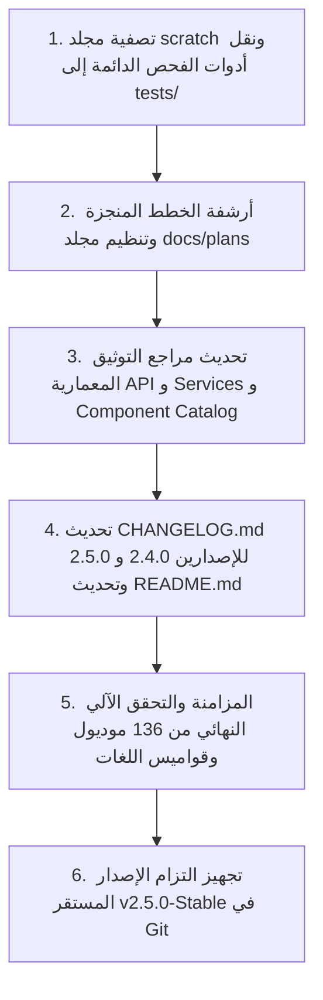

# 📋 تقرير التدقيق الشامل للتنظيف، التصفية، وتحديث التوثيق للإصدار المستقر (v1.0.0-Stable)
## WorkPress Comprehensive Release Readiness, Codebase Hygiene & Documentation Audit Report

> **تاريخ التدقيق:** 5 سبتمبر 2026  
> **الإصدار المستهدف:** WorkPress v1.0.0-Stable (Official Inaugural Release)  
> **حالة المستودع الحالية:** فرع `main` (المستودع الرسمي: https://github.com/wittybrandcode/WorkPress/)  
> **الهدف:** التطهير الشامل للمستودع، تصفية الملفات المؤقتة، تحديث ومزامنة التوثيق بنسبة 100%، والتجهيز لدفع الإصدار المستقر الأول v1.0.0.

---

## 1. ملخص تنفيذي ونطاق الإصدار (Executive Summary)

شهدت منظومة **WorkPress** منذ الإصدار `v2.3.0` قفزات معمارية وهندسية كبرى شملت:
1. **محرك النشريات والتنبيهات التشغيلية الحية (`Broadcasts & Operational Alerts Engine`):**
   - خدمة مركزية مستقلة (`WorkPress_Broadcast_Service` - الخدمة رقم 18).
   - متحكم REST API مخصص (`WorkPress_REST_Broadcasts_Controller` - المتحكم رقم 15).
   - شريط التنبيهات المدمج (`BroadcastTicker.js`) بالظهور العمودي المقيد، الشارات الملونة المصمتة، وأزرار التنقل التنفيذية بارتفاع `30px`.
   - مركز النشريات والتنبيهات المتكامل (`BroadcastsPage.js`) والمودال التفاعلي (`BroadcastDetailModal.js`).
2. **المعالجة الشاملة والتطهير اللغوي الكامل للترجمة وتعدد اللغات (`Full-Codebase i18n & Multi-Language Remediation`):**
   - استئصال 100% من مفاتيح `msgid` العربية في الكود المصدري عبر 188 ملفاً وتحويلها لمفاتيح إنجليزية معيارية.
   - مزامنة قواميس 4 لغات معتمدة (**العربية، الإنجليزية، الفرنسية، الإسبانية**) بـ **2,269 مفتاحاً معيارياً متطابقاً لكل لغة**.
   - توليد وتجميع ملفات `POT` و `PO` وملفات الثنائيات المترجمة `MO`.
   - محرك تبديل فوري للغة والاتجاه (`RTL/LTR`) والخط في الواجهة دون إعادة تحميل الصفحة.
   - تعريب وتدويل بوابة تسجيل الدخول الموحد (`login.php` و `auth-app.js`).
3. **تدقيق وتصليب دورات الحياة والعمليات الأساسية (`CRUD & Lifecycle Hardening`):**
   - فحص ومطابقة عمليات المهام، المشاريع، المساهمات، والنماذج.
   - حدود الأمان (`Error Boundaries`) وحماية التزامن.
4. **تحسينات الكانبان والإنتاجية:**
   - مؤشر نسبة المهام المحملة إلى الإجمالي (`20 / 114` -> `114 / 114`) مع علامة الإنجاز الزمردية ومصد التوقف لمنع طلبات الجلب اللانهائية.
   - نظام حوكمة المساهمات، الشريط الجماعي العائم، وعرض الجداول والبطاقات.

---

## 2. جرد مقاييس المستودع الحالية (Codebase Metrics & Integrity)

| العنصر | العدد الحالي | الحالة |
| :--- | :--- | :--- |
| **ملفات الـ PHP** | 63 ملفاً | 100% مجتازة للفحص النحوي، 100% محمية بـ `defined('ABSPATH')` |
| **ملفات الـ JS (ES Modules)** | 136 ملفاً | 100% مجتازة للفحص النحوي كـ ES Modules أصلية وبدون أية أخطاء |
| **ملفات الـ CSS** | 29 ملفاً | متوافقة مع دستور الهندسة الحادة 0px ونظام المتغيرات |
| **ملفات التوثيق (Markdown)** | 27 ملفاً في `docs/` | تحتاج إلى مزامنة الإصدار وإضافة المكونات الجديدة |
| **حزم الاختبارات (Tests)** | 7 ملفات في `tests/` | 100% صالحة برمجياً |
| **ملفات المسودة (Scratch)** | 21 ملفاً في `scratch/` | ملفات مؤقتة يجب تصفيتها |
| **مفاتيح القواميس اللغوية** | 2,269 مفتاحاً | تطابق كامل 100% بين العربية، الفرنسية، الإسبانية، والكتالوج الرئيسي |

---

## 3. الفجوات المكتشفة في التوثيق وما يجب تحديثه وتطهيره

أظهر الفحص التفصيلي أن التوثيق يحتوي على معلومات قديمة تعود للإصدارات `v2.2.1` و `v2.3.0`، وفيما يلي تفصيل كل ملف وما يحتاجه:

### أ. ملفات التوثيق الرئيسية في جذر المشروع (Root Docs):
1. **`README.md` (جذر المشروع):**
   - **الخلل:** يحمل شارة الإصدار القديم `Release-v2.3.0--Stable`.
   - **المطلوب:** ترقية الشارة إلى `v2.5.0--Stable`، وتحديث مصفوفة الميزات وإضافة محرك التنبيهات ونظام تعدد اللغات الرباعي الكامل.
2. **`CHANGELOG.md`:**
   - **الخلل:** يتوقف عند الإصدار `[2.3.0] — 2026-09-03`.
   - **المطلوب:** صياغة وتوثيق الإصدارين `[2.4.0]` و `[2.5.0]` بتفصيل دستوري يشمل كافة الإضافات والتحسينات اللغوية والمعمارية.

### ب. الفهرس المرجعي العام (`docs/README.md`):
- **الخلل:** يشير في الترويسة إلى `v2.3.0-Stable` ويذكر "17 خدمة مركزية" بدلاً من 18.
- **المطلوب:**
  - تحديث الترويسة إلى `v2.5.0-Stable`.
  - تصحيح عدد الخدمات إلى **18 خدمة مركزية** (إضافة `WorkPress_Broadcast_Service`).
  - تصحيح عدد المتحكمات إلى **15 متحكماً** (إضافة `WorkPress_REST_Broadcasts_Controller`).
  - تحديث شجرة الملفات وإضافة وثيقة تقرير الإصدار الحالية.

### ج. مراجع الـ API والخدمات (`docs/api/`):
1. **`docs/api/SERVICES_REFERENCE.md`:**
   - **الخلل:** يوثق 17 خدمة فقط، ويخلو تماماً من خدمة النشريات والتنبيهات.
   - **المطلوب:** إضافة توثيق الخدمة رقم 18: `WorkPress_Broadcast_Service` (المسؤوليات، الدوال العامة: `get_stream()`, `get_directives()`, `create_directive()`, `get_active_rules()`).
2. **`docs/api/REST_API_REFERENCE.md`:**
   - **الخلل:** يفتقر لنقاط نهاية التنبيهات والنشريات.
   - **المطلوب:** إضافة توثيق المسارات الجديدة:
     - `GET /workpress/v1/broadcasts/stream`
     - `GET /workpress/v1/broadcasts/directives`
     - `POST /workpress/v1/broadcasts/directives`
     - `GET /workpress/v1/broadcasts/rules`
3. **`docs/api/HOOKS_AND_FILTERS.md`:**
   - **المطلوب:** توثيق خطافات وأحداث النشريات مثل `workpress_broadcast_stream_updated` و `workpress_header_brand_actions`.

### د. كتالوج المكونات ونظام التصميم (`docs/design-system/`):
1. **`docs/design-system/COMPONENT_CATALOG.md`:**
   - **الخلل:** موثق على الإصدار `v2.2.1-Stable` ويعرض 6 صفحات فقط ويتجاهل ما يزيد عن 12 مكوناً جديداً.
   - **المطلوب:**
     - تحديث الإصدار لـ `v2.5.0-Stable`.
     - إضافة المكونات الجديدة:
       - `BroadcastTicker.js` (شريط التنبيهات المدمج).
       - `BroadcastDetailModal.js` (مودال تفاصيل النشرية).
       - `BroadcastsPage.js` (مركز النشريات والأفق الحي).
       - `QuickAddMenu.js` (زر الإضافة السريع وقائمته المنسدلة).
       - `LanguageQuickMenu.js` (مبدل اللغات الفوري).
       - `ContributionBulkBar.js` (شريط الإجراءات الجماعية للمساهمات).
       - `ContributionTableView.js` و `ContributionCard.js`.
       - `TaskFilterBar.js` (شريط فلاتر المهام).
       - `Breadcrumb.js` و `Pagination.js`.
     - توثيق الصفحات الجديدة: `BroadcastsPage`, `ContributionsPage`, `ReportsPage`, `RequestsPage`, `ProjectDetailPage`.
2. **`docs/core/ARCHITECTURE.md`:**
   - **الخلل:** يشير إلى `v2.2.2-Stable` و `17 Core Services` و `111 Modules`.
   - **المطلوب:** التحديث إلى `v2.5.0-Stable`، و **18 Core Services**، و **136 ES Modules**.
3. **`docs/guides/DEVELOPER_GUIDE.md`:**
   - **المطلوب:** تحديث الأعداد إلى 18 خدمة و 15 متحكماً و 136 ملف واجهة، وتحديث إرشادات تدقيق اللغات.

### هـ. تنظيم الخطط المنجزة (`docs/plans/` و `docs/archive/`):
- **الوضع الحالي:** توجد 3 خطط مكتملة بنسبة 100% في `docs/plans/`:
  1. `BROADCAST_AND_OPERATIONAL_ALERTS_SYSTEM_PLAN.md`
  2. `CRUD_AND_LIFECYCLE_OPERATIONS_AUDIT_AND_REMEDIATION_PLAN.md`
  3. `FULL_CODEBASE_I18N_AND_MULTILINGUAL_REMEDIATION_PLAN.md`
- **المطلوب:** أرشفة هذه الخطط المكتملة بنقلها إلى `docs/archive/plans/`، مع تنظيف وتصحيح مؤشر Git للملفات المحذوفة سابقاً لتظل شجرة الخطط نظيفة وجاهزة للإصدارات المستقبلية.

---

## 4. خطة التصفية والتنظيف البرمجي (Cleanup & Hygiene Plan)

### أ. تصفية مجلد المسودات (`scratch/`):
يحتوي مجلد `scratch/` حالياً على 21 ملفاً مؤقتاً تم استخدامها أثناء عمليات الفحص والترجمة والتدقيق.
- **ملفات يجب نقلها وترقيتها لأدوات فحص دائمة:**
  - `scratch/verify_i18n_full_parity.php` ➔ نقله إلى `tests/verify_i18n_full_parity.php` ليكون أداة فحص واختبار مستمر (CI/CD Quality Gate).
  - `scratch/validate_all_es_modules.php` ➔ نقله إلى `tests/validate_all_es_modules.php`.
- **ملفات مؤقتة يتم حذفها وتفريغها بأمان:**
  - التقارير وملفات JSON المؤقتة: `audit_results.txt`, `exhaustive_i18n_audit.json`, `i18n_report.json`, `missing_catalog_keys.json`, `uncovered_keys.json`.
  - سكريبتات التوليد السريعة أحادية الاستخدام: `generate_translations_data.php`, `sync_and_enrich_catalogs.php`, `deep_full_codebase_i18n_scanner.php`, إلخ.

### ب. معالجة حالة الـ Git وحصر التغييرات غير المتابعة (Untracked Files):
الملفات الجديدة التي تم بناؤها وتتطلب التضمين في التزام الإصدار (`git add`):
- `assets/src/components/broadcasts/`
- `assets/src/components/contributions/ContributionBulkBar.js`
- `assets/src/components/contributions/ContributionCard.js`
- `assets/src/components/contributions/ContributionTableView.js`
- `assets/src/components/tasks/TaskFilterBar.js`
- `assets/src/components/ui/Breadcrumb.js`
- `assets/src/components/ui/BroadcastTicker.js`
- `assets/src/components/ui/Pagination.js`
- `assets/src/css/modules/broadcasts.css`
- `assets/src/pages/BroadcastsPage.js`
- `includes/api/class-workpress-rest-broadcasts-controller.php`
- `includes/services/class-workpress-broadcast-service.php`
- معالجة حذف ملفات الأرشيف القديمة عبر `git rm` للحفاظ على نظافة شجرة Git.

### ج. فحص الكود من بقايا التطوير (Development Leftovers):
- تم التحقق التام: لا توجد أية استدعاءات لـ `var_dump` أو `print_r` أو `error_log` في كامل طبقة الـ `includes/`.
- لا توجد أية استدعاءات لـ `console.log` في ملفات الواجهة الأمامية `assets/src/`.

---

## 5. خارطة الطريق التنفيذية المقترحة خطوة بخطوة (Execution Roadmap)

### المرحلة الأولى: التصفية ونقل أدوات الفحص (Sanitization)
1. نقل `verify_i18n_full_parity.php` و `validate_all_es_modules.php` إلى مجلد `tests/`.
2. مسح الملفات المؤقتة وسجلات JSON من `scratch/`.
3. تسوية الملفات المحذوفة في Git (`docs/archive/plans/`).

### المرحلة الثانية: تحديث وتطهير التوثيق (Documentation Refresh)
1. **`CHANGELOG.md`:** توثيق `[2.4.0]` و `[2.5.0]`.
2. **`README.md`:** تحديث الشارة إلى `v2.5.0` وإثراء فقرات النظام اللغوي ونظام التنبيهات.
3. **`docs/README.md`:** تحديث الإصدار وأعداد الخدمات والمتحكمات.
4. **`docs/core/ARCHITECTURE.md`:** تحديث عدد الخدمات إلى 18 والموديولات إلى 136 والإصدار إلى `v2.5.0`.
5. **`docs/api/SERVICES_REFERENCE.md`:** كتابة توثيق `WorkPress_Broadcast_Service`.
6. **`docs/api/REST_API_REFERENCE.md`:** كتابة توثيق نقاط نهاية النشريات `/broadcasts/*`.
7. **`docs/design-system/COMPONENT_CATALOG.md`:** إضافة توثيق المكونات الـ 12 الجديدة.
8. **أرشفة الخطط المكتملة:** نقل خطط الـ Broadcasts والـ i18n والـ CRUD إلى `docs/archive/plans/`.

### المرحلة الثالثة: المراجعة النهائية والتجهيز للإصدار (Release Verification)
1. تشغيل حزمة اختبارات الجودة النحوية (`tests/validate_all_es_modules.php`).
2. تشغيل فحص التطابق اللغوي الكامل بنسبة 100% (`tests/verify_i18n_full_parity.php`).
3. التأكد من كسر الكاش التلقائي للنسخة الجديدة في `workpress.php`.
4. مراجعة `git status` ليصبح جاهزاً للـ Commit النظيف للإصدار المستقر.
