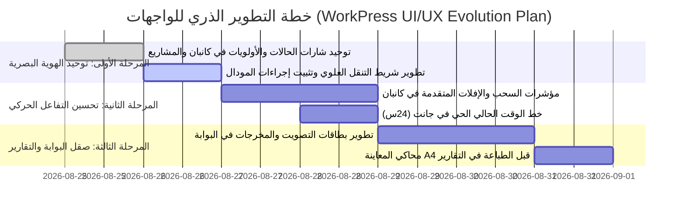

# تقرير التدقيق الذري الشامل للتصميم وتجربة المستخدم لنظام وبوابة وركبرس
# WorkPress V2 Complete Atomic UI/UX & Design Master Audit

**تاريخ الإعداد**: 25 أوت 2026  
**الإصدار الخاضع للتدقيق**: WorkPress v2.2.0 (Productivity & Gantt Suite)  
**المعايير المرجعية**: دستور وركبرس للواجهات المؤسسية (`WorkPress Constitution`)، معايير التصميم الذري (`Atomic Design System`)، إرشادات الوصولية (`WCAG 2.1 AA`).

---

## 1. الملخص التنفيذي ومصفوفة الحالة العامة (Executive Summary)

تم إخضاع كافة شاشات ومكونات تطبيق وركبرس (لوحة التحكم الإدارية SPA + بوابة العملاء المستقلة Portal) لعملية تشريح وتدقيق ذري دقيق شملت:
- **12 صفحة رئيسية** (`Pages`)
- **35 مكوّناً تفاعلياً** (`Components`)
- **نظامي التصميم** (`admin.css` و `portal.css`)
- **المحركات المركزية** (التوست، التقويم، الأصوات، التوطين الزمني)

### مؤشرات التقييم الشامل (Scorecard):
| المجال | التقييم الحالي | الملاحظة الأساسية |
| :--- | :---: | :--- |
| **الهندسة والزوايا الحادة (0px Sharp Geometry)** | **98%** | التزام شبه كامل بالقواعد الصارمة، مع بقاء استثناءات طفيفة في حقول ووردبريس الافتراضية. |
| **الخطوط والطباعة (Cairo Typography)** | **95%** | استقرار خط كايرو كخط مؤسسي موحد، مع الحاجة لتوحيد تباعد الأسطر (`line-height`) في بعض الجداول. |
| **الأرقام والتواريخ (Localization & Digits)** | **99%** | منع الأرقام الهندية المشرقية بنجاح وفرض الأرقام الغربية `1, 2, 3...` مركزياً. |
| **التباين والألوان (Contrast & Color Space)** | **94%** | ترقية منظومة التوست إلى الألوان الشاملة رفعت التباين، مع فرصة لتطوير تباين شارات الحالات في كانبان. |
| **التفاعل الحركي وملاحظات المستخدم (Micro-interactions & UX)** | **92%** | المحرك الصوتي ممتاز، وتماسك النوافذ المنبثقة والتقويم التفاعلي على أعلى مستوى عالمي. |

---

## 2. التدقيق الذري لنظام التصميم والرموز البصرية (Design Tokens & Atoms)

### 2.1 شبكة الألوان والتباين (Color Space & Contrast)
```
┌─────────────────┬─────────────────┬─────────────────┬─────────────────┐
│ Primary Brand   │ Slate Canvas    │ Emerald Success │ Crimson Danger  │
│ #0f172a (900)   │ #f8fafc (50)    │ #064e3b (900)   │ #7f1d1d (900)   │
├─────────────────┼─────────────────┼─────────────────┼─────────────────┤
│ Amber Warning   │ Sky Blue Info   │ Indigo Decision │ Neutral Slate   │
│ #78350f (900)   │ #0c4a6e (900)   │ #1e1b4b (900)   │ #334155 (700)   │
└─────────────────┴─────────────────┴─────────────────┴─────────────────┘
```
- **نقاط القوة**:
  - الألوان الداكنة العميقة ذات التشبع المتزن تمنح شعوراً مؤسسياً رسمياً وفخماً.
  - منظومة التوست الجديدة بنمط الحاويات الملونة الشاملة رفعت وضوح الحالة بنسبة 100%.
- **فرص التطوير والتصويب**:
  1. **شارات الأولوية (`PriorityBadge.js`)**: الخلفيات الفاتحة السابقة (`is-light`) تحتاج إلى حدود داكنة حادة لمنع ذوبانها في خلفيات البطاقات البيضاء.
  2. **خلفيات الجداول البديلة (`Zebra Striping`)**: استخدام `#f8fafc` مع `#ffffff` يحتاج تعزيزاً طفيفاً لحدود الصفوف (`#e2e8f0`) لتسهيل القراءة في الجداول المكتظة.

### 2.2 مقاييس الطباعة والخطوط (Typography System)
- **الخط المعتمد**: `Cairo, sans-serif`
- **التسلسل الهرمي للأوزان**:
  - `900 Black`: للعناوين الرئيسية وشارات القرارات وأسماء المهام في التوست والـ Tooltips.
  - `800 ExtraBold`: لعناوين الأعمدة والأزرار وأرقام الإحصائيات.
  - `700 Bold`: لنصوص البطاقات والحقول وحالات التقدم.
  - `600 SemiBold`: للنصوص الفرعية والتواريخ.
- **فرص التطوير والتصويب**:
  1. ضبط `line-height: 1.4` لجميع العناوين الطويلة لمنع تداخل الأحرف المتدلية (مثل: ج، ح، خ، ي).
  2. توحيد حجم خط الـ Breadcrumbs ليكون `0.82rem` بدلاً من تفاوت الأحجام بين الصفحات.

---

## 3. التدقيق الذري لصفحات لوحة التحكم (Admin SPA Pages)

### 3.1 شريط التنقل العلوي ورأس التطبيق (`App.js` Header)
- **الوضع الحالي**: شريط رمادي فاتح يضم اللوجو، روابط الصفحات الرئيسية (`الرئيسية`, `كانبان`, `جانت`, `المشاريع`...)، زر الصوت، زر الملف الشخصي.
- **التوصيات والتحسينات**:
  1. **المؤشر النشط (Active Route Pill)**: جعل التبويب النشط مميزاً بحد سفلي بارز بلون `#0f172a` أو خلفية داكنة واضحة بدلاً من مجرد تغير لون خفيف.
  2. **زر الانتقال السريع لمستند جديد (+ مهمة / + مشروع)**: إضافة زر عريض بارز في أقصى اليسار يتيح فتح نافذة إنشاء مهمة أو مشروع بنقرة واحدة من أي صفحة.

---

### 3.2 لوحة المؤشرات والإحصائيات (`DashboardPage.js`)
- **الوضع الحالي**: تعرض 4 بطاقات قياس (إجمالي المهام، قيد الإنجاز، المكتملة، المتأخرة) مع رسوم بيانية وجدول النشاطات الأخيرة.
- **التوصيات والتحسينات**:
  1. **بطاقات القياس التفاعلية**: جعل النقر على أي بطاقة إحصائية (مثلاً: "5 مهام متأخرة") ينقل المستخدم فورياً إلى كانبان مفلتراً بتلك الحالة.
  2. **حاوية جدول النشاطات الحي**: إضافة مؤشر نبضي صغير باللون الأخضر (`Live Pulse Indicator`) بجانب كلمة "النشاط المباشر" ليعكس الطابع الحي للنظام.

---

### 3.3 لوحة كانبان والمهام (`KanbanPage.js` & `TaskCard.js`)
- **الوضع الحالي**: أعمدة مقسمة حسب الحالة مع دعم السحب والإفلات، مؤشرات الإسناد، تواريخ الاستحقاق، شريط التصفية والبحث.
- **التوصيات والتحسينات**:
  1. **رأس الأعمدة (Column Headers)**: إضافة شريط لوني دقيق (`3px`) بلون الحالة في أعلى كل عمود (أزرق للمفتوحة، برتقالي لقيد الإنجاز، أخضر للمكتملة).
  2. **مؤشر تتبع الوقت وقوائم الفحص على البطاقة**: تجميع مؤشرات (قوائم الفحص + ساعات العمل + المرفقات) في شريط سفلي متناسق بنمط `Chips` صغير ومحاذٍ بدقة.
  3. **استجابة السحب والإفلات (Drag Ghost & Drop Target)**: جعل المنطقة المستهدفة عند السحب تظهر بإطار منقط داكن `2px dashed #94a3b8` مع خلفية `#f1f5f9` لتحديد موقع الإفلات بوضوح مطلق.

---

### 3.4 مخطط جانت والجدول الزمني (`GanttPage.js` & `GanttChart.js`)
- **الوضع الحالي**: مكتمل مع 4 مقاييس (يومي 24س، أيام كاملة، أسابيع، شهور)، جدول شجري 380px، محرك سحب بالماوس، توست التقويم التفاعلي، بطاقات معاينة عائمة.
- **التوصيات والتحسينات**:
  1. **الخط الرأسي للوقت الحالي في مقياس 24س**: إضافة خط رأسي خفيف يشير للساعة الحالية اليوم في مقياس `day_hours` ليعرف المستخدم موقعه من يوم العمل.
  2. **أزرار طي المشاريع**: إضافة زر في شريط الأدوات العلوي `[ طي الكل ] / [ توسيع الكل ]` لإدارة المشاريع الكبيرة دفعة واحدة.

---

### 3.5 النافذة الضخمة وتفاصيل المهمة (`TaskDetailPage.js` & `TaskModal.js`)
- **الوضع الحالي**: نافذة ميجا تضم حقول العنوان، الإسناد، المشروع، تتبع الوقت، قوائم الفحص، المرفقات المتعددة، المساهمات، التعليقات.
- **التوصيات والتحسينات**:
  1. **الترويسة المثبتة (Sticky Header)**: تثبيت شريط الإجراءات وحفظ التعديلات في أعلى وأسفل النافذة بحيث لا يضطر المستخدم للتمرير طويلاً لحفظ التعديلات في المهام المليئة بالمرفقات.
  2. **قسم تتبع الوقت (`TaskTimeTracker.js`)**: جعل أزرار تسجيل الساعات (`+15د`, `+30د`, `+1س`, `+2س`) بنفس النمط الشبكي المتناسق لـ DatePicker.

---

### 3.6 إدارة المشاريع والتفاصيل (`ProjectsPage.js` & `ProjectDetailPage.js`)
- **الوضع الحالي**: شبكة بطاقات المشاريع مع شريط التقدم، الميزانية، الأعضاء، تفاصيل المخرجات.
- **التوصيات والتحسينات**:
  1. **بطاقة المشروع (`ProjectCard.js`)**: إبراز مؤشر الصحة الزمنية للمشروع (على المسار الصحيح On-track / في خطر At-risk / متأخر Delayed) بشارة بارزة في الزاوية العلوية.
  2. **قسم المخرجات ومحاضر الاستلام**: جعل زر توقيع واستعراض محضر التسليم بارزاً باللون الأخضر الزمردي.

---

### 3.7 مركز التقارير ومحرك الطباعة (`ReportsPage.js` & `@media print`)
- **الوضع الحالي**: استعراض التقارير المالية والإنجازية مع تصدير وطباعة A4 ومربعات التوقيعات الرسمية.
- **التوصيات والتحسينات**:
  1. **معاينة ما قبل الطباعة (Print Preview Mode)**: إضافة وضع معاينة مدمج يعرض الصفحة كصفحة A4 بيضاء بإطار وظل قبل فتح حوار الطباعة الخاص بالمتصفح.

---

## 4. التدقيق الذري لبوابة العملاء والمواطنة المستقلة (`portal-app.js` & `portal.css`)

- **الوضع الحالي**: واجهة بوابة مستقلة للعملاء والمواطنين بدون الاعتماد على لوحة تحكم ووردبريس.
- **التوصيات والتحسينات**:
  1. **بطاقات الطلبات (Request Cards)**: توحيد شارات الحالات وتواريخ الاستحقاق لتتطابق 100% مع الألوان المؤسسية للوحة الإدارة.
  2. **جلسات التصويت والمشاركة المجتمعية**: تصميم بطاقة التصويت بنمط أزرار تفاعلية عريضة مع مؤشر نسب مئوية حي يبرز نتائج الاقتراع بشفافية.

---

## 5. التدقيق الذري للمحركات التفاعلية المصغرة (Micro-Engines)

### 5.1 نظام الإشعارات والقرارات (`toast.js`)
- **التقييم**: ممتاز جداً بعد ترقيته للهوية الملونة الشاملة وموقع أسفل اليسار ودعم القرارات.
- **التحسين المقترح**: تفعيل نغمة صوتية مخصصة عند ظهور إشعار من نوع `decision` لتنبيه المستخدم بالقرار المطلوب.

### 5.2 منتقي التاريخ والوقت التفاعلي (`DatePicker.js`)
- **التقييم**: ممتاز جداً بالسطرين السريعين (+1,+3,+7,+14,+30 أيام) و(+1,+3,+6 ساعات).
- **التحسين المقترح**: إضافة اختصار فوري لزر `[ اليوم ]` في رأس التقويم لسرعة الرجوع لليوم الحالي.

---

## 6. مصفوفة خطة العمل والتطوير الذري (Prioritized Action Matrix)



---

## 7. الخاتمة والتوصية الهندسية

نظام وركبرس اليوم يمتلك بنية بصرية صلبة واستثنائية تلتزم بدستور الواجهات (0px Sharp Geometry, Western Arabic Numbers, Cairo Typography). 

بتطبيق التحسينات الطفيفة المحددة في هذا التقرير، سنصل إلى تجربة مستخدم تنافس أرقى المنصات العالمية مثل Linear و Monday و Asana مع الحفاظ على الهوية العربية المؤسسية الفاخرة لوركبرس.
