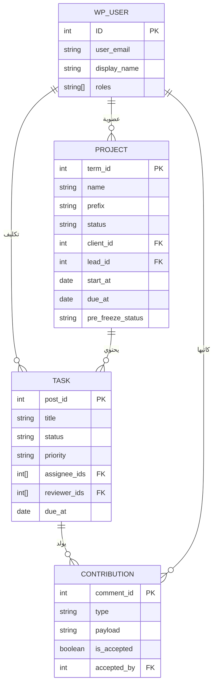

# WorkPress v2.0.0 — تقرير حالة المنظومة الذري الشامل
### 🔬 Atomic State-of-System Report
**تاريخ التقرير**: 23 أغسطس 2026 — الساعة 21:00 بتوقيت +01:00  
**الإصدار**: `2.0.0`  
**البيئة**: WordPress 7.0.2 / PHP 8.3.16 / Laragon on Windows  
**المُعِدّ**: تحليل آلي شامل للقاعدة البرمجية بالكامل

---

## 1. البصمة الكمية للقاعدة البرمجية (Codebase Fingerprint)

| المقياس | القيمة |
| :--- | ---: |
| إجمالي الملفات (PHP + JS + CSS + MD) | **135 ملف** |
| إجمالي حجم الشيفرة المصدرية | **~1.72 ميغابايت** |
| ملفات PHP (الخلفية / Backend) | **45 ملف** (429 كيلوبايت) |
| ملفات JavaScript (الواجهة / Frontend) | **52 ملف** (822 كيلوبايت) |
| ملفات التوثيق (Markdown) | **35 ملف** (381 كيلوبايت) |
| ملفات CSS (التنسيق) | **3 ملفات** (14.5 كيلوبايت مخصصة + Bulma) |
| قالب البوابة المستقل (Template) | **1 ملف** (PHP) |
| أكبر ملف مصدري | `portal-app.js` — **206 كيلوبايت** |

---

## 2. الخريطة المعمارية الهيكلية (Architectural Blueprint)

```
WorkPress v2.0.0
├── workpress.php                          ← نقطة الدخول الرئيسية (Bootstrap)
├── uninstall.php                          ← تنظيف البيانات عند الحذف
│
├── includes/
│   ├── core/                              ← النواة الصلبة
│   │   ├── class-workpress-install.php         ← تسجيل CPT + Taxonomy + Roles
│   │   ├── class-workpress-keys.php            ← ثوابت Meta Keys (العقود)
│   │   ├── class-workpress-capabilities-registry.php ← سجل الصلاحيات
│   │   └── class-workpress-dev-seeder.php      ← بذر بيانات التطوير
│   │
│   ├── services/                          ← طبقة خدمات الأعمال (16 خدمة)
│   │   ├── class-workpress-project-service.php      ← دورة حياة المشروع
│   │   ├── class-workpress-task-service.php          ← دورة حياة المهمة
│   │   ├── class-workpress-contribution-service.php  ← الأدلة والمساهمات
│   │   ├── class-workpress-portal-service.php        ← بوابة ومساحة المستفيد
│   │   ├── class-workpress-webhook-service.php       ← التكاملات الخارجية
│   │   ├── class-workpress-report-service.php        ← التقارير التنفيذية
│   │   ├── class-workpress-hibernation-service.php   ← ثلاجة المشاريع (جديد)
│   │   ├── class-workpress-membership-service.php    ← العضوية والرؤية
│   │   ├── class-workpress-permission-service.php    ← قرار التفويض الثلاثي
│   │   ├── class-workpress-capabilities-service.php  ← إدارة القدرات
│   │   ├── class-workpress-assignment-service.php    ← التكليف والمسؤوليات
│   │   ├── class-workpress-knowledge-service.php     ← المعرفة المستنتجة
│   │   ├── class-workpress-template-service.php      ← قوالب المشاريع
│   │   ├── class-workpress-security-service.php      ← الحماية والأمان
│   │   ├── class-workpress-export-service.php        ← التصدير
│   │   └── class-workpress-workflow-service.php      ← آلة الحالات
│   │
│   ├── api/                               ← طبقة REST API (14 متحكم)
│   │   ├── class-workpress-rest-api.php             ← المحمّل الرئيسي
│   │   ├── class-workpress-rest-portal-controller.php    ← API البوابة
│   │   ├── class-workpress-rest-contributions-controller.php ← API المساهمات
│   │   ├── class-workpress-rest-tasks-controller.php     ← API المهام
│   │   ├── class-workpress-rest-projects-controller.php  ← API المشاريع
│   │   ├── class-workpress-rest-settings-controller.php  ← API الإعدادات
│   │   ├── class-workpress-rest-roles-controller.php     ← API الأدوار
│   │   ├── class-workpress-rest-members-controller.php   ← API الأعضاء
│   │   ├── class-workpress-rest-report-controller.php    ← API التقارير
│   │   ├── class-workpress-rest-webhooks-controller.php  ← API الويب هوك
│   │   ├── class-workpress-rest-trash-controller.php     ← API المحذوفات
│   │   ├── class-workpress-rest-export-controller.php    ← API التصدير
│   │   ├── class-workpress-rest-knowledge-controller.php ← API المعرفة
│   │   └── class-workpress-rest-dev-controller.php       ← API التطوير
│   │
│   ├── admin/                             ← لوحة الإدارة
│   │   └── class-workpress-admin.php           ← تسجيل القوائم والأصول
│   │
│   ├── hooks/                             ← الخطافات العامة
│   │   └── class-workpress-hooks.php           ← نقاط التوسع
│   │
│   ├── modules/                           ← الوحدات الاختيارية
│   │   └── notifications/                      ← نظام الإشعارات (5 ملفات)
│   │
│   └── office-packs/                      ← حزم المكتب التخصصية
│       └── class-workpress-software-pack.php   ← حزمة البرمجيات
│
├── assets/
│   ├── src/
│   │   ├── App.js + index.js              ← نقطة دخول الواجهة
│   │   ├── api/client.js                  ← عميل REST API
│   │   ├── portal/portal-app.js           ← تطبيق البوابة المستقل (SPA)
│   │   ├── pages/ (11 صفحة)              ← صفحات CoWorkPress
│   │   ├── components/ (29 مكون)          ← المكونات القابلة لإعادة الاستخدام
│   │   ├── utils/ (6 أدوات)              ← الأدوات المساعدة
│   │   ├── modules/                       ← وحدات الواجهة
│   │   └── brand/                         ← الهوية البصرية
│   │
│   ├── css/
│   │   ├── portal.css                     ← تنسيقات البوابة المعزولة
│   │   ├── cairo.css                      ← خطوط عربية
│   │   └── bulma.min.css                  ← إطار التنسيق
│   │
│   └── sounds/                            ← المؤثرات الصوتية التفاعلية
│
├── templates/
│   └── portal/index.php                   ← قالب البوابة المعزول (0% CSS Bleed)
│
└── docs/                                  ← التوثيق المعماري (35 ملف)
    ├── core/ (7 وثائق)                    ← المبادئ والمعمارية
    ├── plans/ (7 خطط)                     ← الخطط الرئيسية
    ├── releases/ (2 وثائق)                ← ملاحظات الإصدار
    └── ...
```

---

## 3. نموذج البيانات (Domain Model)



| مفهوم المجال | كيان ووردبريس | آلية التخزين |
| :--- | :--- | :--- |
| المشروع (Project) | `workpress_project` Taxonomy | `term` + `term_meta` |
| المهمة (Task) | `work_item` CPT | `post` + `post_meta` |
| المساهمة (Contribution) | Comment | `comment` + `comment_meta` |
| الشخص (Person) | WP User | `users` + `usermeta` |
| العضوية (Membership) | علاقة مستخدم/مشروع | `term_meta` |
| التكليف (Assignment) | مسؤولية المهمة | `post_meta` |
| المعرفة (Knowledge) | أدلة مقبولة (Query) | لا كيان مستقل |

---

## 4. منظومة الحوكمة والمواطنة (Governance & Citizenship)

### هرم المواطنة الست-مستويات (6-Tier Hierarchy)

```
┌─────────────────────────────────────────────────────────────────┐
│                    هرم مواطنة WorkPress v2.0                     │
├──────────────┬──────────────────────┬───────────────────────────┤
│   الرتبة      │   الدور النظامي       │   الصلاحيات والنطاق        │
├──────────────┼──────────────────────┼───────────────────────────┤
│ 1. مدير عام   │ administrator        │ كامل الصلاحيات + رادار    │
│              │                      │ القيادة في البوابة          │
├──────────────┼──────────────────────┼───────────────────────────┤
│ 2. قائد مشروع │ editor               │ إدارة المشاريع + فرز      │
│              │                      │ الطلبات + كانبان           │
├──────────────┼──────────────────────┼───────────────────────────┤
│ 3. منفذ رئيسي │ author               │ إنجاز المهام + تقديم       │
│              │                      │ الأدلة + المعرفة           │
├──────────────┼──────────────────────┼───────────────────────────┤
│ 4. مساهم فني  │ contributor          │ مساهمات محدودة             │
├──────────────┼──────────────────────┼───────────────────────────┤
│ 5. مستفيد    │ workpress_client     │ البوابة المستقلة + طلب     │
│              │                      │ المشاريع + المصادقة        │
├──────────────┼──────────────────────┼───────────────────────────┤
│ 6. مشترك     │ subscriber           │ الموقع العام فقط +         │
│              │                      │ شاشة توجيه ترحيبية         │
└──────────────┴──────────────────────┴───────────────────────────┘
```

### مصدر الحقيقة المركزي للتسميات

يُدار من ملف واحد: [`userScope.js`](../assets/src/utils/userScope.js) وتُستخدم ثوابته في كامل الواجهة الأمامية (الإعدادات، البوابة، بطاقات الأعضاء، القوائم).

---

## 5. الأنظمة الفرعية المُنجزة ودرجة اكتمالها

### أ. النواة الأساسية (Core Engine)

| النظام الفرعي | الحالة | الملاحظات |
| :--- | :---: | :--- |
| تسجيل CPT (`work_item`) | ✅ مكتمل | مع REST API كامل |
| تسجيل Taxonomy (`workpress_project`) | ✅ مكتمل | هرمي مع meta كاملة |
| نظام الأدوار والصلاحيات | ✅ مكتمل | 6 رتب مع سجل مركزي |
| آلة حالات المشروع والمهمة | ✅ مكتمل | `WorkflowService` |
| خدمة العضوية والرؤية | ✅ مكتمل | عزل كامل بين المشاريع |
| خدمة التكليف والمسؤوليات | ✅ مكتمل | `AssignmentService` |
| خدمة المساهمات والأدلة | ✅ مكتمل | Timeline غير قابل للمحو |
| خدمة المعرفة المؤسسية | ✅ مكتمل | أدلة مقبولة فقط |
| خدمة الأمان والحماية | ✅ مكتمل | `SecurityService` |
| خدمة قوالب المشاريع | ✅ مكتمل | `TemplateService` |
| خدمة التصدير | ✅ مكتمل | `ExportService` |
| خطافات التوسع العامة | ✅ مكتمل | `WorkPress_Hooks` |

### ب. البوابة المستقلة (Standalone Client Portal)

| النظام الفرعي | الحالة | الملاحظات |
| :--- | :---: | :--- |
| قالب معزول بالكامل (0% CSS Bleed) | ✅ مكتمل | `templates/portal/index.php` |
| تطبيق SPA بدون بناء (Preact + HTM) | ✅ مكتمل | `portal-app.js` (206 KB) |
| تسجيل الدخول والجلسة | ✅ مكتمل | مع تجديد Nonce تلقائي |
| استوديو تقديم الطلبات الديناميكي | ✅ مكتمل | نماذج قابلة للتخصيص |
| متابعة المشاريع والمخرجات | ✅ مكتمل | مخرجات مصفاة ومعتمدة |
| المراحل وخط الزمن | ✅ مكتمل | Timeline تفاعلي |
| الاستفسارات والملاحظات | ✅ مكتمل | مع أنماط متعددة |
| المصادقة والتوقيع الرسمي | ✅ مكتمل | `client_signoff` |
| رادار القيادة التنفيذية | ✅ مكتمل | 3 طبقات (admin/lead/member) |
| نظام الإشعارات والتنبيهات | ✅ مكتمل | Polling + Toast |
| التقرير الرسمي المطبوع | ✅ مكتمل | وثيقة استلام PDF-ready |
| بوابة توجيه المشترك الودودة | ✅ مكتمل | Subscriber Gatekeeper Card |
| المؤثرات الصوتية التفاعلية | ✅ مكتمل | 6+ أصوات مخصصة |
| روابط تسجيل الخروج الآمنة | ✅ مكتمل | Nonced `wp_logout_url()` |

### ج. واجهة CoWorkPress (لوحة الإدارة)

| النظام الفرعي | الحالة | الملاحظات |
| :--- | :---: | :--- |
| لوحة القيادة التنفيذية (Dashboard) | ✅ مكتمل | `DashboardPage.js` (40 KB) |
| شبكة المشاريع | ✅ مكتمل | `ProjectsPage.js` + بطاقات |
| صفحة تفاصيل المشروع | ✅ مكتمل | `ProjectDetailPage.js` (23 KB) |
| لوحة كانبان المهام | ✅ مكتمل | `KanbanPage.js` سحب وإفلات |
| صفحة تفاصيل المهمة | ✅ مكتمل | `TaskDetailPage.js` (32 KB) |
| نظام المساهمات | ✅ مكتمل | `ContributionsPage.js` (24 KB) |
| صفحة التقارير التنفيذية | ✅ مكتمل | `ReportsPage.js` (13 KB) |
| صفحة قاعدة المعرفة | ✅ مكتمل | `KnowledgePage.js` (20 KB) |
| استوديو فرز الطلبات | ✅ مكتمل | `RequestsPage.js` (54 KB) |
| صفحة الإعدادات المتكاملة | ✅ مكتمل | `SettingsPage.js` (81 KB) |
| إدارة نماذج استقبال الطلبات | ✅ مكتمل | `IntakeFormsPage.js` (34 KB) |
| نظام أدوار الأعضاء والتبويبات | ✅ مكتمل | مستفيدون / مشتركون / أعضاء |
| فلتر ثلاجة المشاريع | ✅ مكتمل | `🧊 في الثلاجة (مجمدة)` |

### د. الأنظمة المتقدمة

| النظام الفرعي | الحالة | الملاحظات |
| :--- | :---: | :--- |
| محرك الويب هوك والتكاملات | ✅ مكتمل | Slack / Discord / Custom |
| نظام الإشعارات الداخلية | ✅ مكتمل | 5 ملفات (DB + API + Hooks) |
| ثلاجة المشاريع (Cold Storage) | ✅ مكتمل | تجميد/إذابة آلي |
| حزمة مكتب البرمجيات | ✅ مكتمل | Office Pack تجريبي |

---

## 6. طبقة REST API — فهرس نقاط النهاية

| المسار | الطريقة | الوصف |
| :--- | :---: | :--- |
| `/workpress/v1/projects` | `GET/POST` | قائمة وإنشاء المشاريع |
| `/workpress/v1/projects/{id}` | `GET/PUT/DELETE` | عمليات المشروع |
| `/workpress/v1/projects/{id}/members` | `GET/POST/DELETE` | إدارة الأعضاء |
| `/workpress/v1/tasks` | `GET/POST` | قائمة وإنشاء المهام |
| `/workpress/v1/tasks/{id}` | `GET/PUT/DELETE` | عمليات المهمة |
| `/workpress/v1/tasks/{id}/state` | `PUT` | تغيير حالة المهمة |
| `/workpress/v1/tasks/{id}/assignment` | `PUT` | تكليف المهمة |
| `/workpress/v1/tasks/{id}/contributions` | `GET/POST` | المساهمات |
| `/workpress/v1/contributions/{id}/accept` | `POST` | قبول مساهمة |
| `/workpress/v1/knowledge` | `GET` | المعرفة المؤسسية |
| `/workpress/v1/settings` | `GET/PUT` | الإعدادات العامة |
| `/workpress/v1/roles` | `GET/PUT` | إدارة الأدوار |
| `/workpress/v1/members` | `GET` | دليل الأعضاء |
| `/workpress/v1/reports/{id}` | `GET` | التقرير التنفيذي |
| `/workpress/v1/export` | `GET` | تصدير البيانات |
| `/workpress/v1/webhooks` | `GET/POST/PUT/DELETE` | إدارة الويب هوك |
| `/workpress/v1/trash` | `GET/POST/DELETE` | إدارة المحذوفات |
| `/workpress/v1/portal/login` | `POST` | تسجيل دخول البوابة |
| `/workpress/v1/portal/my-projects` | `GET` | مشاريع المستفيد |
| `/workpress/v1/portal/projects/{id}` | `GET` | تفاصيل مشروع |
| `/workpress/v1/portal/projects/{id}/deliverables` | `GET` | المخرجات |
| `/workpress/v1/portal/projects/{id}/milestones` | `GET` | المراحل |
| `/workpress/v1/portal/feedback` | `POST` | إرسال ملاحظة |
| `/workpress/v1/portal/request` | `POST` | تقديم طلب مشروع |
| `/workpress/v1/portal/intake-forms` | `GET` | نماذج الاستقبال |
| `/workpress/v1/portal/pulse` | `GET` | نبض الإشعارات |
| `/workpress/v1/portal/refresh-nonce` | `POST` | تجديد الأمان |
| `/workpress/v1/portal/radar` | `GET` | رادار القيادة |
| `/workpress/v1/portal/upload-file` | `POST` | رفع الملفات |
| `/workpress/v1/portal/report/{id}` | `GET` | التقرير الرسمي |

---

## 7. المكونات الأمامية (Frontend Components Inventory)

### الصفحات (Pages) — 11 صفحة

| الصفحة | الحجم | الوصف |
| :--- | ---: | :--- |
| `SettingsPage.js` | 81 KB | إعدادات + أدوار + أعضاء |
| `RequestsPage.js` | 54 KB | استوديو فرز الطلبات |
| `DashboardPage.js` | 40 KB | لوحة القيادة التنفيذية |
| `IntakeFormsPage.js` | 34 KB | مصمم نماذج الطلبات |
| `TaskDetailPage.js` | 32 KB | تفاصيل المهمة |
| `ContributionsPage.js` | 24 KB | سجل المساهمات |
| `ProjectDetailPage.js` | 23 KB | تفاصيل المشروع |
| `KnowledgePage.js` | 20 KB | قاعدة المعرفة |
| `KanbanPage.js` | 16 KB | لوحة كانبان |
| `ProjectsPage.js` | 14 KB | شبكة المشاريع |
| `ReportsPage.js` | 13 KB | التقارير التنفيذية |

### المكونات المشتركة (Components) — 29 مكون

بما فيها: `FilterBar`, `ProjectCard`, `TaskCard`, `MemberSelect`, `Modal`, `ConfirmModal`, `ProjectMembersModal`, `TaskModal`, `ProjectModal`, `TaskAssignmentModal`, `ContributionModal`, `ContributionDetailModal`, `ContributionComments`, `ReportModal`, `ImagePicker`, `WpEditor`, `CustomSelect`, `ErrorBoundary`, `Loader`, `PriorityBadge`, `AvatarStack`, `ProjectQuickPreviewModal`, `TaskQuickPreviewModal`, `WorkPressLogo`, `AboutWorkPressTab`, `IntakeFormsBuilderTab`, `WebhooksSettingsTab`, `SettingsQuickMenu`, `SoundQuickToggle`.

### الأدوات المساعدة (Utils) — 6 أدوات

| الأداة | الوصف |
| :--- | :--- |
| `userScope.js` | السجل المركزي للأدوار والمواطنة |
| `html.js` | مغلف Preact + HTM |
| `datetime.js` | تنسيق التواريخ العربية |
| `sound.js` | محرك المؤثرات الصوتية |
| `toast.js` | نظام التنبيهات المنبثقة |
| `hooks.js` | خطافات مخصصة |

---

## 8. منظومة «ثلاجة المشاريع» (Project Cold Storage)

```
[مستفيد / workpress_client]  ──(خفض الدور)──►  [مشترك / subscriber]
        │                                            │
        ▼                                            ▼
   مشاريع نشطة                              مشاريع في «الثلاجة»
  (البوابة + الكانبان)                      (status: frozen)
        ▲                                            │
        └────────────(إعادة الترقية)──────────────────┘
                    [إذابة واستعادة آلية]
```

| الخاصية | القيمة |
| :--- | :--- |
| الخدمة المسؤولة | `WorkPress_Hibernation_Service` |
| الخطاف المستخدم | `set_user_role` (أولوية 10، 3 معاملات) |
| Meta التجميد | `_workpress_status` → `frozen` |
| Meta الحفظ | `_workpress_pre_freeze_status` → الحالة الأصلية |
| اتجاه التجميد | `workpress_client` → `subscriber` |
| اتجاه الإذابة | `subscriber` → `workpress_client` |
| حالة الاختبار | ✅ نجاح 100% (Freeze + Unfreeze) |

---

## 9. قائمة التوثيق الرسمي (Documentation Registry)

### وثائق النواة (`docs/core/`)
| الوثيقة | الحجم | الوصف |
| :--- | ---: | :--- |
| `FIRST_PRINCIPLES.md` | 4 KB | 21 مبدأ غير قابل للكسر |
| `ARCHITECTURE.md` | 11 KB | المعمارية التقنية v2 |
| `PRD.md` | 6 KB | وثيقة متطلبات المنتج |
| `GOVERNANCE_AND_CITIZENSHIP_SPECIFICATION.md` | 14 KB | مواصفات الحوكمة والمواطنة |
| `SYSTEM_SYNTHESIS_AND_ONTOLOGY_STUDY.md` | 15 KB | دراسة الأنطولوجيا |
| `SYSTEM_MAINTAINABILITY_AND_HARDENING_REPORT.md` | 10 KB | تقرير المتانة |
| `WEBHOOKS_AND_INTEGRATIONS_ARCHITECTURE.md` | 17 KB | معمارية التكاملات |

### خطط التطوير (`docs/plans/`)
| الخطة | الحجم |
| :--- | ---: |
| `CLIENT_PORTAL_MASTER_ROADMAP.md` | 16 KB |
| `DYNAMIC_REQUEST_FORMS_MASTER_ROADMAP.md` | 19 KB |
| `UNIVERSAL_GOVERNANCE_AND_PORTAL_SYNERGY_MASTER_PLAN.md` | 18 KB |
| `ENTERPRISE_HARDENING_AND_RESILIENCE_MASTER_PLAN.md` | 12 KB |
| `CLIENT_INTERACTIVE_EXPERIENCE_AND_SYNERGY_MASTER_PLAN.md` | 11 KB |
| `EXECUTIVE_REPORTING_AND_ANALYTICS_MASTER_PLAN.md` | 10 KB |
| `ENTERPRISE_WEBHOOKS_AND_INTEGRATIONS_MASTER_PLAN.md` | 8 KB |

---

## 10. المبادئ المعمارية الحاكمة (Governing Principles)

> مصدر السلطة: [`FIRST_PRINCIPLES.md`](FIRST_PRINCIPLES.md)

1. **People create Work** — الأشخاص ينشئون العمل.
2. **Work generates Knowledge** — العمل يولّد المعرفة.
3. **Knowledge becomes Organizational Memory** — المعرفة تصبح ذاكرة المؤسسة.
4. **WordPress Data Model is the Source of Truth** — لا جداول بديلة.
5. **Services own business rules** — لا وصول مباشر للكيانات.
6. **History is never lost** — لا محو لأثر عمل أو قرار.
7. **Core stays domain neutral** — النواة محايدة للمجال.
8. **Extensions are removable without data loss** — الإضافات لا تملك البيانات.

---

## 11. التبعيات الخارجية (External Dependencies)

| التبعية | الإصدار | الاستخدام |
| :--- | :---: | :--- |
| WordPress | 7.0.2 | المنصة الأساسية |
| PHP | 8.3.16 | الخلفية |
| Preact | 10.19.3 | واجهة البوابة (CDN) |
| HTM | 3.1.1 | Tagged Templates (CDN) |
| Bulma CSS | (مضمن) | إطار تنسيق الإدارة |
| Google Fonts (Cairo + Plus Jakarta Sans) | — | الخطوط العربية |

> [!NOTE]
> لا يعتمد WorkPress على أي أداة بناء (No Build Tools). لا `npm`, لا `webpack`, لا `babel`. كل شيء يعمل بدون تجميع مسبق.

---

## 12. خلاصة تنفيذية (Executive Summary)

**WorkPress v2.0.0** هو محرك ذاكرة مؤسسية وإدارة عمل أصيل مبني فوق WordPress بالكامل، يمتد عبر **135 ملف مصدري** بحجم إجمالي **1.72 ميغابايت**، موزعة بين **45 ملف PHP** للخلفية و **52 ملف JavaScript** للواجهة و **35 وثيقة** توثيق رسمي.

المنظومة تضم **16 خدمة أعمال**، **14 متحكم REST API**، **11 صفحة واجهة**، **29 مكون** قابل لإعادة الاستخدام، وتطبيق **بوابة مستقل** بالكامل (206 KB SPA). تعمل بدون أي أداة بناء وتلتزم بنموذج بيانات ووردبريس الأصلي كمصدر حقيقة وحيد.

آخر إنجاز رئيسي: **منظومة «ثلاجة المشاريع» (Project Cold Storage)** مع التجميد/الإذابة الآلي و**بوابة التوجيه الودودة للمشتركين** و**إصلاح روابط البوابة** المعطلة.

---

> **هذا التقرير يعكس حالة المنظومة لحظة التوليد ويمثل نقطة مرجعية رسمية للتطوير المستقبلي.**
