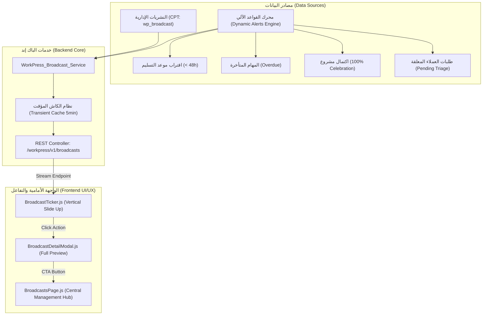

# الخطة المعمارية الشاملة لنظام النشريات والتنبيهات الذكية المبرمجة
## WorkPress Broadcast & Operational Alerts Engine Master Plan

- **تاريخ الإعداد:** 4 سبتمبر 2026
- **الإصدار المستهدف:** WorkPress v2.5.0+
- **الموقع في المشروع:** `docs/plans/BROADCAST_AND_OPERATIONAL_ALERTS_SYSTEM_PLAN.md`
- **الحالة:** بانتظار المراجعة والاعتماد (Under Review)

---

## 1. الرؤية التنفيذية وأهداف النظام (Executive Vision & Objectives)

تحويل الشريط العلوي في خط الأفق (Breadcrumb Horizon) من مجرد سطر نصي إداري بسيط إلى **محرك عمليات تنبيهية متكامل (Broadcast & Operational Alerts Horizon)** يجمع بين:
1. **النشريات الإدارية المباشرة (Managerial Directives):** توجيهات وإعلانات معتمدة من الإدارة بجدولة زمنية وأولويات متباينة (عاجل، هام، إخباري).
2. **التنبيهات الذكية المبرمجة آلياً (Automated System Triggers):** تنبيهات استباقية تتولد ذاتياً وفق قواعد يبرمجها المدير العام (اقتراب مواعيد التسليم، المهام المتأخرة، الاحتفال بإنجاز المشاريع، طلبات الفرز المعلقة).
3. **تجربة عرض تفاعلية مبتكرة (Vertical Slide-in Slot):**
   - ظهور العناصر بحركة عمودية من الأسفل إلى الأعلى داخل الحيز المحدد دون أي زحف أفقي مشتت.
   - اقتطاع النص حسب المساحة المتاحة وإكماله بنقاط الحذف (`text-overflow: ellipsis`).
   - النقر على أي عنصر يفتح نافذة تفاصيل منبثقة (`BroadcastDetailModal`) تعرض النص الكامل والمصدر والإجراء المباشر.
   - وجود زر داخل النافذة ينقل المستخدم فوراً إلى **صفحة الإعلانات والتنبيهات المستقلة (`BroadcastsPage`)**.
4. **صفحة مركزية للإعلانات والتنبيهات (Broadcast Hub):**
   - عرض حي لكافة التنبيهات والنشريات النشطة.
   - إدارة النشريات اليدوية وجدولتها الزمنية.
   - ضبط محرك القواعد الآلية وتحديد معايير الحساسية (مثل مهلة الساعات قبل الموعد).
   - أرشيف موثق لحفظ الذاكرة المؤسسية (Principle 1 & 13).

---

## 2. الهيكلية المعمارية والتدفق البرمجي (System Architecture)

---

## 3. تفصيل المكونات الفنية (Technical Components Specification)

### أ. قاعدة البيانات والتخزين (Database Schema)
1. **Custom Post Type: `wp_broadcast`:**
   - الحقول القياسية: `post_title` (عنوان أو ملخص التنبيه)، `post_content` (نص النشرية المفصل)، `post_date` (تاريخ الإنشاء)، `post_author` (الناشر الإداري).
   - الميتا داتا (`postmeta`):
     - `_workpress_priority`: خيارات (`info` / `warning` / `urgent`).
     - `_workpress_start_at`: تاريخ ووقت بدء النشر (افتراضياً: وقت الإنشاء).
     - `_workpress_expires_at`: تاريخ ووقت انتهاء الصلاحية والاختفاء التلقائي.
     - `_workpress_action_url`: رابط اختياري للانتقال السريع عند النقر (مثلاً `#tasks/123`).
     - `_workpress_is_archived`: علامة الحفظ في الأرشيف المؤسسي.
2. **إعدادات القواعد الآلية (`workpress_broadcast_rules` Option):**
   - `deadlines_enabled` (bool), `deadlines_threshold_hours` (int, default: 48).
   - `overdue_enabled` (bool).
   - `celebrations_enabled` (bool).
   - `triage_pending_enabled` (bool).
   - `unassigned_tasks_enabled` (bool).
   - `slide_interval_seconds` (int, default: 7).

---

### ب. خدمة الباك إند: `WorkPress_Broadcast_Service`
ملف: `includes/services/class-workpress-broadcast-service.php`
- `get_live_stream()`: تجميع طابور التنبيهات النشطة حالياً (نشريات إدارية غير منتهية + تنبيهات النظام الآلية المبرمجة)، مرتبة بالأولوية (`urgent` ثم `warning` ثم `info`).
- `evaluate_automated_alerts()`: فحص ذكي وخفيف لحالة المهام والمشاريع والطلبات واستخراج التنبيهات المبرمجة مع الحفظ في كاش مؤقت (Transients) مدته 5 دقائق، مع تجديده عند حدوث أي تعديل في المهام أو المشاريع عبر الخطافات.
- `create_broadcast( $data )`, `update_broadcast( $id, $data )`, `delete_broadcast( $id )`.
- `get_rules()`, `update_rules( $new_rules )`.

---

### ج. متحكم الـ REST API: `WorkPress_REST_Broadcasts_Controller`
ملف: `includes/api/class-workpress-rest-broadcasts-controller.php`
- `GET /workpress/v1/broadcasts/stream`: مسار سريع وخفيف لجلب عناصر الشريط النشطة للواجهة الأمامية.
- `GET /workpress/v1/broadcasts`: جلب قائمة النشريات للإدارة (مع التصفية والأرشفة والصفحات).
- `POST /workpress/v1/broadcasts`: إنشاء نشرية إدارية جديدة (يتطلب صلاحية الإدارة).
- `PUT /workpress/v1/broadcasts/{id}`: تعديل النشرية.
- `DELETE /workpress/v1/broadcasts/{id}`: أرشفة / حذف النشرية.
- `GET /workpress/v1/broadcasts/rules`: قراءة إعدادات محرك التنبيهات المبرمجة.
- `PUT /workpress/v1/broadcasts/rules`: حفظ إعدادات محرك التنبيهات المبرمجة.

---

### د. تجربة الواجهة الأمامية والشريط التفاعلي (Frontend Experience)

#### 1. تحديث الشريط: `BroadcastTicker.js`
- **الحركة العمودية الذكية (Vertical Slide-In):**
  - استخدام انتقال أنيق CSS `transform: translateY(...)` و `opacity`.
  - كل عنصر يدخل من الأسفل إلى الموضع المخصص ويستقر لمدة محددة (7 ثوانٍ).
  - عند حلول موعد العنصر التالي، ينزلق العنصر الحالي للأعلى ويدخل العنصر الجديد من الأسفل.
- **ضبط المساحة والنقاط:**
  - النص يمتد داخل الحاوية؛ وإذا تجاوز العرض المتاح يُقطَع تلقائياً بـ `text-overflow: ellipsis` ليبقى شريط الأفق أنيقاً ومضبوطاً دائماً بنمط 90 درجة.
- **شارة الأولوية (Priority Badge):**
  - شارة حادة صغيرة سابقة للنص تميز النوع: 🔴 عاجل / 🟠 تنبيه / 🔵 إعلان / 🟢 إنجاز.
- **إيقاف الحركة عند التحويم (Pause on Hover):**
  - عند وضع الماوس على الشريط، يتوقف التدوير المؤقت ليتمكن المستخدم من القراءة بتركيز.
- **النقر لفتح النافذة:**
  - النقر على الشريط يفتح فوراً نافذة التفاصيل `BroadcastDetailModal`.

#### 2. نافذة التفاصيل المنبثقة: `BroadcastDetailModal.js`
- نافذة مريحة وأنيقة تعرض:
  - شارة نوع التنبيه وأولويته.
  - النص الكامل دون أي اقتطاع.
  - وقت النشر وتاريخ الصلاحية.
  - **أزرار الإجراء:**
    - زر انتقال مباشر إذا كان التنبيه مرتبطاً بمهمة أو مشروع (مثل `الانتقال إلى المهمة #123`).
    - زر واضح وبارز: **"الدخول إلى صفحة الإعلانات والتنبيهات"** ينقل المستخدم مباشرة لصفحة الـ Hub.
    - زر إغلاق.

#### 3. صفحة الإعلانات والتنبيهات: `BroadcastsPage.js` (Route: `#/broadcasts`)
صفحة قيادية متكاملة مصممة بهوية WorkPress الحادة 90° مقسمة إلى 3 أقسام تفاعلية:
1. **لوحة النبض الحي (Live Active Stream):**
   - بطاقات أنيقة لكافة النشريات الإدارية والتنبيهات المبرمجة التي تعمل في هذه اللحظة، مع إحصائيات سريعة (عدد النشريات، عدد التنبيهات النشطة، التنبيهات العاجلة).
2. **إدارة النشريات الإدارية (Directives Management):**
   - جدول تنفيذي يعرض كافة النشريات مع حالاتها (نشطة، مجدولة، منتهية).
   - زر علوي واضح **"إضافة نشرية جديدة +"** يفتح نافذة `BroadcastModal.js` لتحديد النص والأولوية والتواريخ.
   - خيارات تعديل، تجميد مؤقت، أو أرشفة.
3. **محرك القواعد والتنبيهات المبرمجة (Automated Triggers Engine):**
   - مفاتيح تشغيل/إيقاف أنيقة (Toggles) مع معايير التحكم:
     - [x] تنبيهات اقتراب المواعيد النهائية (مع إمكانية ضبط المهلة بالساعات).
     - [x] تنبيهات المهام المتأخرة عن موعدها.
     - [x] تنبيهات الاحتفال باكتمال المشاريع.
     - [x] تنبيهات طلبات العملاء المعلقة في الفرز.
     - [x] تنبيهات المهام غير المكلفة (Unassigned).
     - [x] سرعة تدوير الشريط بالثواني.
4. **سجل الأرشيف (Organizational Memory Archive):**
   - عرض النشريات السابقة المكتملة أو المؤرشفة لحفظ التاريخ والتوجيهات المؤسسية.

---

## 4. خطة التحقق والضمان البرمجي (Verification Strategy)
1. كتابة ملف اختبار آلي `scratch/test_broadcast_system.php` لاختبار:
   - إنشاء وقراءة وتحديث وأرشفة النشريات عبر خدمة الدومين والـ REST API.
   - التحقق من تفعيل واشتقاق التنبيهات الآلية بناءً على مواعيد المهام والمشاريع المكتملة.
   - التحقق من ترتيب الأولويات في طابور العرض الموحد.
2. التحقق البصري والتفاعلي داخل المتصفح:
   - فحص انزلاق النصوص عمودياً من الأسفل إلى الأعلى داخل الحاوية.
   - فحص اقتطاع النص الطويل بالنقاط `...`.
   - فحص فتح النافذة المنبثقة عند النقر، وتجربة زر الانتقال إلى صفحة الإعلانات.
   - فحص إضافة نشرية جديدة وتغيير إعدادات القواعد وملاحظة انعكاسها الفوري في الشريط.
3. اجتياز الفحص النحوي التام `php -l` و `node -c`.
