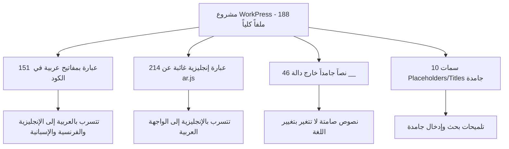
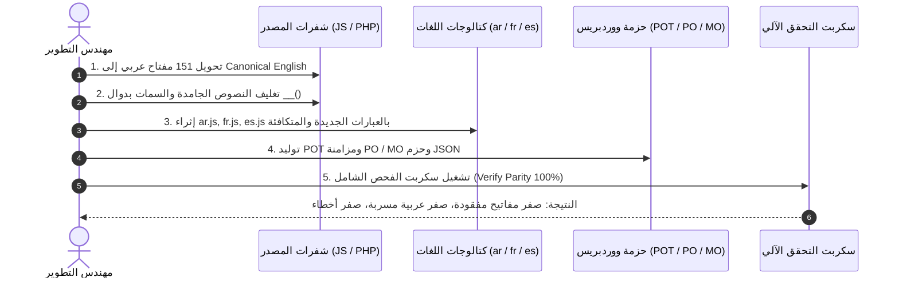

# خطة العمل الشاملة لإصلاح وتوحيد نظام اللغات والترجمة في كامل المشروع
## WorkPress Full-Codebase i18n & Multilingual Parity Remediation Plan (v2.5.1)

> **الإصدار المستهدف:** WorkPress Core v2.5.1  
> **تاريخ الوثيقة:** 2026-09-04  
> **حالة الخطة:** جاهزة للمراجعة والاعتماد (Ready for Review & Decision)  
> **نطاق الفحص:** 188 ملفاً برمجياً شملت كامل الشفرات (56 ملف PHP + 132 ملف JavaScript)  
> **مسار الملف في المشروع:** [`docs/plans/FULL_CODEBASE_I18N_AND_MULTILINGUAL_REMEDIATION_PLAN.md`](file:///c:/laragon/www/WORKPRESS/wp-content/plugins/WorkPress/docs/plans/FULL_CODEBASE_I18N_AND_MULTILINGUAL_REMEDIATION_PLAN.md)

---

## 1. الملخص التنفيذي والأهداف الاستراتيجية

أظهر الفحص الذري الشامل لكافة شفرات المنظومة (188 ملفاً) أن WorkPress يمتلك بنية تحتية هندسية متينة للترجمة (محرك `i18n.js` وكتالوجات تضم 2,182 مصطلحاً لكل لغة)، إلا أن التحديثات المتسارعة الأخيرة أدت إلى حدوث **انفصام في معيار المفاتيح الدولية** نتج عنه ثلاثة اختلالات واضحة:

1. **الواجهة العربية:** يظهر بها **214 مصطلحاً وظيفياً باللغة الإنجليزية** لعدم إدراجها في كتالوج `ar.js` (مثل أشرطة الإجراءات المجمعة، بطاقات المساهمات، وتنبيهات المهام المتأخرة).
2. **الواجهات الإنجليزية والفرنسية والإسبانية:** يظهر بها **151 مصطلحاً باللغة العربية** لأنها كُتبت في الكود بمفاتيح عربية مباشرة `__('نص عربي')` بدلاً من المفتاح المعياري الإنجليزي (`Canonical msgid`).
3. **نصوص جامدة (Hardcoded):** وجود **46 نصاً** في القوالب و **10 سمات حقول (Placeholders / Titles)** كُتبت كنصوص صريحة دون تغليفها بدالة الترجمة `__()`.

### 🎯 الأهداف الصارمة للخطة (Zero-Defect Standard):
* **عربية فصحى خالصة 100%:** القضاء التام على أي تسرب لأي كلمة وظيفية أو زر بالإنجليزية عند اختيار العربية.
* **إنجليزية وفرنسية وإسبانية متكاملة 100%:** انعدام ظهور أي كلمة أو حرف عربي عند تشغيل المنظومة بأي لغة من اللغات الثلاث.
* **توحيد معيار الـ msgid:** جعل المفتاح الأساسي دائماً هو الإنجليزية الفصحى القياسية لتتوافق مع معايير WordPress الدولية ومحررات الترجمة الرسمية (`POT` / `PO` / `MO`).
* **تغذية متزامنة ومتكافئة للكتالوجات الأربعة:** (`ar.js`, `fr.js`, `es.js`, و `workpress.pot`).

---

## 2. مصفوفة التشخيص الذري (Diagnostic Matrix)

### التوزيع العددي للإصلاحات حسب نوع الملف:

| المقياس | لغة PHP (56 ملفاً) | لغة JS (132 ملفاً) | الإجمالي الكلي | التأثير على تجربة المستخدم |
| :--- | :---: | :---: | :---: | :--- |
| **مفاتيح عربية مباشرة (Arabic msgid)** | 2 | 149 | **151** | ظهور العربية في واجهات اللغات الأجنبية |
| **عبارات غائبة عن الكتالوج العربي (`ar.js`)** | 24 | 190 | **214** | ظهور الإنجليزية داخل الواجهة العربية |
| **نصوص جامدة بدون تغليف (`Hardcoded`)** | 3 | 43 | **46** | عدم استجابة النص عند التبديل اللغوي |
| **سمات حقول غير مغلفة (`Placeholders/Titles`)** | 0 | 10 | **10** | بقاء التلميحات بلغة أحادية جامدة |

---

## 3. حصر الملفات الـ 14 المتأثرة بالمفاتيح العربية وخطة توحيدها

فيما يلي قائمة الملفات الـ 14 التي تحتوي على مفاتيح عربية مباشرة، مع توضيح أمثلة المفاتيح الحالية وما سيتم تحويلها إليه وفق المعيار الإنجليزي المعياري (`Canonical msgid`):

| # | الملف المصدر | العدد | العبارة الحالية (مفتاح عربي) | المفتاح المعياري المعتمد (`Canonical msgid`) |
| :-: | :--- | :-: | :--- | :--- |
| 1 | [`QuickAddMenu.js`](file:///c:/laragon/www/WORKPRESS/wp-content/plugins/WorkPress/assets/src/components/ui/QuickAddMenu.js) | 16 | `مشروع جديد` `مهمة جديدة` `توجيه إداري / إعلان` `حل معتمد / مساهمة` `طلب استقبال / مبادرة` `أصل معرفي / توثيق` | `New Project` `New Task` `Managerial Directive / Broadcast` `Verified Solution / Contribution` `Intake Form Request` `Knowledge Asset / Documentation` |
| 2 | [`BroadcastsPage.js`](file:///c:/laragon/www/WORKPRESS/wp-content/plugins/WorkPress/assets/src/pages/BroadcastsPage.js) | 58 | `عاجل ومهم` `توجيهات إدارية` `كل النشريات والتنبيهات` `النشريات النشطة حالياً` `توجيهات الإدارة العليا` | `Urgent & Critical` `Managerial Directives` `All Broadcasts & Alerts` `Currently Active Broadcasts` `Executive Management Directives` |
| 3 | [`BroadcastModal.js`](file:///c:/laragon/www/WORKPRESS/wp-content/plugins/WorkPress/assets/src/components/broadcasts/BroadcastModal.js) | 24 | `تعديل التوجيه الإداري` `نشر توجيه إداري جديد` `عنوان التوجيه أو الإعلان` `مستوى الأهمية والظهور` | `Edit Managerial Directive` `Publish New Managerial Directive` `Directive Title or Announcement` `Priority & Visibility Level` |
| 4 | [`BroadcastDetailModal.js`](file:///c:/laragon/www/WORKPRESS/wp-content/plugins/WorkPress/assets/src/components/broadcasts/BroadcastDetailModal.js) | 17 | `الدخول إلى صفحة الإعلانات والتنبيهات` `المرسل:` `التاريخ:` `ينتهي في:` | `Enter Broadcasts & Alerts Hub` `Sender:` `Date:` `Expires at:` |
| 5 | [`BroadcastTicker.js`](file:///c:/laragon/www/WORKPRESS/wp-content/plugins/WorkPress/assets/src/components/ui/BroadcastTicker.js) | 11 | `عاجل` `تنبيه` `إعلان` `إنجاز` `مركز النشريات والتنبيهات التشغيلية` | `Urgent` `Warning` `Notice` `Celebration` `Broadcasts & Operational Alerts Hub` |
| 6 | [`ContributionCard.js`](file:///c:/laragon/www/WORKPRESS/wp-content/plugins/WorkPress/assets/src/components/contributions/ContributionCard.js) | 3 | `مضى على التقديم:` `معتمد كحل رسمي` `قيد المراجعة والتحقق` | `Elapsed since submission:` `Approved as official solution` `Under review and verification` |
| 7 | [`ProjectCard.js`](file:///c:/laragon/www/WORKPRESS/wp-content/plugins/WorkPress/assets/src/components/projects/ProjectCard.js) | 4 | `استغرق العمل:` `أُنجز في:` `متأخر عن الموعد` `الوقت المتبقي:` | `Work took:` `Completed in:` `Overdue` `Remaining time:` |
| 8 | [`RequestFilterBar.js`](file:///c:/laragon/www/WORKPRESS/wp-content/plugins/WorkPress/assets/src/components/requests/RequestFilterBar.js) | 1 | `نماذج الاستقبال` | `Intake Forms` |
| 9 | [`Breadcrumb.js`](file:///c:/laragon/www/WORKPRESS/wp-content/plugins/WorkPress/assets/src/components/ui/Breadcrumb.js) | 1 | `مركز النشريات والتنبيهات` | `Broadcasts & Alerts Hub` |
| 10 | [`App.js`](file:///c:/laragon/www/WORKPRESS/wp-content/plugins/WorkPress/assets/src/App.js) | 2 | `CoWorkPress — العودة إلى لوحة التحكم الرئيسية` `مركز النشريات والتنبيهات التشغيلية` | `CoWorkPress — Return to main dashboard` `Broadcasts & Operational Alerts` |
| 11 | [`class-workpress-admin.php`](file:///c:/laragon/www/WORKPRESS/wp-content/plugins/WorkPress/includes/admin/class-workpress-admin.php) | 1 | `مرحباً بكم في WorkPress — يرجى توثيق إنجازاتكم...` | `Welcome to WorkPress — please document your achievements via contributions and keep tasks updated.` |
| 12 | [`class-workpress-rest-settings-controller.php`](file:///c:/laragon/www/WORKPRESS/wp-content/plugins/WorkPress/includes/api/class-workpress-rest-settings-controller.php) | 1 | `مرحباً بكم في WorkPress — يرجى توثيق إنجازاتكم...` | `Welcome to WorkPress — please document your achievements via contributions and keep tasks updated.` |
| 13 | [`notification-bell.js`](file:///c:/laragon/www/WORKPRESS/wp-content/plugins/WorkPress/assets/src/modules/notifications/notification-bell.js) | 2 | `مراجعة طلب الحذف في سلة المهملات` `تحديد كمقروء` | `Review trash request` `Mark as read` |
| 14 | [`datetime.js`](file:///c:/laragon/www/WORKPRESS/wp-content/plugins/WorkPress/assets/src/utils/datetime.js) | 1 | `'الآن'` | `Just now` |

---

## 4. حصر العبارات الـ 214 الغائبة عن الكتالوج العربي (`ar.js`)

تتوزع العبارات الإنجليزية الموجودة في الكود والتي لا تملك ترجمة في `ar.js` حالياً على المكونات الحيوية التالية:

### أ. في شفرات الـ JavaScript (190 عبارة):
* **شريط الإجراءات المجمعة للمساهمات (`ContributionBulkBar.js`):**
  * `"%d Selected"` ⬅️ `"%d عنصر محدد"`
  * `"Actions for selected items:"` ⬅️ `"إجراءات العناصر المحددة:"`
  * `"Bulk Verify & Complete"` ⬅️ `"اعتماد وإكمال مجمع"`
  * `"Bulk Delete"` ⬅️ `"حذف مجمع"`
  * `"Cancel selection"` ⬅️ `"إلغاء التحديد"`
* **بطاقات المساهمات والمشاريع والمهام (`ContributionCard.js`, `ProjectCard.js`, `TaskCard.js`):**
  * `"Trash Request Pending"` ⬅️ `"طلب نقل للسلة قيد الانتظار"`
  * `"Requested by author"` ⬅️ `"مقدم من الكاتب الأصلي"`
  * `"Restore"` ⬅️ `"استعادة"`
  * `"Task #"` ⬅️ `"مهمة رقم #"`
  * `"Submitted: %s %s %s %s"` ⬅️ `"تم التقديم: %s %s %s %s"`
  * `"System Log"` ⬅️ `"سجل النظام"`
  * `"Select for bulk action"` ⬅️ `"تحديد لإجراء مجمع"`
  * `"Preview full details"` ⬅️ `"معاينة كامل التفاصيل"`
  * `"More Options"` ⬅️ `"خيارات إضافية"`
* **محرك الإشعارات وبوابة الدخول (`toast.js`, `auth-app.js`):**
  * `"Close all"` ⬅️ `"إغلاق الكل"`
  * `"Dismiss notification"` ⬅️ `"إغلاق الإشعار"`
  * `"Sign In"` ⬅️ `"تسجيل الدخول"`
  * `"Username or Email"` ⬅️ `"اسم المستخدم أو البريد الإلكتروني"`
  * `"Password"` ⬅️ `"كلمة المرور"`
  * `"Remember Me"` ⬅️ `"تذكر بيانات دخولي"`
  * `"Lost your password?"` ⬅️ `"هل فقدت كلمة المرور؟"`
  * `"Access Workspace"` ⬅️ `"دخول مساحة العمل"`
  * `"Send reset link"` ⬅️ `"إرسال رابط الاستعادة"`

### ب. في خدمات وشفرات PHP الخلفية (24 عبارة):
* **خدمة النشريات والتنبيهات التشغيلية (`class-workpress-broadcast-service.php`):**
  * `"Broadcast message content is required."` ⬅️ `"محتوى نص النشرية الإدارية مطلوب."`
  * `"Broadcast not found."` ⬅️ `"لم يتم العثور على النشرية المطلوبة."`
  * `"Overdue task: %d task requires immediate follow-up"` ⬅️ `"مهمة متأخرة: %d مهمة تتطلب متابعة فورية"`
  * `"Task \"%1$s\" and %2$d other items have passed their deadlines without completion."` ⬅️ `"المهمة \"%1$s\" و %2$d عناصر أخرى تجاوزت الموعد النهائي دون اكتمال."`
  * `"Upcoming deadline: \"%s\""` ⬅️ `"اقتراب موعد نهائي: \"%s\""`
  * `"Task \"%s\" is due on %s. Please review work progress."` ⬅️ `"المهمة \"%s\" تستحق في %s. يرجى مراجعة تقدم العمل."`
  * `"New incoming request: \"%s\""` ⬅️ `"طلب استقبال عميل جديد: \"%s\""`
  * `"There are %d incoming client requests awaiting review and triage."` ⬅️ `"يوجد %d طلبات استقبال بانتظار المراجعة والفرز."`
* **سجل الصلاحيات والتثبيت (`class-workpress-capabilities-registry.php`, `class-workpress-install.php`):**
  * `"Manage managerial broadcasts and operational alert rules"` ⬅️ `"إدارة النشريات والتوجيهات وقواعد التنبيهات التشغيلية"`
  * `"Language preference updated successfully."` ⬅️ `"تم تحديث تفضيل اللغة بنجاح."`

---

## 5. مراحل خطة التنفيذ المنهجية (Implementation Plan Roadmap)

تتألف خطة التنفيذ من **5 مراحل متسلسلة ومترابطة** لضمان أعلى مستويات الدقة الهندسية:

### 📍 المرحلة الأولى: تحويل شفرات المصدر إلى معيار الإنجليزية المعياري (`Canonical msgid`)
* **الهدف:** إزالة أي نص عربي يعمل كمفتاح استدعاء أولي في `__()` عبر الـ 14 ملفاً المحددة.
* **الإجراء:**
  1. استبدال النصوص في `QuickAddMenu.js`، `BroadcastsPage.js`، `BroadcastModal.js`، `BroadcastDetailModal.js`، `BroadcastTicker.js`.
  2. استبدال النصوص في `ContributionCard.js`، `ProjectCard.js`، `RequestFilterBar.js`، `Breadcrumb.js`، `App.js`.
  3. استبدال النصوص في ملفات PHP الإدارية (`class-workpress-admin.php`, `class-workpress-rest-settings-controller.php`).

### 📍 المرحلة الثانية: تغليف النصوص الثابتة والسمات غير المترجمة
* **الهدف:** إخضاع كل حرف في الواجهات لآلية التبديل اللغوي الفوري.
* **الإجراء:**
  1. تعديل شاشة الدخول الموحد [`auth-app.js`](file:///c:/laragon/www/WORKPRESS/wp-content/plugins/WorkPress/assets/src/auth/auth-app.js) وتغليف كافة حقول الإدخال والـ placeholders.
  2. تعديل حساب الوقت النسبي [`datetime.js`](file:///c:/laragon/www/WORKPRESS/wp-content/plugins/WorkPress/assets/src/utils/datetime.js) واستبدال `'الآن'` بـ `__( 'Just now', 'workpress' )`.
  3. تعديل نظام التنبيهات [`toast.js`](file:///c:/laragon/www/WORKPRESS/wp-content/plugins/WorkPress/assets/src/utils/toast.js) لتغليف أزرار الإغلاق.
  4. تغليف رسائل الخطأ في وحدات الـ API الخاصة بالتطوير والتصدير.

### 📍 المرحلة الثالثة: إثراء ومطابقة الكتالوجات الثلاثة (`ar.js`, `fr.js`, `es.js`)
* **الهدف:** توفير الترجمات المقابلة بنسبة 100% لكل مفتاح إنجليزي في النظام.
* **الإجراء:**
  1. كتابة وإدراج الترجمات العربية الفصحى في [`ar.js`](file:///c:/laragon/www/WORKPRESS/wp-content/plugins/WorkPress/assets/src/utils/translations/ar.js) (لكافة الـ 214 مفتاحاً المفقودة + مفاتيح النشريات والإضافة السريعة).
  2. كتابة وإدراج الترجمات الفرنسية المهنية الدقيقة في [`fr.js`](file:///c:/laragon/www/WORKPRESS/wp-content/plugins/WorkPress/assets/src/utils/translations/fr.js).
  3. كتابة وإدراج الترجمات الإسبانية المهنية الدقيقة في [`es.js`](file:///c:/laragon/www/WORKPRESS/wp-content/plugins/WorkPress/assets/src/utils/translations/es.js).
  4. التحقق من سلامة بناء ملفات الـ JS عبر `node --check`.

### 📍 المرحلة الرابعة: تحديث حزمة ووردبريس الدولية (POT / PO / MO / JSON)
* **الهدف:** التوافق الكامل مع أدوات التعريب الخارجية مثل Loco Translate ومعايير WordPress الرسمية.
* **الإجراء:**
  1. إعادة استخراج ملف القالب الأساسي `languages/workpress.pot` ليشمل 100% من السلاسل النصية للـ PHP والـ JS.
  2. تحديث وتجميع ملفات `languages/workpress-ar.po` و `.mo`.
  3. تحديث وتجميع ملفات `languages/workpress-fr_FR.po` و `.mo`.
  4. تحديث وتجميع ملفات `languages/workpress-es_ES.po` و `.mo`.

### 📍 المرحلة الخامسة: الاختبار والتحقق الآلي الصارم (Zero-Defect Automated Audit)
* **الهدف:** برهان حسابي قطعي على خلو النظام من أي تسرب لغوي أو مفتاح ناقص.
* **الإجراء:**
  1. بناء وتشغيل سكربت الفحص الآلي `scratch/verify_i18n_full_parity.php`.
  2. التأكد من أن:
     * عدد المفاتيح العربية في الكود = **0**.
     * عدد المفاتيح الإنجليزية غير المترجمة في `ar.js` = **0**.
     * عدد المفاتيح غير المترجمة في `fr.js` = **0**.
     * عدد المفاتيح غير المترجمة في `es.js` = **0**.
     * اجتياز فحص `node --check` وفحص `php -l` لجميع الملفات المعدلة بنجاح تام.

---

## 6. جدول القرارات والموافقة (Decision & Approval Table)

> [!IMPORTANT]
> **التزام الأداء والموارد:**  
> بناءً على توجيهكم الكريم الصارم: **لن يتم استخدام المتصفح نهائياً (No Browser)** لتوفير الموارد بالكامل، وسيعتمد التحقق بنسبة 100% على سكربتات التدقيق الذرية واختبارات الصحة اللغوية والتجميع البرمجي عبر سطر الأوامر.

**خيارات القرار:**
1. **اعتماد الخطة والبدء في التنفيذ الشامل فوراً (الموصى به):**
   - البدء بتنفيذ المراحل الخمس تباعاً والوصول إلى نسبة تطابق 100% بين اللغات الأربع.
2. **تعديل نطاق معين:**
   - في حال رغبتكم في إضافة معايير أو تعديل أي مصطلحات محددة في الخطة.
