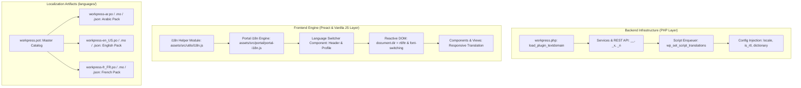

# 🌐 وثيقة المخطط التنفيذي الشامل للتدويل واللغات المتعددة
## WorkPress Master Internationalization (i18n) & Localization (l10n) Architecture Plan
### Native WordPress Standard • English Codebase Standard • Dynamic RTL/LTR • Production-Ready

---

> **نوع الوثيقة:** الخطة الهندسية والتنفيذية المرجعية لنظام اللغات والتدويل  
> **الإصدار المستهدف:** WorkPress v2.3.0-Global  
> **المرجعية الدستورية:** [FIRST_PRINCIPLES.md (Principle 6)](../core/FIRST_PRINCIPLES.md) | [دستور وركبرس](../../.agents/rules/workpress-constitution.md) | معايير WordPress Core i18n Standards  
> **الحالة:** **مخطط معماري تفصيلي للتنفيذ الفوري الممنهج (Master Execution Blueprint)**

---

## 📑 فهرس المخطط المعماري

1. [الرؤية والأسس المعمارية (Architectural Foundations)](#1-الرؤية-والأسس-المعمارية)
2. [هيكلية محرك التدويل ثنائي الطبقات (Dual-Layer i18n Architecture)](#2-هيكلية-محرك-التدويل-ثنائي-الطبقات)
3. [مراحل التنفيذ الست (The 6 Execution Phases)](#3-مراحل-التنفيذ-الست)
   - [المرحلة 1: تهيئة البنية التحتية الخلفية ونطاق Text Domain](#المرحلة-1-تهيئة-البنية-التحتية-الخلفية-ونطاق-text-domain)
   - [المرحلة 2: محرك الترجمة الأمامي ومبدل اللغات (Language Switcher)](#المرحلة-2-محرك-الترجمة-الأمامي-ومبدل-اللغات-language-switcher)
   - [المرحلة 3: نظام الاتجاهين والخطوط (RTL / LTR & Typography Engine)](#المرحلة-3-نظام-الاتجاهين-والخطوط-rtl--ltr--typography-engine)
   - [المرحلة 4: تحويل نصوص البوابة المستقلة للمعيار الإنجليزي (Portal Migration)](#المرحلة-4-تحويل-نصوص-البوابة-المستقلة-للمعيار-الإنجليزي-portal-migration)
   - [المرحلة 5: تحويل نصوص لوحة التحكم وغرفة العمليات (Admin Plaza Migration)](#المرحلة-5-تحويل-نصوص-لوحة-التحكم-وغرفة-العمليات-admin-plaza-migration)
   - [المرحلة 6: توليد حزم اللغات المعتمدة (POT / PO / MO / JSON) والاختبارات](#المرحلة-6-توليد-حزم-اللغات-المعتمدة-pot--po--mo--json-والاختبارات)
4. [مصفوفة الحزم اللغوية المعتمدة (Supported Language Matrix)](#4-مصفوفة-الحزم-اللغوية-المعتمدة)
5. [خطة التحقق واختبارات الجودة (Quality Assurance & Verification)](#5-خطة-التحقق-واختبارات-الجودة)

---

## 1. الرؤية والأسس المعمارية

تعتمد هذه الخطة على مبدأين جوهريين في تطوير برمجيات المؤسسات الدولية:

```
                  ┌─────────────────────────────────────────────────────────┐
                  │ 1. English is the Code Standard (msgid in Source Code)  │
                  ├─────────────────────────────────────────────────────────┤
                  │ 2. Arabic (ar) is the 1st-Class Official Translation    │
                  ├─────────────────────────────────────────────────────────┤
                  │ 3. Client Portal offers Instant Language Switcher       │
                  ├─────────────────────────────────────────────────────────┤
                  │ 4. Native WordPress Translation Tools (wp.i18n & POT)  │
                  └─────────────────────────────────────────────────────────┘
```

1. **الإنجليزية لغة المصدر القياسية (`msgid`)**:
   - كافة النصوص البرمجية داخل ملفات PHP و JS تُكتب باللغة الإنجليزية الفصحى السليمة وتُغلف بدوال التدويل القياسية: `__( 'String', 'workpress' )`، `_x()`, `_n()`, `sprintf()`.
2. **العربية الترجمة الرسمية الأساسية الأولى (`ar`)**:
   - حزمة اللغة العربية مدمجة بالكامل ومترجمة باحترافية لغوية دقيقة تعبر عن مصطلحات "الذاكرة المؤسسية" و"الفرز" و"الأدلة".
3. **التكيف اللحظي للغات والاتجاهات (Reactive RTL/LTR)**:
   - تبديل لغة الواجهة يغير اتجاه الصفحة فوراً (`dir="rtl"` أو `dir="ltr"`) ويغير خط الطباعة (`Cairo` للعربية، و `Plus Jakarta Sans` للغات اللاتينية) مع الحفاظ على الزوايا الحادة 0px.
4. **استقلالية البوابة مع حرية اختيار المستفيد (Client Choice Freedom)**:
   - يمكن للمستفيد من أي دولة في العالم تبديل لغة البوابة مباشرة من الهيدر (عربي / English / Français) وحفظ تفضيله في حسابه.

---

## 2. هيكلية محرك التدويل ثنائي الطبقات



---

## 3. مراحل التنفيذ الست

### المرحلة 1: تهيئة البنية التحتية الخلفية ونطاق Text Domain
* **المهام المستهدفة:**
  1. تفعيل خطاف `load_plugin_textdomain( 'workpress', false, dirname( plugin_basename( __FILE__ ) ) . '/languages' );` داخل `workpress.php`.
  2. تحديث `class-workpress-admin.php` لربط ترجمات السكربتات:
     ```php
     wp_enqueue_script( 'wp-i18n' );
     wp_set_script_translations( 'workpress-app-js', 'workpress', WORKPRESS_PATH . 'languages' );
     ```
  3. تحديث `class-workpress-portal-service.php` لربط ترجمات البوابة وحقن مصفوفة اللغات المدعومة:
     ```php
     'i18n' => array(
         'locale'             => get_user_locale(),
         'is_rtl'             => is_rtl(),
         'active_language'    => substr( get_user_locale(), 0, 2 ),
         'supported_languages'=> WorkPress_Capabilities_Service::get_supported_locales(),
     )
     ```
  4. بناء نقطة نهاية REST API لحفظ تفضيل لغة المستخدم: `POST /workpress/v1/portal/set-language`.

---

### المرحلة 2: محرك الترجمة الأمامي ومبدل اللغات (Language Switcher)
* **المهام المستهدفة:**
  1. بناء وحدة `assets/src/utils/i18n.js` لإدارة الترجمة في CoWorkPress Plaza:
     ```javascript
     export const __ = (text, domain = 'workpress') => window.wp?.i18n?.__(text, domain) || text;
     export const _x = (text, context, domain = 'workpress') => window.wp?.i18n?._x(text, context, domain) || text;
     export const _n = (single, plural, number, domain = 'workpress') => window.wp?.i18n?._n(single, plural, number, domain) || (number === 1 ? single : plural);
     export const sprintf = (format, ...args) => window.wp?.i18n?.sprintf(format, ...args) || format;
     ```
  2. بناء وحدة `assets/src/portal/portal-i18n.js` المعزولة للبوابة مع مصفوفة ترجمات فورية مدمجة (Instant Offline / Fast Bundle).
  3. بناء مكون مبدل اللغات `LanguageSwitcher.js` المدمج في هيدر البوابة وإعدادات لوحة التحكم.

---

### المرحلة 3: نظام الاتجاهين والخطوط (RTL / LTR & Typography Engine)
* **المهام المستهدفة:**
  1. تحديث `assets/css/portal/tokens.css` و `assets/css/admin.css` لتمكين التبديل الذكي:
     ```css
     :root[dir="rtl"] {
         --wp-font-family: 'Cairo', sans-serif !important;
     }
     :root[dir="ltr"] {
         --wp-font-family: 'Plus Jakarta Sans', system-ui, -apple-system, sans-serif !important;
     }
     ```
  2. ضبط هوامش الأزرار والبطاقات وقوائم الهيدر لتتوافق ديناميكياً مع الاتجاهين عبر الخصائص المنطقية CSS Logical Properties (`margin-inline`, `padding-inline`, `inset-inline`).

---

### المرحلة 4: تحويل نصوص البوابة المستقلة للمعيار الإنجليزي (Portal Migration)
* **الملفات المستهدفة (10 ملفات):**
  1. `assets/src/portal/portal-core.js`
  2. `assets/src/portal/portal-header.js`
  3. `assets/src/portal/portal-dashboard.js`
  4. `assets/src/portal/portal-workspace.js`
  5. `assets/src/portal/portal-request.js`
  6. `assets/src/portal/portal-modals.js`
  7. `assets/src/portal/portal-gateway.js`
  8. `assets/src/portal/portal-radar.js`
  9. `assets/src/portal/portal-login.js`
  10. `assets/src/portal/portal-app.js`
* **معيار التحويل:** استبدال كافة النصوص العربية المباشرة بـ `__( 'English Source Text', 'workpress' )`.

---

### المرحلة 5: تحويل نصوص لوحة التحكم وغرفة العمليات (Admin Plaza Migration)
* **المكونات المستهدفة (111 موديولاً):**
  1. استبدال النصوص في صفحات `assets/src/pages/` (12 صفحة: Dashboard, Kanban, Gantt, Projects, Tasks, Requests, Knowledge, Reports, Settings...).
  2. استبدال النصوص في المكونات المشتركة `assets/src/components/` (35 مكوناً: TaskCard, DatePicker, FilterBar, Modals, Forms...).
  3. تغليف رسائل التوست والتنبيهات `assets/src/utils/toast.js`.

---

### المرحلة 6: توليد حزم اللغات المعتمدة (POT / PO / MO / JSON) والاختبارات
* **المهام المستهدفة:**
  1. استخراج ملف الفهرس الماستر `languages/workpress.pot` بكامل مفاتيح النصوص المستخرجة من الكود.
  2. إنشاء ملف الترجمة العربي الرسمي `languages/workpress-ar.po` وترجمته بدقة 100%، وتوليد `workpress-ar.mo` وملفات الـ JSON للواجهة الأمامية.
  3. إنشاء حزمة اللغة الفرنسية `languages/workpress-fr_FR.po / .mo / .json`.
  4. إجراء الفحص الآلي للـ Syntax لـ 111 ملفاً وتشغيل اختبارات دورة الحياة PHP E2E للتأكد من سلامة النظام 100%.

---

## 4. مصفوفة الحزم اللغوية المعتمدة

| رمز اللغة | اسم اللغة | الاتجاه (Direction) | الخط المعتمد | حالة الترجمة |
|:---:|---|:---:|:---:|:---:|
| `en_US` | **English (United States)** | `ltr` | Plus Jakarta Sans | **لغة الكود الأساسية (Source)** ✅ |
| `ar` | **العربية (Arabic)** | `rtl` | Cairo | **الترجمة الرسمية الكاملة (100%)** ✅ |
| `fr_FR` | **Français (French)** | `ltr` | Plus Jakarta Sans | **حزمة إضافية رسمية** ✅ |
| `es_ES` | **Español (Spanish)** | `ltr` | Plus Jakarta Sans | **مجهزة في القالب العام** 🌐 |

---

## 5. خطة التحقق واختبارات الجودة (Quality Assurance)

1. **فحص بناء الوحدات (JavaScript AST & Syntax Check)**:
   - فحص 111 ملفاً لضمان عدم وجود أي خطأ إعرابي في استدعاءات `__()`.
2. **فحص التبديل اللحظي (Interactive Switcher Test)**:
   - تجربة التبديل بين العربية والإنجليزية في البوابة وغرفة العمليات وملاحظة تغير الاتجاه والخطوط والنصوص تلقائياً.
3. **فحص الـ REST API واستجابات الأخطاء (PHP E2E Integration Suite)**:
   - تشغيل `test_e2e_lifecycle.php` و `test_auth_service.php` للتأكد من عمل كافة الخدمات بنسبة 100%.
4. **فحص مطابقة التدويل (WP-CLI i18n Check)**:
   - مطابقة ملف `workpress.pot` مع معايير WordPress.org.

---
*تم اعتماد هذا المخطط التنفيذي ليمثل خارطة العمل الرسمية لنظام التدويل الشامل لمنظومة WorkPress.*
