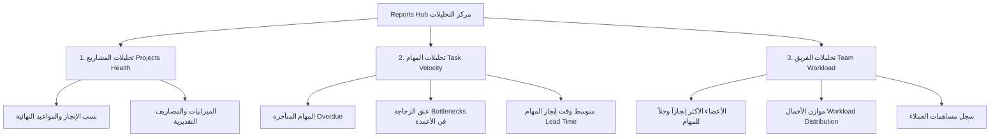

# 📊 وثيقة المخطط الاستراتيجي لتطوير نظام التقارير والمساهمات ومعمارية الواجهات
## WorkPress Reports, Contributions & UI Architecture Evolution Plan
### Multi-Domain Analytics • Enterprise Scalability • Unified Architecture • Production-Ready

---

> **نوع الوثيقة:** مخطط استراتيجي وتحليلي لتطوير وتوسيع الأنظمة التشغيلية في WorkPress  
> **الموقع:** `docs/plans/REPORTS_CONTRIBUTIONS_AND_UI_EVOLUTION_PLAN.md`  
> **الإصدار المستهدف:** WorkPress v2.3.0+  
> **المرجعية الدستورية:** [FIRST_PRINCIPLES.md](../core/FIRST_PRINCIPLES.md) | [دستور وركبرس](../../.agents/rules/workpress-constitution.md)  
> **الحالة:** **مقترح قيد المراجعة وصنع القرار (Under Review & Decision)**

---

## 📑 فهرس المخطط

1. [الرؤية والمنطلقات الاستراتيجية (Executive Vision)](#1-الرؤية-والمنطلقات-الاستراتيجية)
2. [المحور الأول: تحويل التقارير إلى "مركز تحليلات متكامل" (Analytics Hub)](#2-المحور-الأول-تحويل-التقارير-إلى-مركز-تحليلات-متكامل)
   - [2.1 تحليلات صحة المشاريع والميزانيات (Project Health & Financials)](#21-تحليلات-صحة-المشاريع-والميزانيات)
   - [2.2 تحليلات سرعة المهام وعنق الزجاجة (Task Velocity & Bottlenecks)](#22-تحليلات-سرعة-المهام-وعنق-الزجاجة)
   - [2.3 تحليلات أداء الفريق وموازن الأحمال (Team Workload Balancer)](#23-تحليلات-أداء-الفريق-وموازن-الأحمال)
   - [2.4 محرك التصدير التنفيذي (PDF, Excel, Print Engine)](#24-محرك-التصدير-التنفيذي)
3. [المحور الثاني: ترقية تدفق المساهمات والحوكمة الرقمية (Contributions & Governance)](#3-المحور-الثاني-ترقية-تدفق-المساهمات-والحوكمة-الرقمية)
   - [3.1 الترقيم من جانب الخادم (Server-Side Pagination & High Volume)](#31-الترقيم-من-جانب-الخادم)
   - [3.2 العمليات الجماعية (Bulk Governance Actions)](#32-العمليات-الجماعية)
   - [3.3 التفاعل والملاحظات داخل نافذة المعاينة المباشرة](#33-التفاعل-والملاحظات-داخل-نافذة-المعاينة-المباشرة)
4. [المحور الثالث: المعمارية المركزية للواجهات (Unified Component Architecture)](#4-المحور-الثالث-المعمارية-المركزية-للواجهات)
   - [4.1 المكون الأب المجرد لأشرطة الأدوات (`UnifiedToolbar`)](#41-المكون-الأب-المجرد-لأشرطة-الأدوات)
   - [4.2 ترسيخ هندسة القوائم المنسدلة والسهم الموحد عالمياً](#42-ترسيخ-هندسة-القوائم-المنسدلة-والسهم-الموحد-عالمياً)
5. [المحور الرابع: الأداء، التخزين المؤقت، وأتمتة كسر الكاش (Performance & Automation)](#5-المحور-الرابع-الأداء-التخزين-المؤقت-وأتمتة-كسر-الكاش)
   - [5.1 كسر الكاش الآلي بالكامل (Automated PHP Cache Buster)](#51-كسر-الكاش-الآلي-بالكامل)
   - [5.2 تحسين استدعاءات REST API والذاكرة المؤقتة (SWR / React Cache)](#52-تحسين-استدعاءات-rest-api-والذاكرة-المؤقتة)
6. [مصفوفة الأثر مقابل الجهد وسجل القرارات (Impact vs Effort & Decision Matrix)](#6-مصفوفة-الأثر-مقابل-الجهد-وسجل-القرارات)

---

## 1. الرؤية والمنطلقات الاستراتيجية

تستند هذه الخطة إلى الملاحظات الدقيقة المستخلصة أثناء تطوير واجهات `WorkPress`، وتهدف إلى الانتقال بالتطبيق من مجرد "لوحة إدارة مشاريع" إلى **"منظومة تشغيل مؤسسية متكاملة" (Enterprise Operating System)** تضمن:

```
┌───────────────────────────────────────────────────────────────────────────┐
│                           ركائز التطوير المستقبلية                          │
├─────────────────────┬──────────────────────┬──────────────────────────────┤
│ 1. الشمولية التحليلية │ 2. الأداء الفائق     │ 3. الحوكمة المركزية والتلقائية│
│ توسيع التقارير لتشمل │ معالجة آلاف المساهمات│ كسر كاش آلي، أشرطة موحدة،    │
│ مشاريع، مهام، وأعضاء │ بـ Server Pagination │ وإجراءات جماعية بلمسة واحدة  │
└─────────────────────┴──────────────────────┴──────────────────────────────┘
```

---

## 2. المحور الأول: تحويل التقارير إلى "مركز تحليلات متكامل"

> [!NOTE]
> صفحة التقارير الحالية توفر نظرة تنفيذية متميزة لنسب إنجاز المشاريع، لكن إدارة الوكالات والشركات تتطلب رؤية ثلاثية الأبعاد (المشروع + المهام + كفاءة الفريق).



### 2.1 تحليلات صحة المشاريع والميزانيات
- **الهدف:** مراقبة مسار كل مشروع بدقة.
- **المؤشرات المقترحة:**
  - نسبة الإنجاز الحقيقية بناءً على وزن المهام المكتملة.
  - مؤشر الخطر الزمني (`Time Slip Index`): مشاريع اقترب موعد تسليمها ولم تتجاوز 50%.
  - الميزانية المادية ومعدل استهلاك الساعات (إن فُعّل نظام الساعات).

### 2.2 تحليلات سرعة المهام وعنق الزجاجة
- **الهدف:** معرفة المرحلة التي تتعطل فيها المهام (مثلاً: مرحلة المراجعة أو انتظار موافقة العميل).
- **المؤشرات المقترحة:**
  - **مؤشر عنق الزجاجة (Bottleneck Radar):** كم يوماً تقضي المهمة في عمود "قيد المراجعة"؟
  - **مؤشر الدقة الفنية:** عدد المهام التي أُعيد فتحها بعد الرفض.

### 2.3 تحليلات أداء الفريق وموازن الأحمال
- **الهدف:** توزيع عادل للمهام ومنع الاحتراق الوظيفي (Burnout).
- **المؤشرات المقترحة:**
  - عدد المهام النشطة لكل عضو في اللحظة الراهنة.
  - عدد الحلول والمساهمات المعتمدة لكل عضو شهرياً.

### 2.4 محرك التصدير التنفيذي
- تصدير التقرير التنفيذي بضغطة زر إلى:
  - ملف **PDF** مهيأ للطباعة يحمل هوية وشعار المؤسسة.
  - ملف **Excel / CSV** للأرشفة والتحليل المحاسبي.

---

## 3. المحور الثاني: ترقية تدفق المساهمات والحوكمة الرقمية

### 3.1 الترقيم من جانب الخادم (Server-Side Pagination)
- **الوضع الحالي:** يتم جلب 150 مساهمة وتقسيمها في الـ Frontend (`contributions.slice(startIndex, endIndex)`).
- **التحسين المقترح:**
  - دعم تمرير `page` و `per_page` لـ `wp-json/workpress/v1/contributions`.
  - قراءة إجمالي السجلات من ترويسات الاستجابة `X-WP-Total` و `X-WP-TotalPages`.
  - **الفائدة:** التطبيق سيعمل بنفس السرعة الخاطفة حتى لو احتوت قاعدة البيانات على 50,000 مساهمة ومرفق صوتي أو برمجي.

### 3.2 العمليات الجماعية (Bulk Governance Actions)
- في نمط **الجدول التنفيذي (Table View)**:
  - إضافة خانات اختيار (`Checkbox`) لكل سطر مع خيار "تحديد الكل".
  - شريط إجراءات عائم يظهر عند تحديد عنصرين أو أكثر:
    - ✅ **اعتماد جماعي (Bulk Verify):** إغلاق واعتماد الحلول المحددة كحلول نهائية دفعة واحدة.
    - 📁 **نقل / أرشفة جماعية.**
    - 🗑️ **حذف جماعي آمن.**

### 3.3 التفاعل والملاحظات داخل نافذة المعاينة المباشرة
- تمكين المشرف أو العميل من كتابة ملاحظة توجيهية فورية لصاحب المساهمة مباشرة من نافذة المعاينة [ContributionDetailModal.js](file:///c:/laragon/www/WORKPRESS/wp-content/plugins/WorkPress/assets/src/components/contributions/ContributionDetailModal.js) دون الحاجة لمغادرة الصفحة نحو تفاصيل المهمة.

---

## 4. المحور الثالث: المعمارية المركزية للواجهات

### 4.1 المكون الأب المجرد لأشرطة الأدوات (`UnifiedToolbar`)
- **الملاحظة:** أصبح لدينا أشرطة أدوات متناسقة بصرياً بنسبة 100%:
  - `ReportFilterBar.js`
  - `ContributionFilterBar.js`
  - `RequestFilterBar.js`
  - `GanttScaleBar.js`
- **فرصة المعمارية:**
  - بناء مكوّن أساسي: `<UnifiedToolbar sectionStart={...} sectionEnd={...} />`.
  - المكون يتولى تلقائياً:
    - الحسابات مع البورتال `#wp-filterbar-portal-root`.
    - التجاوب مع شاشات الجوال والشاشات العريضة.
    - الفواصل والمحاذاة القياسية `padding: 0 1.5rem;` وارتفاع `44px`.

### 4.2 ترسيخ هندسة القوائم المنسدلة والسهم الموحد عالمياً
- تعميم سلوك الفتح الذكي نحو الداخل (`Auto Inward Direction`) على كافة القوائم التي تضاف في أي شاشة أو مودال.
- الحفاظ الصارم على الزوايا الحادة (`0px Geometry`) في كل المكونات المنسدلة.

---

## 5. المحور الرابع: الأداء، التخزين المؤقت، وأتمتة كسر الكاش

### 5.1 كسر الكاش الآلي بالكامل (Automated PHP Cache Buster)
- **الوضع الحالي:** تحديث استيراد `App.js?v=XX` يدوياً في `index.js`.
- **الحل المقترح:**
  - قراءة رقم الإصدار تلقائياً من الإضافة:
    ```javascript
    // في index.js
    const version = window.workpressSettings?.version || Date.now();
    import( `./App.js?v=${ version }` ).then( ({ default: App }) => { ... } );
    ```
  - **الفائدة:** انتهاء الحاجة نهائياً لتعديل رقم الكاش يدوياً، فالمتصفح سيحدث نفسه تلقائياً عند أي ترقية للإضافة.

### 5.2 التخزين المؤقت للبيانات الثابتة (Data Caching)
- تخزين قوائم المشاريع والأعضاء في ذاكرة الواجهة (Memory Cache) لمدة 60 ثانية لتقليل الضغط على قاعدة البيانات ومنع تكرار طلب نفس البيانات عند التنقل السريع بين التبويبات.

---

## 6. مصفوفة الأثر مقابل الجهد وسجل القرارات

| الميزة المقترحة | الأثر على المستخدم | الجهد التقني | الحالة والقرار |
| :--- | :---: | :---: | :--- |
| **1. كسر الكاش الآلي (Automated Cache Busted Import)** | مرتفع جداً | منخفض (ساعة عمل) | 🟢 موصى بالتنفيذ الفوري |
| **2. ترقيم المساهمات بالسيرفر (Server Pagination)** | مرتفع جداً | متوسط | 🟡 يُنفذ عند زيادة حجم البيانات |
| **3. الإجراءات الجماعية على المساهمات (Bulk Actions)** | مرتفع | متوسط | 🟡 خيار ممتاز لراحة المشرفين |
| **4. تحويل التقارير لمركز تحليلات ثلاثي الأبعاد** | استراتيجي وفارق | متوسط إلى كبير | 🔵 مشروع تطويري متكامل للمرحلة القادمة |
| **5. تجريد شريط الأدوات الموحد (`UnifiedToolbar`)** | تقني داخلي (DRY) | منخفض إلى متوسط | 🟡 ترتيب وتنظيم كود |

---

> **الخطوة التالية:**  
> بعد اطلاعك على هذه الخطة ومراجعة بنودها، يمكنك اختيار أي بند ترغب في تفعيله الآن أو تأجيله للمراحل القادمة!
