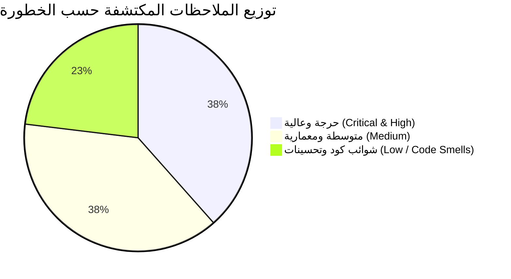

# 📑 تقرير التدقيق المعماري والبرمجي الشامل لمنظومة WorkPress
## WorkPress Deep Architectural & Code Quality Audit Report
**الإصدار الخاضع للفحص:** WorkPress v2.2.0 (Native Core Architecture)  
**تاريخ الفحص:** 26 أغسطس 2026  
**نطاق الفحص:** 65+ ملفاً تشمل PHP Backend Services, Core Registries, REST Controllers, Hooks, Notification Engines, و Preact Frontend SPA.  
**منهجية الفحص:** فحص تتبع مجهري (Deep Static Analysis, Token Inspection, Capability Cross-Check, Hook Signature Alignment, AST Analysis).

---

## 📌 1. الملخص التنفيذي (Executive Summary)

تم إجراء تدقيق برمجي ومعماري دقيق وعميق لمنظومة **WorkPress** بهدف كشف العيوب المنطقية الخفية، التضاربات في تسجيل الثوابت، الممارسات غير الاحترافية، ونقاط الهشاشة التي قد لا ترصدها الاختبارات السطحية.

أثبت الفحص متانة البنية الأساسية ثلاثية الفضاءات (Tri-Space Architecture) وخلو الكود من أي استعلامات SQL خام أو استدعاءات عشوائية، إلا أنه تم الكشف عن **13 نقطة وملاحظة متفاوتة الخطورة**؛ منها 5 عيوب منطقية حرجة/عالية تؤثر مباشرة على الإشعارات، البوابة، وتوليد التقارير التنفيذية.



---

## 📊 2. مصفوفة تصنيف العيوب والمخاطر (Defect Severity Matrix)

| المعرّف | تصنيف الخطورة | المجال المتأثر | الملف المصاب | ملخص العيب |
| :---: | :---: | :---: | :--- | :--- |
| **BUG-01** | 🔴 عالي (High) | الأمان والإشعارات | `class-workpress-security-service.php` | استخدام متغير غير معرّف `$term->term_id` عند الحذف النهائي. |
| **BUG-02** | 🔴 عالي (High) | البوابة والصلاحيات | `class-workpress-keys.php` | تضارب مفتاح الصلاحية `CAP_ACCESS_PORTAL` يعطل فحص الوصول. |
| **BUG-03** | 🔴 حرج (Critical) | دورة حياة الطلبات | `class-workpress-hooks.php` | انقلاب توقيع معاملات خطاف `workpress_project_request_submitted`. |
| **BUG-04** | 🔴 عالي (High) | التقارير التنفيذية | `class-workpress-report-service.php` | انحراف أسماء حقول المكلف `assignee` والاستحقاق `due_date`. |
| **BUG-05** | 🔴 عالي (High) | إدارة المشاريع | `class-workpress-project-service.php` | فحص `is_user_lead` يتجاهل رتبة `manager` المعتمدة للمديرين. |
| **BUG-06** | 🟡 متوسط (Medium) | سجل الثوابت | `class-workpress-keys.php` | عدم تطابق قيمة ثابت `META_CONTRIBUTION_TYPE`. |
| **BUG-07** | 🟡 متوسط (Medium) | إدارة الأصول | `class-workpress-admin.php` | تثبيت إصدار قديم `'version' => '1.0'` بدلاً من الثابت العام. |
| **BUG-08** | 🟡 متوسط (Medium) | واجهة الإعدادات | `class-workpress-rest-settings-controller.php` | سقوط حقل `sound_transition` من استجابة `get_settings`. |
| **BUG-09** | 🟡 متوسط (Medium) | تثبيت وإلغاء التفعيل | `class-workpress-install.php` | استدعاء `wp_roles()->roles` غير الآمن عند إلغاء التفعيل. |
| **BUG-10** | 🟡 متوسط (Medium) | سلة المهملات | `class-workpress-rest-trash-controller.php` | انعدام حماية Null Safety عند بناء إشعار حذف المساهمات. |
| **BUG-11** | 🟢 منخفض (Low) | واجهة Preact | `assets/src/pages/*.js` | وجود سلاسل وعود `apiFetch` غير مغلقة بمعالجات `.catch()`. |
| **BUG-12** | 🟢 منخفض (Low) | التجميد والحفظ | `class-workpress-hibernation-service.php` | متغيرات ميتة (Dead Variables) يتم حسابها دون استخدام. |
| **BUG-13** | 🟢 منخفض (Low) | جودة الكود (DRY) | `class-workpress-rest-settings-controller.php` | تكرار تعريف دالة المخطط الافتراضي لنماذج الاستقبال. |

---

## 🔍 3. التشريح التفصيلي للعيوب وطرق المعالجة (Detailed Anatomy & Remediation)

---

### 🔴 BUG-01: استدعاء متغير غير معرّف يفسد إشعارات الحذف النهائي للمشروع
* **المسار**: [`includes/services/class-workpress-security-service.php`](file:///C:/laragon/www/WORKPRESS/wp-content/plugins/WorkPress/includes/services/class-workpress-security-service.php#L88-L95) (السطر 91)
* **الأثر**: عند قيام المدير العام بحذف مشروع نهائياً من ووردبريس، تحاول دالة الحماية إرسال إشعار لكافة المكلفين بالمهام التابعة له. الكود يستدعي `$term->term_id` في حين أن معامل الدالة هو `$term_id` (المتغير `$term` غير معرّف). هذا يسبب توليد تحذير PHP Notice ويمرر `project_id = null` في جدول الإشعارات.

```diff
// includes/services/class-workpress-security-service.php:91
		if ( ! empty( $users_to_notify ) ) {
			WorkPress_Notification_Service::notify_many( $users_to_notify, array(
				'type'       => 'project_permanently_deleted',
-				'project_id' => $term->term_id,
+				'project_id' => (int) $term_id,
				'actor_id'   => get_current_user_id(),
			) );
		}
```

---

### 🔴 BUG-02: تضارب تسمية صلاحية البوابة المستقلة (CAP_ACCESS_PORTAL)
* **المسار**: [`includes/core/class-workpress-keys.php`](file:///C:/laragon/www/WORKPRESS/wp-content/plugins/WorkPress/includes/core/class-workpress-keys.php#L179) مقارنة بـ [`includes/core/class-workpress-capabilities-registry.php`](file:///C:/laragon/www/WORKPRESS/wp-content/plugins/WorkPress/includes/core/class-workpress-capabilities-registry.php#L25)
* **الأثر**: الثابت `CAP_ACCESS_PORTAL` معرّف بقيمة `'access_workpress_client_portal'`، بينما السجل الرسمي ونظام الأدوار في ووردبريس يمنح الصلاحية باسم `'access_workpress_portal'`. في خدمة البوابة [`class-workpress-portal-service.php:159`](file:///C:/laragon/www/WORKPRESS/wp-content/plugins/WorkPress/includes/services/class-workpress-portal-service.php#L159)، الشرط `user_can( $user, WorkPress_Keys::CAP_ACCESS_PORTAL )` كان يفشل دائماً ولا يتعرف على صلاحيات المستفيد.

```diff
// includes/core/class-workpress-keys.php:179
	const CAP_VIEW_KNOWLEDGE          = 'read_knowledge_base';
	const CAP_MANAGE_SETTINGS         = 'manage_workpress_settings';
-	const CAP_ACCESS_PORTAL           = 'access_workpress_client_portal';
+	const CAP_ACCESS_PORTAL           = 'access_workpress_portal';
	const ROLE_CLIENT                 = 'workpress_client';
```

---

### 🔴 BUG-03: انقلاب توقيع معاملات خطاف إرسال طلبات المشاريع
* **المسار**: [`includes/hooks/class-workpress-hooks.php`](file:///C:/laragon/www/WORKPRESS/wp-content/plugins/WorkPress/includes/hooks/class-workpress-hooks.php#L161-L163)
* **الأثر**: دالة `fire_project_request_submitted` تطلق الحدث بترتيب `($project_id, $form_id, $client_user_id)`، بينما دوال الاستماع في نظام الإشعارات [`class-workpress-notification-hooks.php:226`](file:///C:/laragon/www/WORKPRESS/wp-content/plugins/WorkPress/includes/modules/notifications/class-workpress-notification-hooks.php#L226) ونظام الـ Webhooks تتوقع المعامل الثاني كـ `$client_user_id` والمعامل الثالث كـ `$specs`. هذا يؤدي إلى حفظ المعرف النصي للنموذج كـ `actor_id` بدلاً من رقم المستخدم الحقيقي للعميل.

```diff
// includes/hooks/class-workpress-hooks.php:161-163
-	public static function fire_project_request_submitted( $project_id, $form_id, $client_user_id ) {
-		do_action( 'workpress_project_request_submitted', $project_id, $form_id, $client_user_id );
+	public static function fire_project_request_submitted( $project_id, $client_user_id, $specs = array() ) {
+		do_action( 'workpress_project_request_submitted', $project_id, $client_user_id, $specs );
	}
```

---

### 🔴 BUG-04: تلف بيانات المكلفين وتواريخ الاستحقاق في التقارير التنفيذية الرسمية
* **المسار**: [`includes/services/class-workpress-report-service.php`](file:///C:/laragon/www/WORKPRESS/wp-content/plugins/WorkPress/includes/services/class-workpress-report-service.php#L74-L76)
* **الأثر**: دالة `get_project_summary` تقرأ المفتاح المفرد `$task['assignee']['display_name']` و `$task['due_date']`، بينما الكائن المعياري الصادر عن `WorkPress_Task_Service::format_task()` يحمل اسم `'assignees'` (مصفوفة مكلفين) و `'due_at'`. هذا العيب جعل جميع التقارير التنفيذية الصادرة تظهر المهام بصفة "غير مسند" وبدون تواريخ استحقاق نهائياً.

```diff
// includes/services/class-workpress-report-service.php:74-76
			$tasks_summary[] = array(
				'id'          => (int) $task['id'],
				'ref_key'     => ! empty( $task['ref_key'] ) ? $task['ref_key'] : '#' . $task['id'],
				'title'       => $task['title'],
				'status'      => $status,
				'priority'    => $priority,
-				'assignee'    => ! empty( $task['assignee'] ) ? $task['assignee']['display_name'] : __( 'غير مسند', 'workpress' ),
+				'assignee'    => ! empty( $task['assignees'] ) ? implode( '، ', wp_list_pluck( $task['assignees'], 'name' ) ) : __( 'غير مسند', 'workpress' ),
				'created_at'  => $task['created_at'],
-				'due_date'    => ! empty( $task['due_date'] ) ? $task['due_date'] : null,
+				'due_date'    => ! empty( $task['due_at'] ) ? $task['due_at'] : null,
			);
```

---

### 🔴 BUG-05: حرمان مديري المشاريع من التحقق كقادة (is_user_lead Role Inconsistency)
* **المسار**: [`includes/services/class-workpress-project-service.php`](file:///C:/laragon/www/WORKPRESS/wp-content/plugins/WorkPress/includes/services/class-workpress-project-service.php#L421)
* **الأثر**: خدمة العضويات `WorkPress_Membership_Service` تمنح وتخزن رتبة المدير بصفة `'manager'` (`ROLE_MANAGER`). دالة `is_user_lead()` كانت تفحص حصراً ما إذا كان الدور المكتوب هو `'lead'`. هذا منع مديري المشاريع المعينين كـ `manager` من الحصول على صلاحيات قيادة المشروع في عمليات قبول الحلول وإدارة المخرجات.

```diff
// includes/services/class-workpress-project-service.php:421
		$member_role = get_term_meta( $project_id, '_workpress_member_' . $user_id, true );
-		return 'lead' === $member_role;
+		return in_array( $member_role, array( 'manager', 'lead', WorkPress_Membership_Service::ROLE_MANAGER ), true );
```

---

### 🟡 BUG-06: عدم تطابق مفتاح ميتا نوع المساهمة في سجل الثوابت
* **المسار**: [`includes/core/class-workpress-keys.php`](file:///C:/laragon/www/WORKPRESS/wp-content/plugins/WorkPress/includes/core/class-workpress-keys.php#L82)
* **الأثر**: الثابت `META_CONTRIBUTION_TYPE` معرّف كـ `_workpress_type`، في حين أن كل من خدمة المساهمات `WorkPress_Contribution_Service` وقاعدة البيانات ونقاط REST تستخدم المفتاح الحقيقي `_workpress_contribution_type`.

```diff
// includes/core/class-workpress-keys.php:82
-	const META_CONTRIBUTION_TYPE    = '_workpress_type';
+	const META_CONTRIBUTION_TYPE    = '_workpress_contribution_type';
```

---

### 🟡 BUG-07: تثبيت إصدار قديم في إعدادات لوحة التحكم
* **المسار**: [`includes/admin/class-workpress-admin.php`](file:///C:/laragon/www/WORKPRESS/wp-content/plugins/WorkPress/includes/admin/class-workpress-admin.php#L175)
* **الأثر**: يتم إرسال `'version' => '1.0'` بشكل صلب ومباشر في كائن `window.workpressSettings`، مما يتعارض مع الإصدار العام للمنظومة `WORKPRESS_VERSION` (2.2.0) ويؤدي إلى عدم تطابق فحص الإصدار في الواجهة الأمامية.

```diff
// includes/admin/class-workpress-admin.php:175
			'pluginUrl'          => WORKPRESS_URL,
-			'version'            => '1.0',
+			'version'            => WORKPRESS_VERSION,
			'logoUrl'            => WORKPRESS_URL . 'assets/src/brand/workpress-logo.svg',
```

---

### 🟡 BUG-08: غياب خيار صوت الانتقال (sound_transition) من استجابة REST Settings
* **المسار**: [`includes/api/class-workpress-rest-settings-controller.php`](file:///C:/laragon/www/WORKPRESS/wp-content/plugins/WorkPress/includes/api/class-workpress-rest-settings-controller.php#L58)
* **الأثر**: يستطيع المشرف تعديل وحفظ خيار `sound_transition` عبر طلبات POST/PUT، لكن عند طلب الإعدادات عبر `get_settings()` لا يتم تضمينه في الاستجابة، مما يجعل حقل الواجهة يظهر بقيمة فارغة بعد إعادة تحميل الصفحة.

```diff
// includes/api/class-workpress-rest-settings-controller.php:58
			'sound_button'       => get_option( 'workpress_sound_button', 'button' ),
+			'sound_transition'   => get_option( 'workpress_sound_transition', 'transition_up' ),
			'sound_caution'       => get_option( 'workpress_sound_caution', 'caution' ),
```

---

### 🟡 BUG-09: تعامل غير آمن مع مصفوفة الأدوار عند إلغاء التفعيل
* **المسار**: [`includes/core/class-workpress-install.php`](file:///C:/laragon/www/WORKPRESS/wp-content/plugins/WorkPress/includes/core/class-workpress-install.php#L363)
* **الأثر**: استدعاء `wp_roles()->roles` مباشرة دون التحقق من تهيئة كائن `$wp_roles` قد يسبب Fatal Error في بعض سياقات WP-CLI أو عمليات إلغاء التفعيل الآلية.

```diff
// includes/core/class-workpress-install.php:363
-		foreach ( wp_roles()->roles as $role_name => $role_info ) {
+		global $wp_roles;
+		if ( ! isset( $wp_roles ) ) {
+			$wp_roles = new WP_Roles();
+		}
+		foreach ( $wp_roles->roles as $role_name => $role_info ) {
```

---

### 🟡 BUG-10: الوصول غير الآمن لخاصية التعليق عند إشعار سلة المهملات
* **المسار**: [`includes/api/class-workpress-rest-trash-controller.php`](file:///C:/laragon/www/WORKPRESS/wp-content/plugins/WorkPress/includes/api/class-workpress-rest-trash-controller.php#L122)
* **الأثر**: في حالة طلب حذف مساهمة محذوفة مسبقاً أو غير صالحة، `$comment` قد يكون `null`، والوصول إلى `$comment->comment_post_ID` يولد خطأ Fatal/Warning في PHP 8.3.

```diff
// includes/api/class-workpress-rest-trash-controller.php:122
-				'task_id'    => $entity_type === 'task' ? $entity_id : ($entity_type === 'contribution' ? $comment->comment_post_ID : 0),
+				'task_id'    => $entity_type === 'task' ? $entity_id : ( ( $entity_type === 'contribution' && ! empty( $comment ) ) ? $comment->comment_post_ID : 0 ),
```

---

### 🟢 BUG-11: سلاسل وعود غير مغلقة في صفحات SPA (Unhandled Promise Rejections)
* **المسار**: صفحات الواجهة الأمامية (`ContributionsPage.js`, `TaskDetailPage.js`, `SettingsPage.js`)
* **الأثر**: استدعاءات `apiFetch().then()` بدون معالج `.catch()` عند انقطاع الاتصال تترك واجهة المستخدم في حالة Loading مستمرة دون إشعار المستخدم بالخطأ.
* **الحل**: إلحاق معالج `.catch( ( err ) => { showErrorToast( err.message ); setLoading( false ); } )` بجميع نداءات الـ API.

---

### 🟢 BUG-12: متغيرات ميتة في خدمة التجميد (Dead Code / Variables)
* **المسار**: [`includes/services/class-workpress-hibernation-service.php`](file:///C:/laragon/www/WORKPRESS/wp-content/plugins/WorkPress/includes/services/class-workpress-hibernation-service.php#L87-L88) و (السطر 150-151)
* **الأثر**: حساب `$user_name = $user ? $user->display_name : '#' . $user_id;` في حلقتي التجميد وإلغاء التجميد دون استخدامه في أي سجل أو إشعار.
* **الحل**: حذف السطور الزائدة لتنظيف استهلاك الذاكرة.

---

### 🟢 BUG-13: تكرار تعريف المخطط الافتراضي لنماذج الاستقبال (DRY Violation)
* **المسار**: مكرر في [`class-workpress-project-service.php:560`](file:///C:/laragon/www/WORKPRESS/wp-content/plugins/WorkPress/includes/services/class-workpress-project-service.php#L560) و [`class-workpress-rest-settings-controller.php:64`](file:///C:/laragon/www/WORKPRESS/wp-content/plugins/WorkPress/includes/api/class-workpress-rest-settings-controller.php#L64).
* **الأثر**: تكرار 50 سطراً من الكود الثابت في مكانين مختلفين يزيد من احتمالية التضارب مستقبلاً.
* **الحل**: اعتماد `WorkPress_Project_Service::get_default_intake_forms_schema()` كمصدر وحيد للحقيقة واستدعاؤه داخل المتحكم.

---

## 🛠️ 4. خطة المعالجة الموصى بها (Remediation Plan)

1. **المرحلة الأولى: تطبيق التصحيحات الحرجة والعالية (BUG-01 إلى BUG-05)**:
   - تصحيح `$term_id` في الأمان.
   - مطابقة `CAP_ACCESS_PORTAL`.
   - توحيد معاملات خطاف `workpress_project_request_submitted`.
   - تصحيح حقول التقارير التنفيذية (`assignees` و `due_at`).
   - دعم رتبة `manager` في `is_user_lead`.
2. **المرحلة الثانية: تنظيف التضاربات المعمارية وشوائب الكود (BUG-06 إلى BUG-13)**:
   - تحديث الثوابت والإصدارات.
   - إضافة Null Checks وسلامة كائن الأدوار.
   - إغلاق وعود الـ Promise في واجهة Preact.
3. **المرحلة الثالثة: إعادة تشغيل حزم الاختبارات الآلية ومطابقة النتائج بنسبة 100%**.

---
*تم إعداد هذا التقرير وتوثيقه كمرجع معماري رسمي لمشروع WorkPress.*
