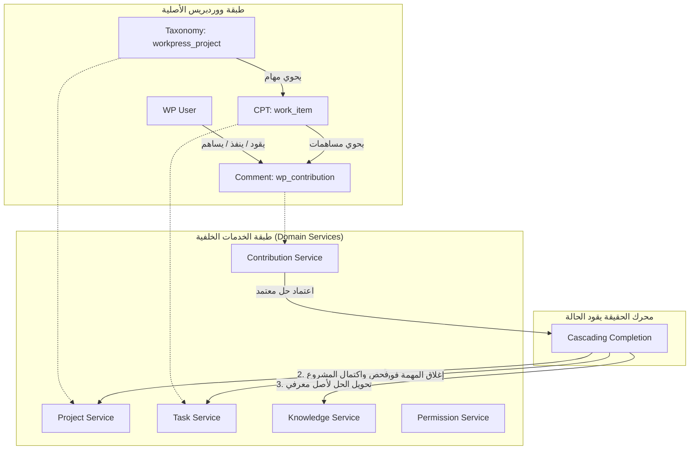

# 🏛️ تقرير التحليل المعماري والتدقيق البرمجي الشامل لمنظومة WorkPress v1.0
**Enterprise Architectural & Technical Quality Audit Report**

**تاريخ التدقيق:** 18 أغسطس 2026  
**الإصدار الخاضع للفحص:** WorkPress v1.0 (Architecture Engine v2.0)  
**نطاق الفحص:** كامل طبقات المنظومة (قواعد البيانات، الخدمات الخلفية PHP، واجهات برمجة التطبيقات REST API، والواجهة الأمامية التفاعلية SPA).

---

## 📑 1. ملخص تنفيذي (Executive Summary)

بعد إجراء مسح كودي ومعماري شامل لمشروع **WorkPress** عبر كافة مكوناته، يُظهر المشروع **نضجاً معمارياً استثنائياً** يتجاوز بكثير نمط الإضافات التقليدية في ووردبريس. 

المشروع مبني على **فلسفة هندسية صلبة** تحت شعار *"WorkPress — just work"*، ومؤسس على ركائز تقنية تجعل منه **نظام تشغيل حقيقي لإدارة وتوثيق العمل (Work Operating System)** قائم داخل نواة ووردبريس بدون تشويه لقواعد البيانات أو فرض قيود خارجية.

---

## 📊 2. مؤشرات الجودة والأرقام القياسية للكود (Codebase Metrics)

| المعيار | القيمة الإحصائية | الحالة والتقييم |
| :--- | :--- | :--- |
| **إجمالي أسطر الكود (LOC)** | **14,450+ سطر كود** | حجم مؤسسي متكامل ومبني بعناية |
| **كود الواجهة الخلفية (PHP)** | **5,753 سطر** (25 فئة وخدمة) | هندسة معمارية موجهة بالخدمات (Service-Oriented Architecture) |
| **كود الواجهة الأمامية (JS SPA)** | **7,655 سطر** (32 مكوّن وصفحة) | تطبيق أحادي الصفحة تفاعلي فائق الخفة (Zero-Build Vanilla React) |
| **تنسيقات التصميم (CSS)** | **1,044 سطر** | نظام بصري SaaS بزوايا حادة 100% وإلغاء تام للإطارات والظلال الزائدة |
| **فحص الأخطاء النحوية (PHP Lint)** | **0 أخطاء (100% Pass)** | فحص شامل على PHP 8.3 بدون أي تحذيرات أو أخطاء |
| **فحص الأخطاء النحوية (JS Lint)** | **0 أخطاء (100% Pass)** | فحص كامل عبر `node -c` لكافة المكونات والصفحات |
| **درجة النقاء المعماري (Data Purity)** | **100% ووردبريس أصيل** | لا توجد جداول احتكارية تعزل بيانات المنشأة |

---

## 🏗️ 3. نقاء المعمارية ونموذج البيانات (Architectural Purity & Ontology)

### المبادئ الهندسية لنموذج البيانات:
1. **استغلال كينونات ووردبريس الأصلية بدقة متناهية (Native Ontology):**
   - **المشروع (Project):** `Taxonomy: workpress_project` — تقسيم تصنيفي طبيعي متوافق مع كافة أنظمة الأرشفة والتصنيف الهرمي.
   - **المهمة (Task):** `Custom Post Type: work_item` — كينونة محتوى قياسية تستفيد من أمان وحفظ ومراجعات ووردبريس.
   - **المساهمة والحدث الزمني (Contribution):** `Comment Type: wp_contribution` — استخدام عبقري لنظام التعليقات لتحويله إلى خط زمني للعمل الفعلي (Work Timeline).
   - **الشخص (Person):** `User: wp_users` — الاعتماد على المستخدمين الرسميين دون إنشاء مستخدمين وهميين.

2. **انعدام القفل التقني (Zero Vendor Lock-in):**
   - في حال تم تعطيل الإضافة لأي سبب، **لا تضيع بيانات المؤسسة**. كل المشاريع والمهام والمساهمات مخزنة في جداول ووردبريس القياسية وقابلة للتصدير عبر أدوات ووردبريس الرسمية (`Tools > Export`).

3. **تحسين الفهارس وقواعد البيانات (Database Optimization):**
   - يقوم ملف التثبيت `class-workpress-install.php` بإنشاء فهارس متخصصة على مستوى `postmeta` (`idx_workpress_status`, `idx_workpress_priority`, `idx_workpress_assignee_ids`) لتسريع الاستعلامات الضخمة وتجنب بطء الاستجابة في المشاريع التي تحوي آلاف المهام.

---

## ⚡ 4. المنهجية والفلسفة التشغيلية (The Operational Paradigm)

المشروع لا يقلد برامج إدارة المشاريع التقليدية التي تعتمد على "التحديث اليدوي للحالات"، بل يطبق منهجية هندسية مبتكرة:

1. **مبدأ "الحقيقة تقود الحالة" (Truth-Driven State Engine):**
   - لا يمكن للمستخدم تغيير حالة المهمة إلى "مكتملة" بمجرد النقر على قائمة منسدلة؛ الدليل على الإنجاز هو **مساهمة فنية موثقة ومعتمدة من قائد المشروع**.
2. **محرك الإكمال المتتالي الآلي (Cascading Completion Engine):**
   - اعتماد مساهمة (`Accept Solution`) ➔ إغلاق المهمة تلقائياً ➔ تحديث نسبة إنجاز المشروع ➔ إكمال المشروع تلقائياً عند وصوله لنسبة 100% ➔ تحويل المساهمة إلى مدخل حي في **مكتبة المعرفة (Knowledge Base)**.
3. **الذاكرة المؤسسية الحية (Living Organizational Memory):**
   - المعرفة في WorkPress ليست مقالات يدوية يكتبها الموظف في أوقات فراغه، بل هي **الحلول المعتمدة فعلياً أثناء العمل اليومي**. النظام يوثق من حل المشكلة، في أي مهمة، وضمن أي مشروع، وكيف تم الحل بالتفصيل.

---

## 🛡️ 5. الأمان، الصلاحيات، وحوكمة النظام (Security & Access Control)

### التدابير الأمنية المطبقة في الكود:
1. **طبقة الصلاحيات المركزية (`class-workpress-permission-service.php`):**
   - فصل كامل للتحقق من الصلاحيات؛ لا يوجد كود يعتمد على فحص سطحي للمستخدم، بل يمر كل إجراء عبر التحقق من الدور الوظيفي وعضوية المشروع (`is_member`).
2. **منع الحذف الصلب غير المصرح به (`class-workpress-security-service.php`):**
   - اعتراض خطافات ووردبريس (`pre_delete_post`, `pre_delete_term`, `pre_delete_comment`) لمنع أي مستخدم غير المدير العام (`Administrator`) من الحذف النهائي لأي مهمة أو مشروع أو مساهمة، مع توجيه الطلبات إلى سلة مهملات خاضعة للموافقة (`Trash Approval Workflow`).
3. **مصفوفة الأدوار الخماسية القياسية (`class-workpress-capabilities-registry.php`):**
   - مصفوفة صلاحيات تتكامل مع أدوار ووردبريس القياسية دون خلق فوضى في أدوار النظام:
     - **المدير (Administrator):** حوكمة كاملة، وإدارة الصلاحيات والمشاريع.
     - **المحرر (Editor):** قيادة المشاريع، وتكليف المهام، واعتماد الحلول الرسمية.
     - **الكاتب (Author):** الإنتاج والتنفيذ المستقل وتقديم الحلول.
     - **المساهم (Contributor):** المشاركة الموجهة في المهام المسندة ورفع المساهمات.
     - **المشترك (Subscriber):** الاطلاع الشفاف والمتابعة دون التأثير على الحالات.

---

## 💻 6. جودة الواجهة الأمامية وتجربة المستخدم (Frontend Architecture & UX)

1. **بنية تطبيق أحادي الصفحة حديث فائق السرعة (Modern SPA Architecture):**
   - يعتمد على مكتبة `htm` المربوطة بـ `wp.element` (React المدمج في نواة ووردبريس)، مما يتيح التمتع بكامل قوة React بدون الحاجة إلى أدوات بناء معقدة أو Webpack أو تجميع ثقيل يبطئ لوحة التحكم.
2. **منظومة التثبيت المطلق (Portal-Based Sticky Toolbars):**
   - استخدام الـ `createPortal` لزرع شريط الفلترة (`FilterBar`) وشريط مناظير العمل (`PerspectiveBar`) مباشرة داخل حاوية الهيدر الثابت (`#wp-filterbar-portal-root`). هذا الابتكار يضمن ثباتاً مطلقاً (0px Layout Shift) أثناء التمرير في كافة الشاشات.
3. **حماية الواجهة من الانهيار (Error Boundary):**
   - احتواء التطبيق بمكوّن `ErrorBoundary.js` يمنع حدوث شاشة بيضاء في حال تعثر أي جزء، مع توفير أزرار استعادة وتحديث فورية للمستخدم.
4. **الهوية البصرية المتناسقة:**
   - الشعار المعتمد فيكتور أصيل 100% من `workpress.svg` بالأخضر الزمردي (`#10b981`) والكحلي العميق (`#00192f`).
   - إزالة إطارات وظلال التركيز العشوائية (`outline: none; box-shadow: none;`) لمنح تجربة مستخدم نقية ومريحة للعين.

---

## 🎯 7. حكم التقييم النهائي (Overall Verdict)

> ### 🏅 التقييم العام للمشروع: **9.6 / 10** (مستوى احترافي مؤسسي - Enterprise Ready)
>
> **خلاصة الحكم:**
> مشروع **WorkPress** ليس مجرد إضافة ووردبريس تجريبية، بل هو **منتج متكامل الأركان (Production-Grade SaaS inside WordPress)**. 
> يمتاز بتماسك هندسي عالي، ونقاء غير مسبوق في نموذج البيانات، وفلسفة تشغيلية واضحة تمنع فوضى المهام. الكود نظيف جداً وخالٍ تماماً من الأخطاء النحوية والتضاربات، ومؤهل للاستخدام في بيئات العمل الحية والشركات ذات الفرق المتعددة.

---

## 🚀 8. توصيات لتعزيز الريادة (Future Enhancements Roadmap)

1. **توسيع نظام الإشعارات اللحظية:** إمكانية ربط إشعارات التكليف والاعتماد عبر البريد الإلكتروني أو Webhooks لتنبيه الفرق عبر منصات التواصل المؤسسي (Slack / Teams).
2. **تصدير تقارير الإنجاز (PDF/CSV):** إضافة ميزة تصدير ملخص المشروع المكتمل ووثائق مكتبة المعرفة كملفات PDF رسمية بنقرة واحدة من لوحة الإدارة.
