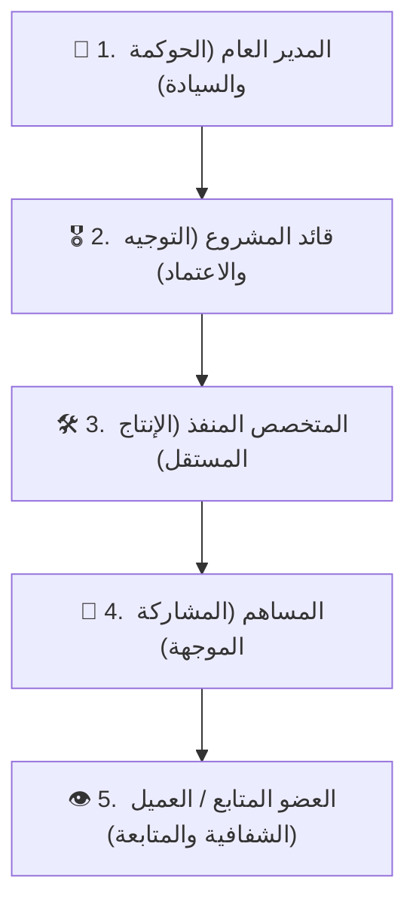
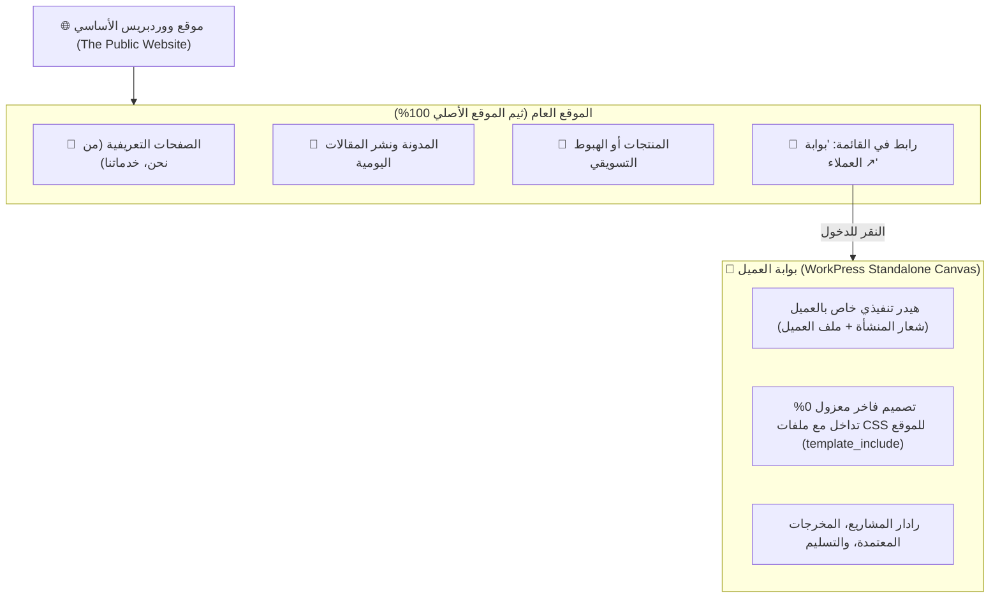

# 🌟 وثيقة المواصفات الهندسية: بوابة ومنظور العميل والمتابع المستقلة
## WorkPress Standalone Client & Viewer Portal Specification (v1.1 Backlog)

> **حالة الوثيقة:** ✅ **مكتملة ومنفذة رسمياً في الإنتاج (Graduated to Production in v1.1.0 & v1.3.0)**  
> **الخطة التنفيذية المنجزة:** [CLIENT_PORTAL_MASTER_ROADMAP.md](../plans/CLIENT_PORTAL_MASTER_ROADMAP.md)  
> **الدليل التشغيلي المعتمد:** [CLIENT_PORTAL_NARRATIVE_GUIDE.md](../guides/CLIENT_PORTAL_NARRATIVE_GUIDE.md) | [المحاكي البصري](../guides/client-portal-visual-guide.html)  
> **المراجع العليا:** [FIRST_PRINCIPLES.md](../core/FIRST_PRINCIPLES.md) | [ARCHITECTURE.md](../core/ARCHITECTURE.md)  

---

> [!NOTE]
> **إشعار التخريج والاعتماد:**  
> تم تحويل هذه المواصفة المقترحة إلى حقيقة برمجية كاملة في منظومة WorkPress، وتم إطلاق بوابة العميل المستقلة بالكامل بنظام SPA متطور وعزل تام في مسار `/portal/`، مع رادار القيادة التنفيذي، نظام إرسال الملاحظات، استوديو استقبال الطلبات الديناميكي، وخزينة المخرجات المعتمدة.

---

## 1. الفلسفة المعمارية ودور العضو المتابع (Core Philosophy)

في منظومة WorkPress، يمثل **العضو المتابع (`subscriber` / المشترك)** المستوى الخامس والأصيل في الهرمية الخماسية للأدوار:



### التعريف التشغيلي:
> **«العضو المتابع هو كل مستخدم مستفيد أو صاحب مصلحة خارجي أو داخلي يحتاج إلى متابعة مسار العمل بشفافية تامة، ورؤية نسب التقدم الحقيقية، والاطلاع على المخرجات النهائية المعتمدة وتقديم ملاحظات توجيهية، دون إمكانية تحريك المهام أو تغيير حالاتها أو الاطلاع على المسودات الفنية الأولية.»**

---

## 2. مصفوفة الصلاحيات والحصانة الأمنية (Capability & Security Boundaries)

وفقاً للمبادئ التأسيسية لـ WorkPress (المبدأ #7: القدرات ملك لووردبريس، والمبدأ #8: الرؤية تتبع العضوية):

| الإجراء / الصلاحية | الحالة للمتابع | الآلية والضابط الأمني |
| :--- | :---: | :--- |
| **استعراض المشاريع المصرح بها** | ✅ مصرح | مقيد بشرط العضوية الصريح في المشروع (`_workpress_member_{user_id}`). |
| **رؤية نسب الإنجاز والمؤشرات** | ✅ مصرح | حساب مئوي مشتق من قاعدة البيانات استناداً للمهام المكتملة. |
| **معاينة المخرجات المعتمدة (الحلول)** | ✅ مصرح | قراءة المساهمات الموسومة بـ `_workpress_is_accepted = 1`. |
| **إضافة ملاحظات واستفسارات** | ✅ مصرح | إضافة تعليق مراجعة من نوع `feedback` يصل كإشعار لقائد المشروع. |
| **إنشاء مشاريع أو مهام جديدة** | ❌ محظور تماماً | حظر قدرات `create_workpress_projects` و `create_workpress_tasks`. |
| **سحب المهام في الكانبان أو تغيير حالتها** | ❌ محظور تماماً | حظر قدرة `edit_tasks_state` والتحقق من الصلاحية في خادم REST API. |
| **تكليف أو إعادة إسناد المهام** | ❌ محظور تماماً | حظر قدرة `assign_tasks`. |
| **الاعتماد الرسمي للحلول** | ❌ محظور تماماً | حق سيادي حصري لمدير المشروع (`Lead`) أو المدير العام (`Admin`). |
| **رؤية النقاشات والمسودات الداخلية** | ❌ محجوب | فلترة المساهمات غير المعتمدة لعزل كواليس الفريق (Purification Effect). |

---

## 3. العزل البصري والهندسي الكامل (Standalone Canvas Architecture)

لحماية الموقع العام والحفاظ على ثيم صاحب الموقع وحرية نشر مقالاته دون أي تداخل:



---

## 4. هندسة الهوية والتمييز الذكي للأعضاء (Identity & Routing Engine)

لمنع تداخل المشترك العادي (الذي يسجل ليعلق على مقال) مع عميل WorkPress الحقيقي:

```mermaid
graph TD
    User["👤 المستخدم يقوم بتسجيل الدخول"]
    
    subgraph Engine["⚙️ محرك التوجيه والفحص الذكي في WorkPress"]
        Check1{"1. هل يملك مشاريع مرتبطة به؟<br/>(Term Meta: _workpress_member_{user_id})"}
        Check2{"2. هل يملك قدرة بوابة العملاء؟<br/>(access_workpress_client_portal)"}
    end

    User --> Check1
    Check1 -->|نعم (عميل WorkPress حقيقي)| RedirectPortal["🚀 توجيه فوري لبوابة العميل:<br/>https://site.com/portal/"]
    Check1 -->|لا| Check2
    Check2 -->|نعم (عميل جديد بلا مشاريع بعد)| RedirectPortal
    Check2 -->|لا (قارئ مدونة عادي)| RedirectBlog["🌐 يبقى في واجهة الموقع العادي أو المقال"]
```

### ركائز نظام الهوية:
1. **القدرة الحصرية (`access_workpress_client_portal`):** تمنح للعميل فور ربطه بأي مشروع لتمييزه عن المشتركين العاديين.
2. **محرك التوجيه الذكي (`login_redirect Hook`):** توجيه المدراء للوحة التحكم الداخلية `/wp-admin/admin.php?page=workpress`، والعملاء لبوابة المشاريع `/portal/`، وإبقاء القراء في المدونة.
3. **حارس البوابة لغير المرتبطين بمشاريع (Gatekeeper Guard):** إظهار رسالة توجيهية راقية في حال فتح قارئ عادي رابط البوابة دون وجود مشاريع مربوطة بحسابه.

---

## 5. خطة مسارات REST API للبوابة

```
GET    /wp-json/workpress/v1/portal/my-projects       # استرجاع المشاريع المصرح بها للعميل فقط
GET    /wp-json/workpress/v1/portal/projects/{id}     # تفاصيل المشروع ونسبة الإنجاز
GET    /wp-json/workpress/v1/portal/projects/{id}/deliverables # المخرجات المعتمدة فقط للتنزيل
POST   /wp-json/workpress/v1/portal/feedback          # إرسال استفسار/ملاحظة لمدير المشروع
POST   /wp-json/workpress/v1/portal/request           # تقديم طلب مشروع/خدمة جديدة
```
