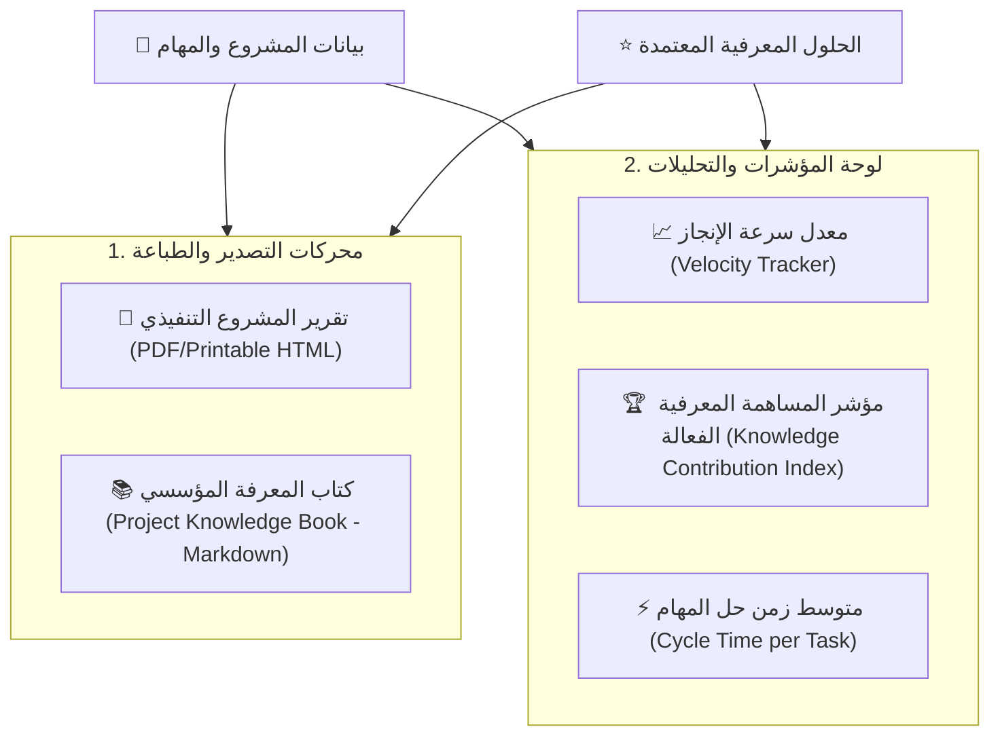

# 📊 وثيقة المواصفات الهندسية: التقارير التنفيذية المنسقة والتحليلات المعرفية
## WorkPress Executive Reporting & Analytics Specification

> [!NOTE]
> **حالة الوثيقة:** ✅ **تم الإنجاز والاعتماد في الإنتاج (Graduated to Production in v1.4.0)**  
> **الخطة التنفيذية المنفذة:** [EXECUTIVE_REPORTING_AND_ANALYTICS_MASTER_PLAN.md](../plans/EXECUTIVE_REPORTING_AND_ANALYTICS_MASTER_PLAN.md)  
> **الإصدار المنفذ:** WorkPress v1.4.0 (Executive Reporting, Knowledge Book & Analytics)  
> **المراجع العليا:** [FIRST_PRINCIPLES.md](../core/FIRST_PRINCIPLES.md) | [ARCHITECTURE.md](../core/ARCHITECTURE.md)

---

## 1. الدوافع والقيمة التشغيلية (Executive Value Proposition)

في بيئات الأعمال الاحترافية، لا تكتمل قيمة العمل المنجز بمجرد إغلاق المهام على الشاشة، بل تحتاج المنشأة إلى:
1. **تقارير إنجاز رسمية (Executive Sign-off Reports):** لتقديمها للعملاء والجهات الممولة أو الإدارة التنفيذية لإثبات اكتمال المشروع وتسليم المخرجات.
2. **كتيب المعرفة المؤسسية (Project Knowledge Book):** تصدير كافة الحلول المعتمدة المكتسبة أثناء تنفيذ المشروع في وثيقة مرجعية واحدة موحدة.
3. **تحليلات الأداء المعرفي (Velocity & Contribution Insights):** قياس مدى فعالية أعضاء الفريق في تقديم حلول معتمدة بدلاً من مجرد قياس عدد المهام المنقولة.

---

## 2. محاور النظام ومكوناته الهندسية



---

## 3. تفاصيل التقارير التوليدية

### أ. تقرير المشروع التنفيذي (Executive Project Report):
- **النمط البصري:** قالب CSS طباعي فاخر (`@media print`) مخصص بدون عناصر المتصفح أو أزرار التحكم:
  - ترويسة رسمية: شعار المنشأة، اسم المشروع، كود المشروع، المدير العام، قائد المشروع، وفترة التنفيذ.
  - الملخص التنفيذي: عدد المهام الكلية، نسبة الإنجاز 100%، إجمالي المساهمات، وعدد الحلول المعتمدة.
  - فهرس المخرجات والحلول المعتمدة: كل مهمة مع الحل المعتمد وتاريخ اعتماده والشخص المنفذ.
  - قسم توقيع واستلام المشروع (Sign-off Section).

### ب. كتاب المعرفة المجمّع (Compiled Knowledge Book - Markdown & PDF):
- تجميع كافة المساهمات المعتمدة (`_workpress_is_accepted = 1`) المرتبطة بالمشروع في مستند Markdown مهيكل ومنسق، يسهل رفعه على GitHub Wiki أو Notion أو أرشفته كملف PDF.

---

## 4. مؤشرات التحليلات ولوحة الإنتاجية (KPI Analytics)

| المؤشر | طريقة الحساب البرمجية | الفائدة التشغيلية |
| :--- | :--- | :--- |
| **معدل قبول الحلول (Acceptance Rate)** | نسبة المساهمات المعتمدة إلى إجمالي المساهمات الفنية المرفوعة. | قياس جودة مخرجات الفريق من المحاولة الأولى. |
| **زمن دورة المهمة (Cycle Time)** | الفارق الزمني بين إنشاء المهمة وتاريخ اعتماد الحل وإغلاقها. | كشف الاختناقات الزمنية في المشاريع. |
| **مؤشر القيمة المعرفية لكل عضو** | عدد الحلول المعتمدة التي ألفها العضو وأودعت في بنك المعرفة. | مكافأة الأعضاء الأكثر إضافة للقيمة والذاكرة المؤسسية. |

---

## 5. خطة مسارات REST API والتخزين المؤقت

```
GET /wp-json/workpress/v1/projects/{id}/report?format=html|json|markdown
GET /wp-json/workpress/v1/projects/{id}/knowledge-book?format=markdown|pdf
GET /wp-json/workpress/v1/analytics/team-insights?project_id={id}&period=30d
```

> ⚡ **محرك الكاش اللحظي (KPI Transients):** يتم تخزين نتائج المؤشرات الإحصائية في `_transient_workpress_analytics_{project_id}` وتحديثها تلقائياً عند وقوع أحداث اعتماد الحلول (`workpress_contribution_accepted`).
