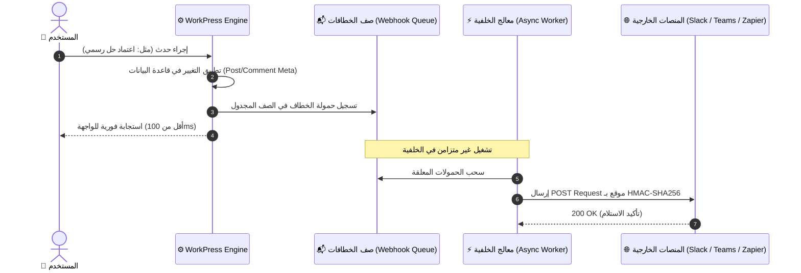

# 🔗 وثيقة المواصفات الهندسية: خطافات الويب والتكاملات المؤسسية
## WorkPress Enterprise Webhooks & External Integrations Specification (v1.5.0 Graduated)

> [!NOTE]
> **حالة الوثيقة: تم التخرج والتنفيذ الفعلي بالإنتاج في WorkPress v1.5.0**  
> أصبحت منظومة خطافات الويب والتكامل المؤسسي الخارجي مدمجة بالكامل عبر `WorkPress_Webhook_Service` و `WorkPress_REST_Webhooks_Controller` وواجهة `WebhooksSettingsTab.js` في لوحة الإعدادات مع دعم قوالب Discord و Slack و Teams وتوقيع HMAC-SHA256 المشفر.

> **نوع الوثيقة:** مواصفات معمارية وتكاملية للربط الخارجي والأتمتة  
> **الإصدار المنفذ:** WorkPress v1.5.0  
> **الهدف:** تمكين المنشآت من ربط أحداث WorkPress الحية بالمنصات الخارجية (Slack, Microsoft Teams, Discord, Telegram, Zapier) فور وقوعها دون تأخير.  
> **المراجع العليا:** [FIRST_PRINCIPLES.md](../core/FIRST_PRINCIPLES.md) | [ARCHITECTURE.md](../core/ARCHITECTURE.md)

---

## 1. الدوافع والاحتياج التشغيلي (Why Webhooks Matter)

في فرق العمل الحديثة، لا يتواجد جميع المتخصصين والمدراء داخل لوحة تحكم ووردبريس طوال الوقت. بناء محرك خطافات ويب (`Outgoing Webhooks`) يضمن:
1. **التنبيه اللحظي خارج النظام:** إرسال إشعارات فورية في قنوات الفريق المفضلة عند وقوع أحداث حرجة (مثل: تكليف مهمة عاجلة، أو اعتماد حل نهائي).
2. **الأتمتة المؤسسية الشاملة:** ربط اكتمال المشاريع بأنظمة المحاسبة والفوترة أو أنظمة إدارة علاقات العملاء (CRM) عبر Zapier أو Make.
3. **التشغيل غير المتزامن (Asynchronous Dispatch):** معالجة الإرسال في الخلفية دون أي تأثير على سرعة استجابة واجهة المستخدم.

---

## 2. الهيكلية المعمارية لمحرك الخطافات



---

## 3. قائمة الأحداث القابلة للاشتراك (Subscribed Events)

| كود الحدث (`event_key`) | وقت الإطلاق | الحقول المرسلة في الحمولة |
| :--- | :--- | :--- |
| `workpress.solution_accepted` | فور اعتماد قائد المشروع لحل المهمة. | `task_id`, `project_name`, `solution_author`, `accepted_by`, `solution_preview`, `task_url` |
| `workpress.task_assigned` | عند تكليف عضو بمهمة جديدة. | `task_id`, `task_title`, `priority`, `assignee_name`, `assignee_email`, `due_date` |
| `workpress.project_completed` | فور اكتمال كافة مهام المشروع بنسبة 100%. | `project_id`, `project_name`, `total_tasks`, `completed_at`, `lead_name` |
| `workpress.client_feedback` | عند كتابة العضو المتابع لملاحظة مراجعة. | `task_id`, `client_name`, `feedback_content`, `task_url` |

---

## 4. نموذج الحمولة والتوقيع الأمني (Payload Schema & Security)

### أ. ترويسات الأمان المشفرة (Security Headers):
يتم توقيع كل طلب برأس `X-WorkPress-Signature` المحسوب عبر خوارزمية `HMAC-SHA256` باستخدام المفتاح السري المشترك (`Secret Key`):
```http
POST /webhook-endpoint HTTP/1.1
Host: api.yourcompany.com
Content-Type: application/json
X-WorkPress-Event: workpress.solution_accepted
X-WorkPress-Signature: sha256=d5b3...
X-WorkPress-Timestamp: 1724089200
```

### ب. هيكل الحمولة القياسي (JSON Payload):
```json
{
  "event": "workpress.solution_accepted",
  "timestamp": "2026-08-19T18:30:00Z",
  "workspace": "قسم الإبداع والتطوير",
  "data": {
    "project": {
      "id": 142,
      "name": "تطوير البوابة المؤسسية",
      "prefix": "PORTAL"
    },
    "task": {
      "id": 890,
      "title": "إعداد خادم البريد والمصادقة الثنائية",
      "priority": "high",
      "url": "https://company.local/wp-admin/admin.php?page=workpress#/task/890"
    },
    "solution": {
      "author": "أحمد المتخصص",
      "accepted_by": "سارة مديرة المشروع",
      "content_summary": "تم ربط خادم SMTP وتفعيل مفاتيح TOTP واختبار التدفق بنجاح."
    }
  }
}
```

---

## 5. واجهة الإعدادات والتحكم في لوحة الإدارة
- تبويب فرعي في صفحة الإعدادات: **«التكاملات وخطافات الويب (Webhooks)»**.
- إمكانية إضافة خطاف جديد: إدخال الرابط (`Endpoint URL`)، تحديد الأحداث المطلوبة، وإنشاء مفتاح سري عشوائي.
- زر **«إرسال فحص تجريبي (Send Test Ping)»** مع سجل لعرض آخر 10 محاولات إرسال وحالة الاستجابة (`HTTP 200` أو رمز الخطأ).
