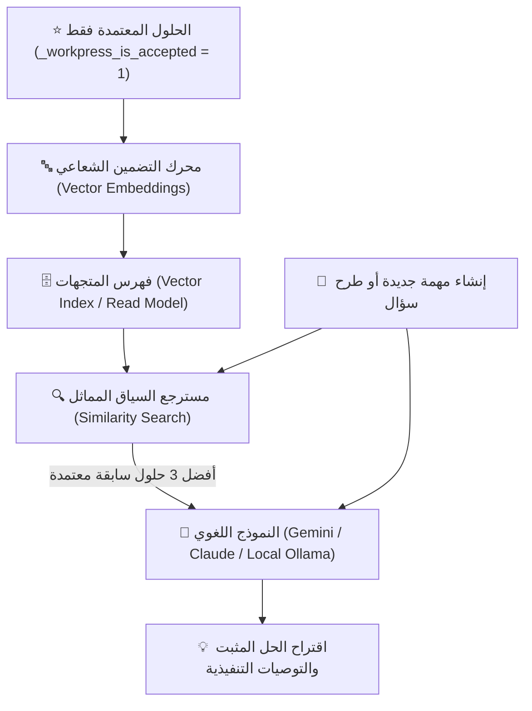

# 🧠 وثيقة المواصفات الهندسية: محرك الذكاء الاصطناعي المؤسسي المبني على المعرفة
## WorkPress Knowledge AI & RAG Engine Specification (v2.0 Backlog)

> **نوع الوثيقة:** مواصفات معمارية لأنظمة الذكاء الاصطناعي المؤسسي المستند إلى الحقيقة  
> **الإصدار المستهدف:** WorkPress v2.0.0  
> **الهدف:** توظيف الذكاء الاصطناعي التوليدي (AI/RAG) المرتكز حصراً على الذاكرة المؤسسية والحلول المعتمدة رسمياً لتقديم إجابات واقتراحات خالية من الهلوسة.  
> **المراجع العليا:** [FIRST_PRINCIPLES.md](../core/FIRST_PRINCIPLES.md) | [ARCHITECTURE.md](../core/ARCHITECTURE.md)

---

## 1. الفلسفة الجوهرية: الذكاء الاصطناعي المرتكز على الحقيقة (Grounding in Truth)

معظم أدوات الذكاء الاصطناعي العامة تفشل في البيئات المؤسسية لأنها تفتقر للسياق الداخلي للمنظمة وتولد إجابات تخمينية غير دقيقة (Hallucinations).

في **WorkPress**، نمتلك كنزاً لا يقدر بثمن:
> **«بنك المعرفة لا يحتوي على نصوص عشوائية، بل يحتوي حصراً على حلول برمجية وفنية وإجرائية تم تطبيقها واقعياً واعتمادها رسمياً من قبل قادة المشاريع (`_workpress_is_accepted = 1`).»**

هذا النقاء المعماري يجعل تغذية نموذج استرجاع المعرفة المولد (RAG - Retrieval-Augmented Generation) ينتج **«عقلاً مؤسسياً خارق الدقة»** يستحضر تجارب المنشأة السابقة بدقة 100%.

---

## 2. الهيكل المعماري لمحرك الـ RAG المؤسسي

---

## 3. حالات الاستخدام والتطبيقات الذكية

### 1. الاقتراح الاستباقي للحلول المشابهة (Similar Solution Recommender):
- أثناء كتابة المطور أو المنفذ لمهمة جديدة (مثل: *"معالجة فشل اتصال قاعدة البيانات مع الخادم الاحتياطي"*):
  - يقوم المحرك فوراً بالبحث في بنك المعرفة عن المهام التاريخية المشابهة.
  - يظهر للمنفذ تنبيه جانبي ذكي: **«💡 تم حل مشكلة مشابهة في مشروع (SEC) بواسطة أحمد بتاريخ 12 ماي — إليك الكود والإجراء المعتمد»**.
  - النتيجة: حل المهام المعقدة في دقائق بدلاً من إعادة اختراع العجلة.

### 2. المساعد المعرفي للدردشة والاستفسار (Workspace Copilot):
- نافذة محادثة ذكية للمدراء وأعضاء الفريق تجيب عن أسئلة العمل:
  - *"كيف قمنا بإعداد بوابات الدفع في المشاريع السابقة؟"*
  - *"ما هو بروتوكول معالجة الشكاوى المعتمد في المنشأة؟"*
  - يقوم المساعد بالإجابة مع وضع روابط مباشرة للمهام والمساهمات التي استقى منها الإجابة.

### 3. التلخيص التلقائي وصياغة ملخصات المهام (Auto-Summarizer):
- تلخيص سلاسل المناقشات الطويلة على المهام وصياغة ملخص تنفيذي جاهز للمدير لاعتماد الحل بنقرة واحدة.

---

## 4. الحصانة والخصوصية (Privacy & Zero-Data-Leakage)
- دعم الارتباط بالنماذج السحابية المؤمنة (Google Gemini Enterprise / OpenAI Private Endpoint) أو **النماذج المحلية بالكامل (Local Self-Hosted via Ollama)** التي تعمل داخل خادم المنشأة دون خروج حرف واحد خارج الشبكة المحلية.
- مراعاة شرط العضوية (Principle #8): لا يسترجع الذكاء الاصطناعي أي معرفة أو حلول من مشاريع سرية إلا إذا كان المستخدم عضواً مصرحاً له فيها.
