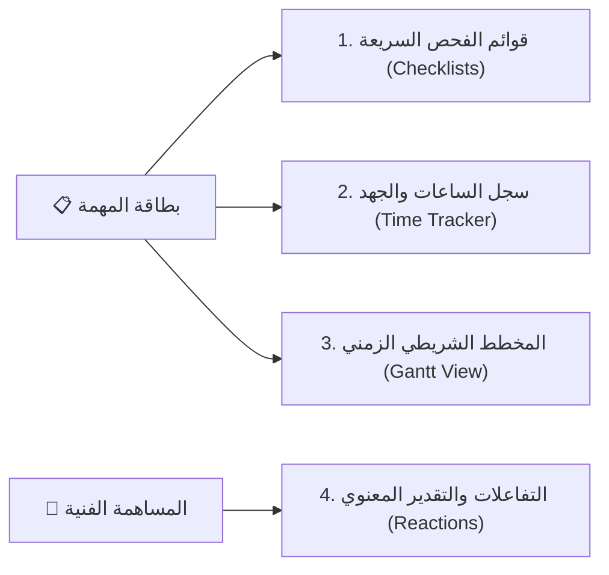

# 🎯 وثيقة المواصفات الهندسية: أدوات الإنتاجية الميدانية وتتبع الجهد
## WorkPress Field Productivity & Workflow Tools Specification (v1.2 Backlog)

> **نوع الوثيقة:** مواصفات معمارية وتفاعلية لأدوات الإنتاجية اليومية  
> **الإصدار المستهدف:** WorkPress v1.2.0  
> **الهدف:** تعزيز كفاءة المنفذين وسرعة إنجاز المهام من خلال أدوات ميدانية خفيفة وسريعة (قوائم الفحص، تتبع الوقت، التفاعلات المعنوية، والمخطط الزمني الشريطي).  
> **المراجع العليا:** [FIRST_PRINCIPLES.md](../core/FIRST_PRINCIPLES.md) | [ARCHITECTURE.md](../core/ARCHITECTURE.md)

---

## 1. محاور أدوات الإنتاجية الميدانية



---

## 2. تفاصيل الأدوات والمكونات

### 1. قوائم الفحص السريعة للمهام (Subtasks & Checklists):
- **الهدف:** تفتيت المهمة الواحدة إلى خطوات إجرائية سريعة (Todo List) قبل رفع المساهمة النهائية.
- **التخزين البرمجي:** مفتاح ميتا `_workpress_subtasks` في جدول `wp_postmeta`:
  ```json
  [
    { "id": "chk_1", "title": "مراجعة متطلبات الأمان وتشفير كلمات المرور", "is_done": true, "completed_by": 2 },
    { "id": "chk_2", "title": "إجراء اختبارات الضغط وتحمل الخادم", "is_done": false, "completed_by": null }
  ]
  ```
- **التجربة البصرية:** شريط تقدم نقطي يوضح `2/5 خطوات مكتملة` مع مربعات اختيار تفاعلية سريعة التحديث دون إعادة تحميل الصفحة.

---

### 2. تتبع الوقت وتسجيل ساعات العمل (Time Tracking & Effort Logging):
- **الهدف:** توثيق الساعات المستغرقة في تنفيذ المهمة لتقدير التكاليف وحساب مستحقات المستقلين والمنفذين.
- **التخزين البرمجي:**
  - عداد وقت تفاعلي (Stopwatch Timer) أو إدخال يدوي عند رفع المساهمة: `_workpress_time_spent_minutes`.
  - إمكانية استخراج تقرير إجمالي الساعات لكل مشروع أو عضو.

---

### 3. التفاعلات السريعة والتقدير المعنوي (Emoji Reactions):
- **الهدف:** تمكين الزملاء والقادة من إبداء الإعجاب والتقدير الفوري لمساهمات الأعضاء دون الحاجة لكتابة ردود طويلة.
- **الرموز المعتمدة:**
  - 👍 **موافق / تم التأكيد (Acknowledged)**
  - ⭐ **حل استثنائي / مقترح مبدع (Brilliant Idea)**
  - 🔥 **إنجاز فائق السرعة (Fast Delivery)**
  - 💡 **طريقة ملهمة (Inspiring Approach)**
- **التخزين البرمجي:** ميتا التعليق `_workpress_reactions` ككائن JSON يحفظ مصفوفة بمعرفات المستخدمين المتفاعلين.

---

### 4. المخطط الشريطي الزمني لمشاريع الكانبان (Interactive Gantt Chart):
- **الهدف:** تقديم منظور زمني ممتد (Timeline) لمهام المشروع يبين تواريخ البدء (`start_at`) وتواريخ الاستحقاق (`due_at`).
- **المزايا التفاعلية:**
  - سحب حواف الأشرطة لتعديل المواعيد مباشرة.
  - إبراز المسار الحرج (Critical Path) والمهام المتأخرة باللون الأحمر للتنبيه الاستباقي.
