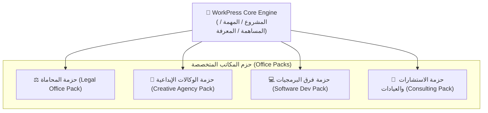

# 📦 وثيقة المواصفات الهندسية: منظومة حزم المكاتب المتخصصة
## WorkPress Office Packs Ecosystem Specification (v2.0 Backlog)

> **نوع الوثيقة:** مواصفات معمارية لمنظومة الامتدادات والتخصص القطاعي  
> **الإصدار المستهدف:** WorkPress v2.0.0  
> **الهدف:** تمكين المطورين والشركات من تخصيص WorkPress لقطاعات أعمال محددة (محاماة، تسويق، برمجة، استشارات) عبر إضافات خفيفة (`Add-on Plugins`) دون لمس أو تعديل سطر كود واحد في النواة.  
> **المراجع العليا:** [FIRST_PRINCIPLES.md](../core/FIRST_PRINCIPLES.md) | [ARCHITECTURE.md](../core/ARCHITECTURE.md)

---

## 1. الفلسفة المعمارية: النواة الحيادية وحزم التخصص (Domain Neutrality)

وفقاً للمبدأ التأسيسي رقم 19 و 20:
> **«النواة المركزية (Core Engine) لا تعرف شيئاً عن قطاعات التجارة؛ إنها تعرف فقط (المشروع، المهمة، المساهمة، والمعرفة). أما حزم المكاتب (Office Packs) فهي التي تمنح هذه الكيانات معناها التخصصي وسياقها المهني.»**



---

## 2. بروتوكول تسجيل الحزمة (Office Pack Registration API)

تقوم كل حزمة بتسجيل نفسها عبر خطاف PHP بسيط وموحد:

```php
add_action( 'workpress_register_office_packs', function() {
    workpress_register_office_pack( array(
        'id'          => 'legal_office_pack',
        'name'        => 'حزمة مكاتب المحاماة والاستشارات القانونية',
        'version'     => '1.0.0',
        'author'      => 'WorkPress Legal Team',
        'description' => 'قوالب دعاوى قضائية، صياغة عقود، مذكرات دفاع، ومراجعات لوائح.',
        
        // 1. أنواع المساهمات المخصصة للقطاع
        'contribution_types' => array(
            array( 'key' => 'legal_contract', 'label' => 'صياغة عقد / اتفاقية ⚖️', 'icon' => 'dashicons-media-document' ),
            array( 'key' => 'court_plea',     'label' => 'مذكرة دفاع / لائحة دعوى 📜', 'icon' => 'dashicons-pressthis' ),
            array( 'key' => 'legal_advice',   'label' => 'رأي قانوني / استشارة 💡', 'icon' => 'dashicons-lightbulb' ),
            array( 'key' => 'verdict',        'label' => 'حكم قضائي / قرار نهائي 🏛️', 'icon' => 'dashicons-awards' ),
        ),

        // 2. الأسماء المستعارة للأدوار
        'role_aliases' => array(
            'administrator' => 'رئيس هيئة المحامين',
            'editor'        => 'محامي أول / مدير القضية',
            'author'        => 'محامي ممارس / باحث قانوني',
            'contributor'   => 'مساعد قانوني / متدرب',
            'subscriber'    => 'الموكل / صاحب القضية',
        ),

        // 3. قوالب المشاريع والمهام الجاهزة
        'templates' => array(
            'templates/lawsuit-template.json',
            'templates/company-incorporation.json',
        ),
    ) );
} );
```

---

## 3. نماذج تطبيقية للحزم الجاهزة (Pre-configured Blueprints)

### 1. حزمة مكاتب المحاماة (Legal Office Pack):
- **المشاريع:** ملفات القضايا، قضايا التحكيم، تأسيس الشركات.
- **المهام:** جمع الأدلة، صياغة اللائحة، حضور الجلسة، تقديم الاستئناف.
- **المعرفة المعتمدة:** السوابق القضائية الناجحة والصيغ القانونية النموذجية المعتمدة ليعاد استخدامها تلقائياً في القضايا المستقبلية.

### 2. حزمة الوكالات الإعلانية والتسويق (Creative Agency Pack):
- **المشاريع:** حملات إطلاق الهويات التجارية، إدارة حسابات التواصل.
- **المهام:** كتابة السيناريو الإعلاني، التصميم الجرافيكي، المونتاج، موافقة العميل.
- **أنواع المساهمات:** مسودة تصميم 🎨، مراجعة فنية 🔍، موافقة العميل النهائية ✅.

### 3. حزمة فرق التطوير والبرمجيات (Software Dev Pack):
- **المشاريع:** تطبيقات الويب، أنظمة الـ API، ترقيات الخوادم.
- **المهام:** تتبع الأخطاء البرمجية (Bugs)، ميزات جديدة (Features)، ترقيعات أمنية (Security Patches).
- **أنواع المساهمات:** رابط Pull Request 🛠️، نتائج اختبارات الأداء 📊، كود الحل المعتمد ⭐.

---

## 4. سوق الحزم والتبادل المعرفي (Community Ecosystem)
- إمكانية تصدير واستيراد الحزم كملفات مضغوطة (`.zip`) أو عبر مستودع إضافات ووردبريس العام، مما يخلق اقتصاداً بيئياً متكاملاً حول WorkPress.
