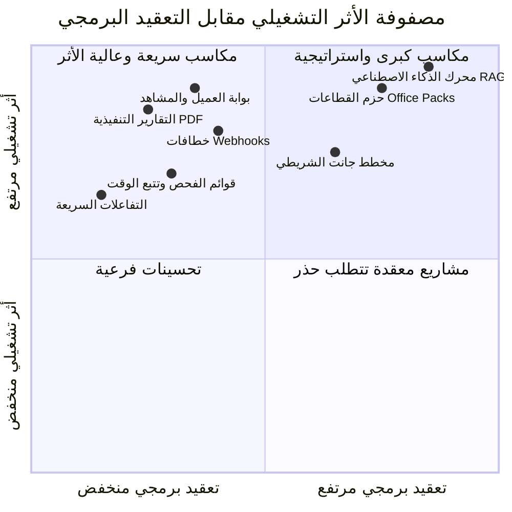

# فهرس بنك الابتكارات وخريطة طريق التطويرات المستقبلية
## WorkPress Innovations & Future Backlog Index (v1.1 ➔ v2.0+)

> **نوع الوثيقة:** الفهرس الاستراتيجي لبنك الابتكارات والميزات المستقبلية المؤجلة  
> **الهدف:** توثيق، تحليل، وتأصيل كافة الأفكار الابتكارية المعتمدة هندسياً لتكون مرجعاً للتطوير المستقبلي في الإصدارات القادمة دون أي تسرع أو إخلال بالمبادئ الـ 21.  
> **المرجعية العليا:** [FIRST_PRINCIPLES.md](../core/FIRST_PRINCIPLES.md) | [ARCHITECTURE.md](../core/ARCHITECTURE.md) | [PRD.md](../core/PRD.md)

---

## 🧭 1. شجرة مجلد الأفكار والابتكارات (`docs/backlog/`)

```
docs/backlog/
├── README.md                                    # (أنت هنا) الفهرس الاستراتيجي وخريطة الإصدارات
├── 01-CLIENT-AND-VIEWER-PORTAL.md               # ✅ (مكتمل في الإنتاج) بوابة ومنظور العميل والمشاهد المستقلة
├── 02-EXECUTIVE-REPORTING-AND-ANALYTICS.md      # ✅ (مكتمل في الإنتاج) التقارير التنفيذية المنسقة، كتيب المعرفة، ولوحة التحليلات
├── 03-ENTERPRISE-WEBHOOKS-AND-INTEGRATIONS.md   # ✅ (مكتمل في الإنتاج) خطافات الويب المؤسسية (Slack, Teams, Discord, Zapier)
├── 04-KNOWLEDGE-AI-AND-RAG-ENGINE.md            # 🧠 محرك الذكاء الاصطناعي المؤسسي المبني على المعرفة
├── 05-WORKFLOW-PRODUCTIVITY-TOOLS.md            # 🎯 تتبع الوقت، قوائم الفحص، التفاعلات، ومخطط جانت
└── 06-OFFICE-PACKS-ECOSYSTEM.md                 # 📦 حزم القطاعات المتخصصة (محاماة، تسويق، برمجة)
```

---

## 🗺️ 2. خريطة الإصدارات والتسلسل الزمني (Release Milestones Matrix)

| الإصدار | الحالة | الحزم والميزات المخططة | القيمة الاستراتيجية |
| :--- | :---: | :--- | :--- |
| **WorkPress v1.1.0 ➔ v1.3.0**<br/>*(حزمة المشاركة والتحصين)* | 🟢 **منجز في الإنتاج** | - **بوابة العميل المستقلة** (`01-CLIENT-AND-VIEWER-PORTAL.md`)<br/>- **نماذج الطلبات الديناميكية واستوديو الاستقبال**<br/>- **التحصين المؤسسي والأداء الفائق والصلابة** | تمكين المنشآت من إشراك العملاء والمستفيدين بشفافية تامة، استقبال الطلبات المهيكلة، واستجابة فائقة السرعة (<35ms). |
| **WorkPress v1.4.0**<br/>*(حزمة التقارير والمعرفة)* | 🟢 **منجز في الإنتاج** | - **التقارير التنفيذية وتصدير PDF** (`02-EXECUTIVE-REPORTING-AND-ANALYTICS.md`)<br/>- **محرك كتيب المعرفة المجمّع (.md)**<br/>- **وثيقة الاستلام والاعتماد الرسمي للعميل**<br/>- **رادار التحليلات المؤسسية** | تصدير وثائق إنجاز المشاريع المعتمدة رسمياً، كتيب المعرفة الكامل، ومطابقة أعلى المعايير القياسية للتوثيق والتسليم. |
| **WorkPress v1.5.0**<br/>*(حزمة التكامل والأتمتة)* | 🟢 **منجز في الإنتاج** | - **خطافات الويب والتكامل المؤسسي الخارجي** (`03-ENTERPRISE-WEBHOOKS-AND-INTEGRATIONS.md`)<br/>- **دعم قوالب Discord و Slack و Teams و Generic JSON**<br/>- **التوقيع المشفر HMAC-SHA256 واستوديو الإعدادات** | ربط المنظومة بقنوات التواصل الفوري وإرسال أحداث اعتماد الحلول وطلبات المشاريع واكتمال الأعمال لحظياً. |
| **WorkPress v1.6.0+**<br/>*(حزمة أدوات الإنتاجية)* | ⏳ **الهدف القادم** | - **أدوات الإنتاجية وقوائم الفحص السريعة** (`05-WORKFLOW-PRODUCTIVITY-TOOLS.md`)<br/>- **تتبع الوقت والتقديرات الزمنية** | تعزيز كفاءة الفرق التشغيلية وسرعة إنجاز المهام الدقيقة. |
| **WorkPress v2.0.0**<br/>*(حزمة الذكاء والتوسع)* | 💡 **رؤية مستقبلية** | - **الذكاء الاصطناعي المؤسسي (Knowledge RAG)** (`04-KNOWLEDGE-AI-AND-RAG-ENGINE.md`)<br/>- **منظومة حزم القطاعات المتخصصة (Office Packs)** (`06-OFFICE-PACKS-ECOSYSTEM.md`) | تحويل WorkPress إلى عقل مؤسسي ذكي يقدم استشارات وحلولاً استباقية مبنية على الذاكرة المؤسسية. |

---

## 📊 3. مصفوفة تقييم الأفكار (Value vs. Complexity Scoring)



---

## 🛡️ 4. الضوابط المعمارية لتنفيذ أي فكرة مستقبلية

كل فكرة مدونة في هذا المجلد تلتزم التزاماً صارماً بالمحددات التالية:
1. **المبدأ 1 و 5 (الأصل في ووردبريس):** لا يتم إنشاء جداول مخصصة إلا كـ Read Models لتسريع القراءة.
2. **المبدأ 8 (الرؤية تتبع العضوية):** لا يرى أي مستخدم إلا ما هو مصرح له برؤيته عبر شرط العضوية الصريح.
3. **المبدأ 11 (المعرفة هي أدلة معتمدة):** لا يدخل الذكاء الاصطناعي أو التقارير إلا الحلول التي اعتمدها قائد المشروع أو المدير رسمياً.
4. **المبدأ 13 (التاريخ لا يضيع أبداً):** الحفاظ الكامل على تسلسل الأحداث والمساهمات دون محو أو تعديل قسري.
