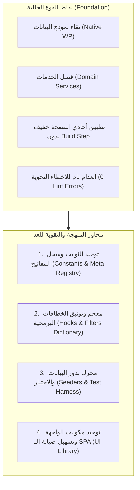

# 🏛️ وثيقة منهجة النظام وقابلية الصيانة والتطوير المستدام لمنظومة WorkPress
## WorkPress Engineering Maintainability & Systems Hardening Blueprint

> **نوع الوثيقة:** دراسة معمارية وخطة عمل استراتيجية (Architectural Blueprint & Action Plan)  
> **الهدف:** تعزيز متانة المنظومة، وتوحيد الأنماط البرمجية، وتهيئة الكود للتطوير السلس، والصيانة السريعة، والتكامل الآمن للسنوات القادمة.  
> **تاريخ الإعداد:** 18 أغسطس 2026  
> **الإصدار المستهدف:** WorkPress v1.0+ (Architecture Hardening Phase)

---

## 📑 1. الفلسفة الهندسية للاستدامة (The Sustainability Philosophy)

لتظل منظومة **WorkPress** سهلة التطوير والصيانة مهما تعاظم حجمها وتشعبت فرق العمل التي تطورها، يجب أن ترتكز على **4 مبادئ هندسية صارمة**:

1. **مبدأ العزل وفصل المسؤوليات (Separation of Concerns):**  
   لا توجد منطق أعمال (Business Logic) داخل المتحكمات (Controllers) أو الواجهات (UI)؛ كل منطق العمليات محصور وموثق داخل طبقة الخدمات (`includes/services/`).
2. **المصدر الوحيد للحقيقة (Single Source of Truth - SSOT):**  
   جميع أسماء الحقول الوصفية (Meta Keys)، وأنواع المحتوى (CPT/Taxonomy)، ومفاتيح الصلاحيات تُدار من خلال سجلات مركزية وثوابت معرفة (Registry & Constants) دون أي سلاسل نصية مبعثرة (No Magic Strings).
3. **التوسعة عبر الخطافات لا التعديل المباشر (Open-Closed Principle via Hooks):**  
   أي ميزة جديدة (مثل حزم المكاتب، التنبيهات الخارجية، التصدير) تُبنى كامتداد يتصل بخطافات ووردبريس (`Actions & Filters`) دون الحاجة لتعديل النواة الأساسية.
4. **التطوير القائم على الثقة والاختبار (Test-Driven Reliability):**  
   امتلاك أدوات اختبار وبذور بيانات (`Data Seeders`) تتيح للمطورين الجدد إعداد بيئة عمل متكاملة وفحص كافة الوظائف بضغطة زر واحدة.

---

## 🏗️ 2. تشخيص الوضع الراهن ومحاور التقوية (Current State Diagnosis)



---

## 🛠️ 3. المحاور التفصيلية لمنهجة وتسهيل التطوير والصيانة

### المحور الأول: توحيد الثوابت وسجل المفاتيح المركزي (`WorkPress_Schema_Registry`)
* **الوضع الحالي:** بعض المفاتيح مثل `_workpress_status` و `_workpress_priority` و `_workpress_is_accepted` مكتوبة كنصوص مباشرة في عدة ملفات.
* **التحسين المنهجي:** إنشاء فئة مركزية [`WorkPress_Keys`](#) أو توسيع `WorkPress_Install` لجمع كافة الثوابت في مكان واحد:
  ```php
  class WorkPress_Keys {
      const META_STATUS       = '_workpress_status';
      const META_PRIORITY     = '_workpress_priority';
      const META_ASSIGNEES    = '_workpress_assignee_ids';
      const META_IS_ACCEPTED  = '_workpress_is_accepted';
      const META_ACCEPTED_BY  = '_workpress_accepted_by';
      const META_ACCEPTED_AT  = '_workpress_accepted_at';
      const CPT_TASK          = 'work_item';
      const TAX_PROJECT       = 'workpress_project';
      const COMMENT_CONTRIB   = 'wp_contribution';
  }
  ```
* **الأثر:** أي تعديل أو إعادة تسمية مستقبلاً يتم في سطر واحد دون أي مخاطرة بحدوث تضارب في الشيفرة.

---

### المحور الثاني: دليل ومعجم الخطافات البرمجية الرسمي (`WorkPress Hooks API`)
* **الوضع الحالي:** توجد خطافات ممتازة مثل `workpress_contribution_accepted` و `workpress_task_state_changed` ولكنها تحتاج لمعجم موحد يسهل على المطورين الخارجيين بناء إضافات وحزم مكاتب (`Office Packs`) متوافقة.
* **التحسين المنهجي:** توثيق ونشر مصفوفة الخطافات وتوفير دوال مساعدة موحدة:
  - `do_action( 'workpress_task_created', $task_id, $task_data );`
  - `do_action( 'workpress_task_assigned', $task_id, $assignee_ids, $actor_id );`
  - `do_action( 'workpress_contribution_accepted', $contrib_id, $task_id, $actor_id );`
  - `do_action( 'workpress_project_completed', $project_id, $actor_id );`
  - `apply_filters( 'workpress_header_brand_actions', $components );`
  - `apply_filters( 'workpress_notification_item_actions', $actions, $notification );`
* **الأثر:** تحويل WorkPress إلى منصة برمجية مفتوحة وقابلة للدمج والتوسع بدون لمس الملفات الأساسية.

---

### المحور الثالث: محرك توليد البيانات التجريبية وبيئة المطورين (`Developer Seeders & Sandbox Mode`)
* **الوضع الحالي:** لاختبار النظام، يحتاج المطور لإنشاء مشاريع ومهام ومساهمات يدوياً في كل مرة يجري فيها اختباراً على بيئة جديدة.
* **التحسين المنهجي:** إضافة أداة تفعيل بذور البيانات (CLI / UI Seeder) تنشئ بنقرة واحدة:
  - 3 مشاريع تجريبية بقطاعات مختلفة (تقنية، تسويق، إدارة).
  - 15 مهمة بحالات وأولويات متنوعة.
  - مساهمات فنية وحلول معتمدة لتعبئة مكتبة المعرفة.
  - مستخدمين تجريبيين لكافة الأدوار الخمسة (`Manager`, `Author`, `Contributor`, `Subscriber`).
* **الأثر:** تقليص وقت إعداد بيئة التطوير والاختبار من 30 دقيقة إلى **3 ثوانٍ فقط**.

---

### المحور الرابع: توحيد مكونات الواجهة الأمامية ونظام الرسائل (UI Tokens & Micro-Components)
* **الوضع الحالي:** الواجهة مبنية بـ React الأصيل عبر `htm` وهي خفيفة جداً وسريعة، ولكن بعض عناصر البطاقات والقوائم تتكرر في أكثر من صفحة.
* **التحسين المنهجي:**
  - استخراج المكونات المتكررة (مثل `StatusBadge`, `DropdownMenu`, `StatCard`, `UserPicker`) إلى مجلد `assets/src/components/common/`.
  - توحيد طبقة الاتصال بواجهة برمجة التطبيقات (`api/client.js`) مع معالجة أخطاء موحدة (Global Error Interceptor).
* **الأثر:** كتابة أي صفحة أو نافذة جديدة مستقبلاً بـ 20% فقط من أسطر الكود الحالية، مع ضمان تناسق تام بنسبة 100% في التصميم.

---

## 📅 4. خارطة طريق جلسة العمل المقترحة للغد (Tomorrow's Action Plan)

| المرحلة | عنوان النشاط الهندسي | الأهداف والمخرجات |
| :--- | :--- | :--- |
| **المرحلة 1** | **تطهير المفاتيح والثوابت (Keys & Constants Consolidation)** | جمع كافة الـ Meta Keys والـ CPTs في فئة ثوابت رسمية موحدة وإحلالها عبر الخدمات والمتحكمات. |
| **المرحلة 2** | **بناء محرك بذور البيانات التجريبية (Dev Data Seeder)** | توفير أداة توليد فوري للبيانات التجريبية لاختبار دورة العمل الكاملة وحالات الحافة (Edge Cases). |
| **المرحلة 3** | **معالجة وتوحيد استجابات الـ REST API (Standard Response Envelope)** | توحيد شكل الردود البرمجية ورموز الخطأ لضمان استقرار وسهولة ربط أي تطبيقات أو واجهات مستقبلية. |
| **المرحلة 4** | **دليل المطورين وحزم المكاتب (Office Packs Developer Kit)** | توثيق كيفية إنشاء حزمة مكتب جديدة (مثل حزمة المحاماة، حزمة الاستشارات) بخطوات قياسية. |

---

## 🎯 5. الخلاصة والتأهب للغد

مشروع **WorkPress** يمتلك بالفعل بنية برمجية نقية جداً وخالية من الديون التقنية. من خلال تنفيذ خطوات هذه الوثيقة غداً، سنرفع المنظومة إلى أعلى معايير **الهندسة المؤسسية (Enterprise-Grade Maintainability)**، لتصبح منصة ممتعة في التطوير، واضحة في الصيانة، ومحصنة ضد أي أخطاء أو تضاربات مستقبلية.
