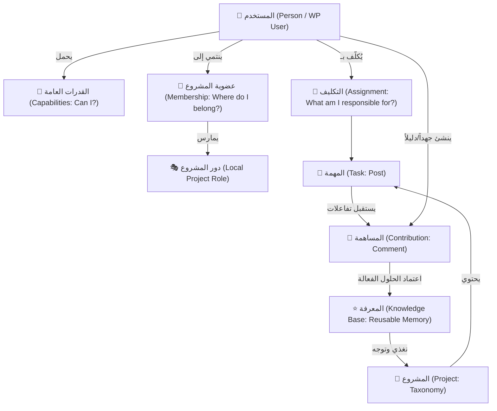
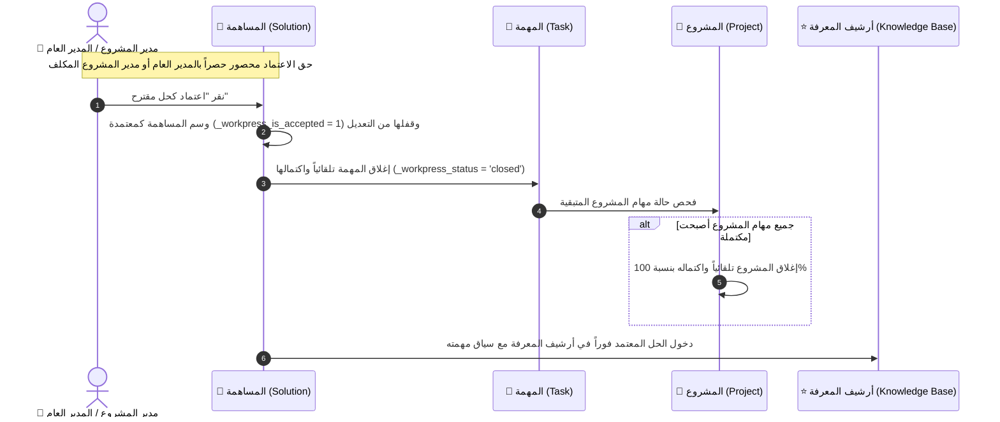
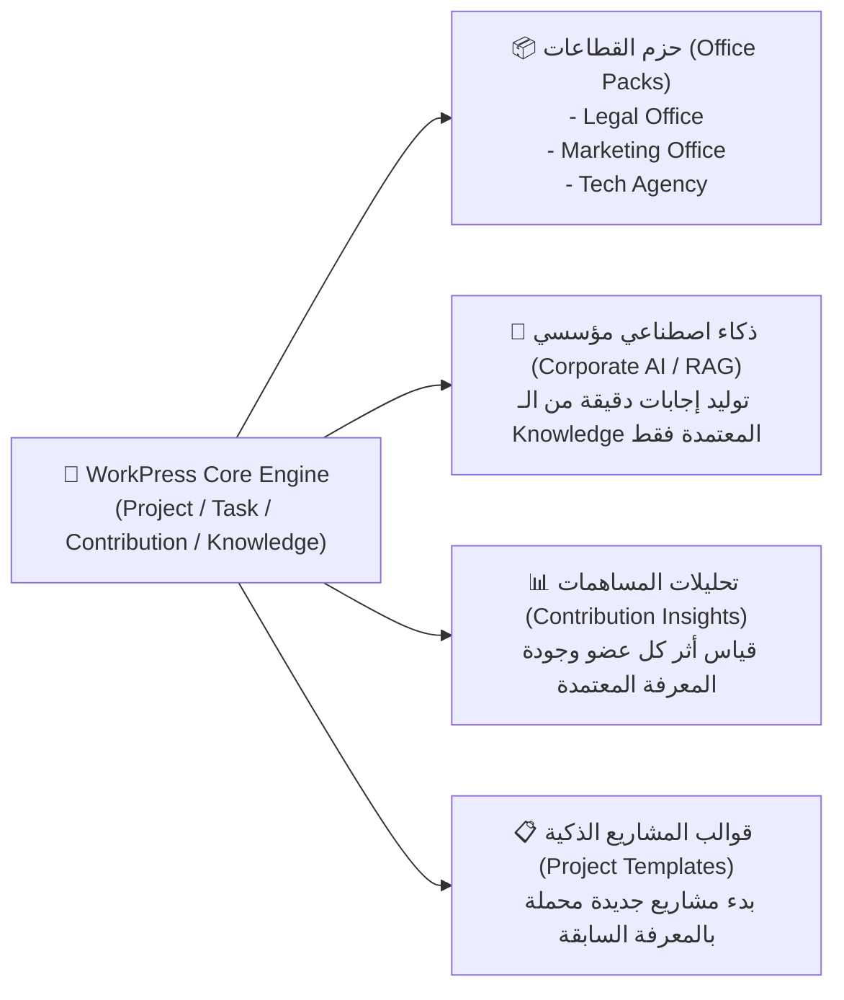

# دراسة معمارية ووجودية شاملة: منظومة WorkPress
## التحليل الذكي للكيانات، ديناميكيات التدفق، وبناء ذاكرة المؤسسة (Organizational Memory Engine)

> **وثيقة مرجعية استراتيجية وتحليلية**  
> **الإصدار:** 2.0 | **النطاق:** Core Architecture, Ontology, Security, & Knowledge Lifecycle  
> **المرجعية العليا:** [FIRST_PRINCIPLES.md](FIRST_PRINCIPLES.md) | [ARCHITECTURE.md](ARCHITECTURE.md) | [PRD.md](PRD.md)

---

## 1. الفلسفة الكلية: ما الذي يميز توليفة WorkPress؟

معظم أنظمة إدارة المهام التقليدية (مثل Trello أو Jira أو Asana) تُبنى كـ **«أنظمة تشغيلية عابرة (Ephemeral Operational Tools)»**؛ تنتهي قيمة المهمة فيها بمجرد تحريكها إلى عمود "Done".

بينما **WorkPress** صُمم من الجذور وفق فلسفة مغايرة جذرياً:
> **«العمل ليس بيانات عابرة تُطوى بعد إنجازها، بل هو محتوى دائم (Work is Content)، والعمل المنجز يولّد معرفة (Knowledge)، والمعرفة المتراكمة تتحول إلى ذاكرة مؤسسية مستدامة (Organizational Memory).»**

هذه الفلسفة أنتجت توليفة وجودية محكمة تتكون من محورين متكاملين:
1. **محور العمل والمعرفة (Work & Knowledge Axis):** `مشروع ➔ مهمة ➔ مساهمة ➔ معرفة`.
2. **محور الأشخاص والصلاحيات (People & Governance Axis):** `مستخدم ➔ عضوية ➔ دور محلي ➔ قدرات وظيفية ➔ تكليف`.

---

## 2. مصفوفة الكيانات الوجودية (The Ontological Matrix)

لتحقيق أقصى درجات الاستقرار وقابلية التوسع دون إعادة اختراع العجلة، بُني WorkPress بالكامل فوق الكيانات الأصلية لـ WordPress (المبدأ 5 والمبدأ 6):

| الكيان في WorkPress | الأصل في WordPress | الوظيفة الفلسفية والمعمارية | السؤال الذي يجيب عنه |
| :--- | :--- | :--- | :--- |
| **المشروع (Project)** | `Taxonomy` (`workpress_project`) | سياق العمل، الحاوية التنظيمية، وحدود الرؤية. | **«أين يجري العمل؟»** |
| **المهمة (Task)** | `Custom Post Type` (`workpress_task`) | وحدة الالتزام والهدف المطلوب تنفيذه. | **«ما هو العمل المطلوب؟»** |
| **المساهمة (Contribution)** | `Comment` (`wp_contribution`) | الجهد البشري، الشرح، الكود، المرفقات، وسجل الأحداث. | **«ما الذي حدث؟ وما الدليل؟»** |
| **المعرفة (Knowledge)** | `Read Model` (المساهمات المعتمدة `_workpress_is_accepted`) | الأثر المعرفي الدائم والحكمة المستخلصة المعتمدة. | **«ما الذي تعلمناه وأثبت نجاحه؟»** |
| **الشخص (Person)** | `WP_User` | الفاعل البشري والمسؤولية الأخلاقية. | **«من الفاعل؟»** |
| **العضوية (Membership)** | `Term Meta` (`_workpress_member_{user_id}`) | نطاق الانتماء وصمام أمان الخصوصية. | **«إلى أين أنتمي؟»** |
| **القدرة (Capability)** | `WP Capability` | الاستطاعة النظامية التقنية. | **«هل أستطيع نظامياً؟ (Can I?)»** |
| **التكليف (Assignment)** | `Post Meta` (`_workpress_assignees`) | المسؤولية التنفيذية المؤقتة. | **«ما الذي أنا مسؤول عنه الآن؟»** |

---

## 3. دراسة تفصيلية للعلاقات البينية والديناميكيات الذكية

### أ. الفصل المعماري العبقري بين (القدرة / العضوية / التكليف)

أحد أعظم الابتكارات في معمارية WorkPress هو **الفصل ثلاثي الأبعاد** للصلاحيات:

1. **القدرة (Capability):** تُمنح على مستوى الموقع ككل (مثل: `view_projects` أو `edit_tasks`). تجيب عن: *هل يملك المستخدم الكفاءة التقنية للقيام بهذا الفعل؟*
2. **العضوية (Membership):** تُمنح على مستوى المشروع الواحد. تجيب عن: *هل يُسمح لهذا المستخدم برؤية هذا السياق المحدد؟* (امتلاك صلاحية مدير لا يجعله يرى المشاريع الخاصة دون مسار تدقيق صريح).
3. **التكليف (Assignment):** يُمنح على مستوى المهمة الواحدة. يجيب عن: *من المسؤول عن إنجاز هذا العمل الآن؟* (التكليف لا يمنح عضوية ولا يمنح صلاحيات إضافية، بل هو مسؤولية محددة).

> 💡 **القيمة الذكية:** هذا الفصل يمنع تسرب البيانات (Data Leakage) ويتيح العمل مع عملاء خارجيين أو مراجعين في مشاريع محددة دون كشف باقي أسرار المؤسسة.

---

### ب. الحالة الحالية مقابل سجل الأحداث (Current State vs History)

وفق **المبدأ رقم 12 و 13**:
- **الحالة الحالية (Current State):** تُحفظ في `Post Meta` (مثل: الحالة الحالية للمهمة `_workpress_status`، الأولوية `_workpress_priority`، المكلفون الحاليون `_workpress_assignees`).
- **التاريخ وسجل التدقيق (Event History):** لا يُكتب فوقه أو يُمسح أبداً، بل يُسجل كـ **مساهمات متعاقبة (Contributions)**.
  - إذا غُيِّرت حالة المهمة من "قيد التنفيذ" إلى "مراجعة"، تبقى الحالة الحالية في الـ Meta، ويُولد تعليق حدث `state_change` يوثق: *من غيّرها، متى، ولماذا*.
  - إذا حُذف نوع مساهمة، تنتقل المساهمات آلياً إلى تصنيف نظامي محمي **«عام (General)»** دون محو سطر واحد من التاريخ.

---

### ج. دورة الاكتمال المتسلسل والتحول المعرفي (Cascading Completion & Knowledge Engine)

#### القواعد الهندسية الصارمة للاكتمال والحوكمة:
1. **الاعتماد يعني اكتمال المهمة بالضرورة:** بمجرد اعتماد مساهمة كحل من قبل المخول، تُغلق المهمة تلقائياً وتتحول إلى "مكتملة ✅" وتدخل المعرفة فوراً.
2. **اكتمال كل المهام يعني اكتمال المشروع بالضرورة:** عندما تكتمل جميع مهام المشروع (0 مهام متبقية / 100% إنجاز)، يتحول المشروع تلقائياً إلى حالة **«مكتمل / مغلق»**.
3. **حوكمة صلاحية الاعتماد (Lead/Admin Exclusive):** زر الاعتماد يظهر ويعمل حصرياً لـ:
   - **المدير العام (Administrator / `manage_options`).**
   - **مدير المشروع المعين (`Project Lead` داخل سياق مشروعه).**
4. **مسار التراجع التلقائي (Rollback on Revoke):** عند إلغاء اعتماد الحل، تعود المهمة تلقائياً إلى حالة **«قيد المراجعة 🔍»**، وتُسحب المساهمة من المعرفة، ويعود المشروع تلقائياً لحالة **«نشط / قيد التنفيذ»**.
5. **حماية الأثر المعرفي (Immutability):** قفل المساهمة المعتمدة من التعديل لضمان بقاء الحل كما اعتمده القائد دون تحريف.

---

## 4. الميزات الاستراتيجية الإضافية المكتشفة في البنية الحالية

### 1. حيادية النواة وتعدد مجالات العمل (Domain Neutrality Engine)
- بفضل تحرير **«أنواع المساهمات»** وجعلها ديناميكية بالكامل في الإعدادات:
  - **قطاع المحاماة:** يستخدم (صياغة عقد ⚖️، استشارة، تدقيق لائحة، حكم قضائي).
  - **وكالات التسويق:** تستخدم (تصميم هوية 🎨، كتابة إعلان، فيديو، موافقة عميل).
  - **البرمجة والتطوير:** تستخدم (كود 🛠️، حل معماري ⭐، مراجعة 🔍، نقاش 💭).
  - **القطاع الصحي أو التعليمي:** يمكنه تخصيص أنواع تناسب عمله فوراً دون كتابة سطر كود واحد.

### 2. شريط الفلترة متعدد الأبعاد وقوة الاسترجاع السريع
- الجمع بين `المشروع`، `المهمة`، `النوع المخصص`، `حالة الاعتماد المعرفي`، `الكاتب`، و`البحث النصي الفوري` حول لوحة المساهمات من مجرد سجل تعليقات بسيط إلى **محرك بحث واستقصاء استخباراتي للعمليات (Operational Intelligence)**.

### 3. الأمان المطبق على كل نقطة نهاية (Zero Trust REST Layer)
- كل طلب يمر عبر طبقة الخدمات (`Services`)؛ لا يُسمح لأي تحكم مباشر بقاعدة البيانات.
- الحذف يتم بنظام **طلب الأرشفة والحذف المسبب (Trash Request with Audit Reason)** بدلاً من الحذف العشوائي، مما يحمي الذاكرة المؤسسية من التخريب العرضي أو المتعمد.

---

## 5. الآفاق التوسعية المستقبلية (Future Horizons & Strategic Synergies)

بناءً على هذه التوليفة الصلبة، تفتح أمام WorkPress آفاق استراتيجية غير مسبوقة:

1. **الذكاء الاصطناعي التوليدي المبني على المعرفة (Knowledge-based Enterprise AI):**
   - بما أن قاعدة المعرفة تحتوي فقط على **«المساهمات المعتمدة رسمياً»**، يمكن تغذية نموذج ذكاء اصطناعي (RAG) بهذه المعرفة حصراً، ليقدم إجابات وحلولاً دقيقة 100% مستمدة من تاريخ وخبرات المؤسسة الواقعية، دون أي هلوسة (Hallucination).
2. **حزم المكاتب المتخصصة (Office Packs):**
   - إنشاء إضافات مسبقة الإعداد لقطاعات محددة (مثل: حزمة مكاتب المحاماة، حزمة الوكالات الإعلانية) تحتوي على أدوار وصلاحيات وأنواع مساهمات وقوالب مشاريع جاهزة.
3. **مؤشرات الأداء القائمة على القيمة المعرفية (Knowledge Contribution Index):**
   - تقييم أداء الموظفين ليس فقط بعدد المهام المنجزة، بل بـ **كمية المعرفة والحلول المعتمدة** التي أضافوها لذاكرة المؤسسة واستفاد منها زملاؤهم.

---

## 6. الخلاصة الهندسية

توليفة **(مشروع / مهمة / مساهمة / معرفة + أعضاء / أدوار / صلاحيات / تكليفات)** التي بنيناها تمثل **نموذجاً معمارياً ناضجاً ومكتملاً (Enterprise-Grade Architecture)**:
- **تحترم WordPress** وتستغل كامل قوته وأمانه.
- **تحمي التاريخ** وتفصل الحالة الآنية عن مسار التدقيق.
- **تخدم أي قطاع عمل** بحيادية ومرونة مطلقة.
- **تُحوّل العمل اليومي الروتيني إلى أصل معرفي ومالي دائم للمؤسسة.**
