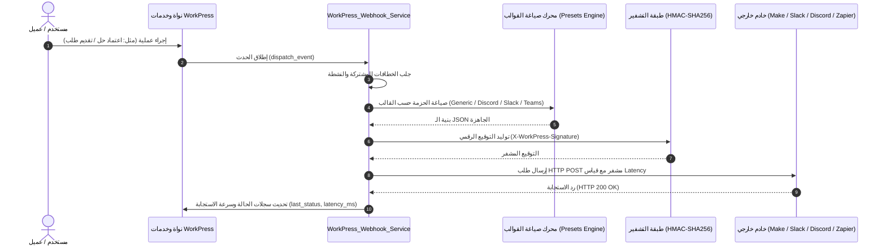
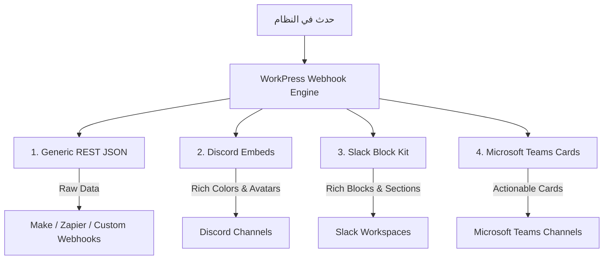

# التوثيق البرمجي والمعماري الشامل لمحرك خطافات الويب والتكامل المؤسسي
## WorkPress Webhook & Event-Driven Integrations Engine Architecture

> **المرجع التقني والبرمجي الأعلى لمحرك خطافات الويب (Webhooks Engine) في منظومة WorkPress.**  
> يشرح هذا الملف الهيكلية المعمارية، طبقة الأحداث، آليات التشفير والمصادقة الأمنية، ومخططات الحزم (Payload Schemas) وقوالب التكامل الجاهزة (Presets: Generic, Discord, Slack, Microsoft Teams).

---

## 🧭 1. المعمارية العامة ومسار تدفق الأحداث (Event-Driven Flow)

يعمل محرك خطافات الويب في WorkPress بنموذج **Event-Driven Publisher/Subscriber** فائق الأداء، حيث يستمع المحرك تلقائياً للأحداث الحيوية داخل بيئة العمل (إنشاء المهام، اعتماد الحلول، تقديم الطلبات، اكتمال المشاريع) ويقوم بصياغة حزمة بيانات وتوزيعها بشكل فوري وغير متزامن عبر طلبات `HTTP POST` مشفرة.



---

## 🛡️ 2. الأمان والمصادقة الرقمية (Security & Cryptographic Signatures)

لضمان سلامة البيانات ومنع هجمات التلاعب (Tampering) أو انتحال الشخصية (Spoofing)، يرفق المحرك مع كل طلب ترويسات أمنية معيارية مع توقيع رقمي يتم احتسابه بمفتاح سري مشترك (**Shared Secret**).

### 2.1 ترويسات الـ HTTP المرسلة (Request Headers)
| اسم الترويسة (Header) | النوع | الوصف الفني | مثال |
| :--- | :--- | :--- | :--- |
| `Content-Type` | `string` | نوع المحتوى المشفر بترميز UTF-8 | `application/json; charset=utf-8` |
| `User-Agent` | `string` | المعرف البرمجي للمحرك مع رقم الإصدار | `WorkPress-Webhook-Engine/1.5.0` |
| `X-WorkPress-Event` | `string` | المفتاح المعياري للحدث المثار | `workpress.solution_accepted` |
| `X-WorkPress-Signature` | `string` | توقيع الـ HMAC-SHA256 المشفر | `sha256=e1a5613b33f248...` |
| `X-WorkPress-Timestamp` | `string` | الطابع الزمني للطلب (Unix Epoch) | `1787351040` |

### 2.2 خوارزمية التحقق من التوقيع (Signature Verification)
يتم احتساب التوقيع باستخدام دالة الـ HMAC بخوارزمية SHA256 على النص الخام للـ JSON المرسل (`Raw Body`):

$$\text{Signature} = \text{"sha256="} + \text{HMAC\_SHA256}(\text{Raw Payload Body}, \text{Secret})$$

#### كود التحقق البرمجي بلغة PHP (للمستقبلين / Webhook Consumers):
```php
function verify_workpress_webhook( $raw_body, $secret, $header_signature ) {
    $expected_signature = 'sha256=' . hash_hmac( 'sha256', $raw_body, $secret );
    return hash_equals( $expected_signature, $header_signature );
}
```

#### كود التحقق البرمجي بلغة Node.js / JavaScript:
```javascript
const crypto = require('crypto');

function verifyWorkPressWebhook(rawBody, secret, headerSignature) {
    const computedSignature = 'sha256=' + crypto.createHmac('sha256', secret).update(rawBody).digest('hex');
    return crypto.timingSafeEqual(Buffer.from(computedSignature), Buffer.from(headerSignature));
}
```

---

## ⚡ 3. أنطولوجيا الأحداث المعتمدة (Supported Events Registry)

يدعم المحرك 6 أحداث تأسيسية تغطي دورة حياة العمل والمشاريع بالكامل:

| مفتاح الحدث (`event_key`) | المسمى العربي | محفز الإطلاق (Trigger) | مستوى الأهمية |
| :--- | :--- | :--- | :--- |
| `workpress.solution_accepted` | اعتماد حل رسمي لمهمة | عند قيام مدير المشروع أو المسؤول باعتماد مساهمة كحل رسمي | 🟢 High Value |
| `workpress.solution_revoked` | سحب اعتماد حل مهمة | عند التراجع عن اعتماد حل وإعادة فتح المهمة للنقاش | 🟡 Notice |
| `workpress.request_submitted` | تقديم طلب مشروع جديد | عند قيام العميل بتقديم طلب من خلال النماذج التفاعلية | 🔵 Milestone |
| `workpress.project_completed` | اكتمال مشروع بالكامل | عند وصول نسبة إنجاز مهام المشروع إلى 100% | 🏆 Celebration |
| `workpress.task_status_changed` | تغير حالة مهمة عمل | عند نقل مهمة بين الحالات (قيد التنفيذ، مراجعة، مكتملة) | 🟣 Workflow |
| `workpress.test_ping` | فحص تجريبي فوري | عند الضغط على زر الاختبار من لوحة التحكم أو عبر الـ REST API | ⚙️ Diagnostic |

---

## 📦 4. مواصفات الحزم وقوالب التكامل (Payload Specifications & Presets)

يدعم المحرك صياغة البيانات تلقائياً بـ **4 قوالب معمارية جاهزة**:



---

### 4.1 القالب العام القياسي (`preset: "generic"`)
القالب الأمثل لمنصات الأتمتة (Make.com, Zapier, n8n, Webhook.site) والأنظمة الخاصة:

```json
{
  "event": "workpress.solution_accepted",
  "timestamp": "2026-08-21T22:30:14+01:00",
  "workspace": "مؤسسة الإبداع والحلول البرمجية",
  "data": {
    "task_id": 142,
    "task_title": "تطوير واجهة تسجيل الدخول الموحدة SSO",
    "project_id": 38,
    "project_name": "مشروع المنصة المؤسسية v2",
    "author_id": 12,
    "author_name": "توفيق مصطفاوي",
    "author_email": "toufik@example.com",
    "accepted_by": "مدير النظام",
    "comment_id": 405,
    "accepted_at": "2026-08-21 22:30:14"
  }
}
```

---

### 4.2 قالب ديسكورد الغني (`preset: "discord"`)
مُهيأ لـ Discord Incoming Webhooks مع بطاقات مدمجة ملونة (`Embeds`) وأيقونات ديناميكية:

```json
{
  "username": "WorkPress Engine",
  "avatar_url": "https://raw.githubusercontent.com/WordPress/dashicons/master/svg/clipboard.svg",
  "embeds": [
    {
      "title": "✅ تم اعتماد حل رسمي لمهمة!",
      "description": "**المشروع:** مشروع المنصة المؤسسية v2\n**المهمة:** تطوير واجهة تسجيل الدخول الموحدة SSO\n**المنفذ:** توفيق مصطفاوي\n**المعتمد:** مدير النظام",
      "color": 1097601,
      "footer": {
        "text": "مؤسسة الإبداع والحلول البرمجية • 2026-08-21 22:30"
      }
    }
  ]
}
```

---

### 4.3 قالب سلاك المعياري (`preset: "slack"`)
مُهيأ لمعمارية **Slack Block Kit** مع ترويسات ومقاطع نصية Markdown منسقة:

```json
{
  "text": "🔔 *WorkPress Event:* اعتماد حل رسمي لمهمة",
  "blocks": [
    {
      "type": "header",
      "text": {
        "type": "plain_text",
        "text": "🚀 WorkPress Workspace Alert",
        "emoji": true
      }
    },
    {
      "type": "section",
      "text": {
        "type": "mrkdwn",
        "text": "*🔔 WorkPress Event: اعتماد حل رسمي لمهمة*\n**المشروع:** مشروع المنصة المؤسسية v2\n**المهمة:** تطوير واجهة تسجيل الدخول الموحدة SSO\n_Workspace: مؤسسة الإبداع والحلول البرمجية_"
      }
    }
  ]
}
```

---

### 4.4 قالب ميكروسوفت تيمز (`preset: "teams"`)
مُهيأ لمعمارية **Office 365 / Microsoft Teams MessageCard**:

```json
{
  "@type": "MessageCard",
  "@context": "https://schema.org/extensions",
  "themeColor": "4F46E5",
  "summary": "WorkPress Notification: workpress.solution_accepted",
  "title": "WorkPress: اعتماد حل رسمي لمهمة",
  "text": "تم اعتماد مساهمة كحل رسمي لمهمة العمل المذكورة أدناه.",
  "sections": [
    {
      "activityTitle": "مؤسسة الإبداع والحلول البرمجية",
      "activitySubtitle": "2026-08-21T22:30:14+01:00",
      "facts": [
        { "name": "Event", "value": "workpress.solution_accepted" },
        { "name": "Project", "value": "مشروع المنصة المؤسسية v2" },
        { "name": "Task", "value": "تطوير واجهة تسجيل الدخول الموحدة SSO" },
        { "name": "Author", "value": "توفيق مصطفاوي" }
      ]
    }
  ]
}
```

---

## 📖 5. معجم الحقول والبيانات المرسلة (Complete Data Dictionary)

جدول تفصيلي بكافة الحقول المتضمنة داخل كائن `data` لكل حدث:

| اسم الحقل | النوع | الأحداث التي يتواجد فيها | الوصف الفني ومثال القيمة |
| :--- | :--- | :--- | :--- |
| `event` | `string` | كافة الأحداث | معرف الحدث المثار (مثال: `workpress.solution_accepted`) |
| `timestamp` | `string` | كافة الأحداث | تاريخ ووقت الإرسال بتنسيق ISO 8601 |
| `workspace` | `string` | كافة الأحداث | اسم مساحة العمل / موقع الووردبريس (Blog Name) |
| `project_id` | `int` | جميع أحداث المشاريع والمهام | المعرف الرقمي للمشروع (Term ID) |
| `project_name` | `string` | جميع أحداث المشاريع والمهام | الاسم النصي للمشروع |
| `task_id` | `int` | أحداث المهام والحلول | المعرف الرقمي للمهمة (Post ID) |
| `task_title` | `string` | أحداث المهام والحلول | العنوان النصي لمهمة العمل |
| `author_id` | `int` | `workpress.solution_accepted` | المعرف الرقمي للمستخدم صاحب الحل المعتمد |
| `author_name` | `string` | `workpress.solution_accepted` | الاسم الظاهر للمستخدم صاحب الحل |
| `author_email` | `string` | `workpress.solution_accepted` | البريد الإلكتروني للمستخدم صاحب الحل |
| `accepted_by` | `string` | `workpress.solution_accepted` | الاسم الظاهر للمشرف الذي اعتمد الحل |
| `revoked_by` | `string` | `workpress.solution_revoked` | الاسم الظاهر للمشرف الذي سحب الاعتماد |
| `client_id` | `int` | `workpress.request_submitted` | المعرف الرقمي لحساب العميل |
| `client_name` | `string` | `workpress.request_submitted` | اسم العميل مقدم الطلب |
| `client_email` | `string` | `workpress.request_submitted` | البريد الإلكتروني للعميل |
| `form_id` | `int` | `workpress.request_submitted` | المعرف الرقمي لنموذج الطلب المستخدم |
| `form_title` | `string` | `workpress.request_submitted` | عنوان نموذج الطلب |
| `specs` | `array/object` | `workpress.request_submitted` | الحقول المخصصة ومواصفات الطلب المدخلة من العميل |
| `tasks_count` | `int` | `workpress.project_completed` | إجمالي عدد المهام المنجزة في المشروع |
| `completed_at` | `string` | `workpress.project_completed` | تاريخ ووقت اكتمال المشروع |
| `old_status` | `string` | `workpress.task_status_changed` | الحالة السابقة للمهمة (open, in_progress, review, closed) |
| `new_status` | `string` | `workpress.task_status_changed` | الحالة الجديدة للمهمة |
| `changed_by` | `string` | `workpress.task_status_changed` | اسم المستخدم الذي قام بتغيير حالة المهمة |
| `test` | `bool` | `workpress.test_ping` | قيمة ثابتة `true` للتأكيد على كونه فحصاً تجريبياً |
| `message` | `string` | `workpress.test_ping` | الرسالة التوضيحية للفحص التجريبي |

---

## 🔌 6. واجهة برمجة التطبيقات REST API Endpoints

تتيح منظومة WorkPress واجهات REST كاملة وم محمية بصلاحية `manage_options` للتحكم في الخطافات:

### 6.1 المسارات المعتمدة:
```http
GET    /wp-json/workpress/v1/webhooks         # استرجاع قائمة كافة الخطافات المسجلة
POST   /wp-json/workpress/v1/webhooks         # إنشاء أو تعديل خطاف ويب
DELETE /wp-json/workpress/v1/webhooks/{id}    # حذف خطاف ويب نهائياً
POST   /wp-json/workpress/v1/webhooks/test    # إرسال فحص تجريبي فوري (Ping)
```

### 6.2 نموذج جسم الطلب لحفظ خطاف (`POST /wp-json/workpress/v1/webhooks`):
```json
{
  "id": "wh_7d0418875f",
  "name": "تكامل خادم الديسكورد - قسم التطوير",
  "url": "https://discord.com/api/webhooks/123456/abcdef...",
  "preset": "discord",
  "events": [
    "workpress.solution_accepted",
    "workpress.request_submitted",
    "workpress.project_completed"
  ],
  "secret": "whsec_o1fmx2z17cpa06kigeec",
  "active": true
}
```

---

## ⚙️ 7. بنية الكود البرمجي ونقاط الامتداد (PHP Service Extension Points)

يتم تخزين الخطافات في قاعدة بيانات ووردبريس ضمن جدول الخيارات القياسي في خيار واحد عالي الكفاءة `workpress_webhooks`.

### الملفات المسؤولة عن المحرك:
1. `includes/services/class-workpress-webhook-service.php`: محرك الخطافات، معالجة التشفير، توزيع الأحداث، وصياغة القوالب.
2. `includes/api/class-workpress-rest-webhooks-controller.php`: متحكم الـ REST API لإدارة وتعديل واختبار الخطافات.
3. `assets/src/components/WebhooksSettingsTab.js`: استوديو إدارة الخطافات التفاعلي داخل لوحة التحكم React SPA.

### كيفية إطلاق حدث مخصص برمجياً (Custom Event Triggering):
يمكن لأي إضافة أو كود مخصص في بيئة ووردبريس إطلاق إشعار Webhook عبر استدعاء المحرك مباشرة:

```php
// إطلاق حدث مخصص عبر محرك WorkPress
if ( class_exists( 'WorkPress_Webhook_Service' ) ) {
    WorkPress_Webhook_Service::dispatch_event( 'workpress.solution_accepted', array(
        'task_id'      => $task_id,
        'task_title'   => get_the_title( $task_id ),
        'project_id'   => $project_id,
        'project_name' => $project_term->name,
        'author_name'  => $user->display_name,
        'author_email' => $user->user_email,
        'accepted_by'  => wp_get_current_user()->display_name,
        'accepted_at'  => current_time( 'mysql' ),
    ) );
}
```
