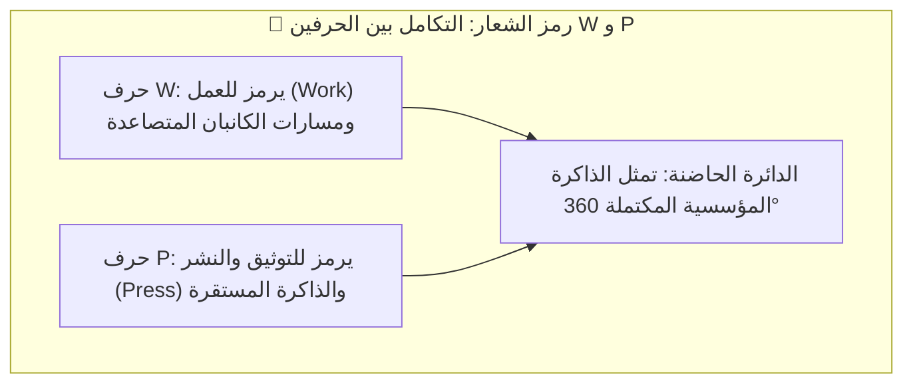

# دليل الهوية البصرية والعلامة التجارية لمنظومة WorkPress
## WorkPress Brand Identity & Visual Design Guidelines Manual

> **النوع:** دليل الهوية المؤسسية الشامل (Comprehensive Brand Guidelines)  
> **الإصدار:** 1.0 Enterprise  
> **النطاق:** شعار المنظومة، التايبوجرافي، لوحة الألوان، نبرة الصوت، الشعارات اللفظية (Slogans)، وضوابط الاستخدام  
> **المراجع:** [FIRST_PRINCIPLES.md](../core/FIRST_PRINCIPLES.md) | [ARCHITECTURE.md](../core/ARCHITECTURE.md) | [01-TOKENS.md](01-TOKENS.md)

---

## 1. قصة وهوية العلامة التجارية (Brand Narrative & Core Essence)

### 1.1. الامتداد التاريخي والشرف المعماري:
* **WordPress**: المنصة التي حررت وديمقراطت **النشر وصناعة المحتوى** على الويب (`Word + Press`).
* **WooCommerce**: المنظومة التي حررت وديمقراطت **التجارة الإلكترونية** عالمياً (`Woo + Commerce`).
* **WorkPress**: المنظومة التي تحرر وتديمقراط **إدارة العمل التشاركي والذاكرة المؤسسية** (`Work + Press`).

### 1.2. الجوهر الفلسفي الحاكم:
> **«الأشخاص يصنعون العمل، والعمل يولد برهاناً، والبرهان المعتمد يصبح ذاكرة المؤسسة.»**  
> WorkPress ليست مجرد أداة لإدارة المهام السريعة العابرة؛ بل هي **نظام تشغيل مؤسسي (Work OS)** يوثق الحقيقة اللحظية ويحمي أثر العمل المنجز للأجيال القادمة.

---

## 2. اقتراحات الشعارات اللفظية (Slogans & Taglines)

تم ابتكار الشعارات اللفظية في مستويات متعددة لتناسب سياقات التسويق، الشاشات الترحيبية، والوثائق الرسمية:

### أ. الشعار الرئيسي (The Master Tagline - موصى به):
* **باللغة الإنجليزية:** **« Where Work Becomes Memory »**
* **باللغة العربية:** **« حيث يتحول العمل إلى ذاكرة مؤسسية »**
* **الدلالة:** يربط فوراً بين الفعل اليومي (Work) والأثر التراكمي الدائم (Memory).

### ب. شعارات بديلة متخصصة:

| النمط التسويقي | الشعار بالإنجليزية (English) | الشعار بالعربية (Arabic) | الاستخدام المناسب |
| :--- | :--- | :--- | :--- |
| **المعياري المؤسسي** | *The Operating System for Real Work* | **نظام تشغيل العمل الحقيقي والتشاركي** | العروض التقديمية ووثائق الشركات |
| **البرهاني / محرك الحقيقة** | *From Effort to Evidence* | **من الجهد إلى البرهان والمعرفة** | لوحات الإنجاز وتقارير الإنتاجية |
| **الديمقراطي (على خطى ووردبريس)** | *Democratizing Work & Knowledge* | **تحرير طاقات العمل وحفظ المعرفة** | المؤتمرات والمجتمعات المفتوحة |
| **التنفيذي الذكي** | *Truth-Driven Project Intelligence* | **إدارة مشاريع تقودها الحقيقة اللحظية** | الحملات الإعلانية ومواقع SaaS |

---

## 3. تشريح الشعار والرمز الأيقوني (Logo Anatomy & Symbolism)



### 3.1. العناصر التكوينية للشعار:
1. **الرمز المركزي (The Monogram Icon):**  
   شعار هندسي دائري أيقوني يدمج بين حرف **W** الصاعد بديناميكية وحرف **P** الرصين في خطوط متصلة فائقة التناغم، تشبه في قوتها وهيبتها أيقونة **WordPress** و **WooCommerce**.
2. **الاسم اللفظي (Wordmark):**  
   كلمة **WorkPress** مكتوبة بخط هجين يجمع بين الأناقة العصرية والوزن الجريء، مع تمييز دقيق في سماكة الكلمتين (`Work` بوزن Bold و `Press` بوزن Medium/SemiBold) لإبراز التركيب الثنائي للعلامة.

---

## 4. لوحة الألوان الرسمية (Brand Color Palette & Tokens)

تم اختيار لوحة الألوان لتعكس الاحترافية العالية والذكاء التكنولوجي مع الحفاظ على التباين والراحة البصرية:

```
[ Electric Indigo ]    [ Emerald Truth ]    [ Obsidian Slate ]    [ Titanium Pure ]
     #6366F1               #10B981               #0F172A               #F8FAFC
  (اللون الرئيسي)        (لون الحقيقة والاعتماد)     (الخلفيات الداكنة)       (النصوص والأسطح)
```

### المواصفات اللونية الدقيقة:

| اسم اللون | الرمز السداسي (HEX) | تركيبة RGB | دلالة الاستخدام |
| :--- | :--- | :--- | :--- |
| **Electric Indigo (الرئيسي)** | `#6366F1` | `rgb(99, 102, 241)` | لون الشعار الأساسي، الأزرار التفاعلية، وهوية العلامة. |
| **Royal Indigo Dark** | `#4F46E5` | `rgb(79, 70, 229)` | حالات التحويم (Hover)، العناوين النشطة، والحدود البارزة. |
| **Emerald Truth (الاعتماد)** | `#10B981` | `rgb(16, 185, 129)` | الحلول المعتمدة، المهام المكتملة 100%، وحالات النجاح. |
| **Obsidian Navy (الأساس)** | `#0F172A` | `rgb(15, 23, 42)` | خلفيات الواجهات، أشرطة التحكم، والأسطح الصلبة. |
| **Slate Grey (المحايد)** | `#64748B` | `rgb(100, 116, 139)` | النصوص الثانوية، الحدود الهادئة، وأيقونات التنقل. |
| **Knowledge Gold (المعرفة)** | `#F59E0B` | `rgb(245, 158, 11)` | أوسمة الحلول الممتازة، والمساهمات المرشحة، والتنبيهات. |
| **Titanium Light (الفاتح)** | `#F8FAFC` | `rgb(248, 250, 252)` | خلفيات النمط الفاتح، والبطاقات النقية، ونصوص العناوين. |

---

## 5. التايبوجرافي والخطوط المعتمدة (Typography System)

تعتمد الهوية على خطوط مفتوحة المصدر عالية الجودة متوفرة عبر Google Fonts لضمان التوافق التام:

### أ. الخط العربي المعتمد (Primary Arabic Typeface):
* **اسم الخط:** **Cairo** (أو **IBM Plex Sans Arabic**)
* **الأوزان المستخدمة:**
  * **Black (900):** عناوين الشعار الرئيسية واللافتات الكبرى.
  * **Bold (700):** عناوين الأقسام والبطاقات وأسماء المشاريع.
  * **SemiBold (600):** عناصر القوائم، الأزرار، والوسوم.
  * **Regular (400):** النصوص السردية والوصف والتعليقات.

### ب. الخط اللاتيني المعتمد (Primary Latin Typeface):
* **اسم الخط:** **Plus Jakarta Sans** (أو **Inter**)
* **الأوزان المستخدمة:** 800 (ExtraBold)، 700 (Bold)، 600 (SemiBold)، 400 (Regular).

### ج. الخط البرمجي والتقني (Monospace):
* **اسم الخط:** **JetBrains Mono** أو **Fira Code** للمعرفات والـ Slugs والأكواد.

---

## 6. المساحة الآمنة والحدود الدنيا للشعار (Clear Space & Sizing)

* **المساحة الآمنة (Clear Space):**  
  يجب ترك مسافة فارغة حول الشعار من جميع الجهات لا تقل عن نصف ارتفاع الرمز الأيقوني ($0.5X$) لمنع التداخل مع أي نصوص أو عناصر أخرى.
* **الحد الأدنى للحجم في الشاشات الرقمية:**
  * **الشعار الكامل (الرمز + النص):** لا يقل عرضه عن `120px`.
  * **الرمز الأيقوني المستقل (Icon Only):** لا يقل عن `24x24px` (أيقونة المتصفح Favicon: `32x32px`).
* **الحد الأدنى في المطبوعات:** لا يقل عرض الشعار عن `30mm`.

---

## 7. لغة الأيقونات والرسومات (Iconography & Visual Tone)

1. **الالتزام بأيقونات ووردبريس الرسمية (WordPress Dashicons):**  
   تعتمد واجهات المنظومة حصرياً على أيقونات Dashicons والرموز المتجهة النظيفة (SVG).
2. **حظر الإيموجيات في الواجهات الرسمية:**  
   للحفاظ على هيبة المنظومة المؤسسية وتجنب التباين العشوائي بين أنظمة التشغيل، تُستبدل أي إيموجيات يونيكود بأيقونات أحادية اللون منسجمة مع لوحة ألوان الهوية.
3. **الزوايا والأسطح (Surfaces & Radii):**  
   حواف أنيقة وحادة بلمسة عصرية ناعمة (`border-radius: 6px` للأزرار، `12px` للبطاقات، و `16px` للنوافذ المنبثقة الكبرى).

---

## 8. محظورات وضوابط استخدام الهوية (Brand Do's & Don'ts)

* ❌ **ممنوع:** تغيير نسب أبعاد الشعار (مطّه أفقياً أو رأسياً).
* ❌ **ممنوع:** استخدام ألوان عشوائية خارج لوحة الألوان الرسمية للعلامة.
* ❌ **ممنوع:** وضع الشعار فوق خلفيات مزدحمة بالتفاصيل دون توفير تباين كافٍ.
* ❌ **ممنوع:** فصل حرفي W و P عن تكوينهما الهندسي المعتمد.
* ✅ **مسموح:** استخدام النسخة الأحادية اللون (Monochrome White أو Monochrome Black) على الخلفيات المتجانسة.
* ✅ **مسموح:** استخدام الرمز الأيقوني منفرداً كأيقونة تطبيق أو صورة رمزية (Avatar / App Icon).
