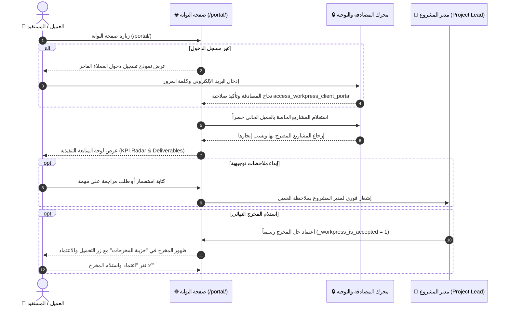
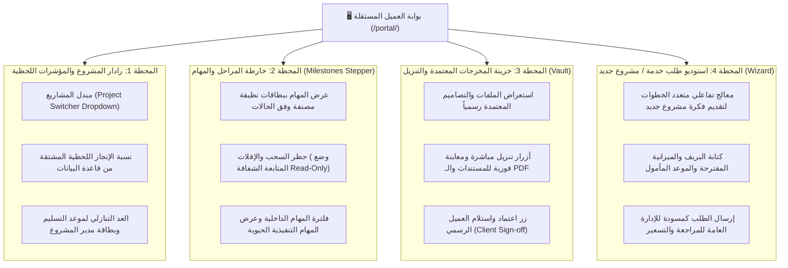

# الدليل السردي والمعماري الشامل: مساحة وبوابة العميل المستقلة
## WorkPress Standalone Client Portal & Customer Care Narrative Guide

> **نوع الوثيقة:** دليل سردي وتشغيلي مفصل لمساحة وبوابة العميل المستقلة (Standalone Canvas)  
> **النطاق:** تجربة العضو المتابع والعميل الخارجي (Subscriber / Client / Viewer Workspace)  
> **الملف البصري التفاعلي المرافق:** [client-portal-visual-guide.html](client-portal-visual-guide.html)  
> **المرجع المعماري الأساسي:** [01-CLIENT-AND-VIEWER-PORTAL.md](../backlog/01-CLIENT-AND-VIEWER-PORTAL.md)

---

## 🧭 1. الفلسفة التشغيلية: كيف يرى العميل المنظومة؟

في التصور المعماري المعتمد لـ **WorkPress**، العميل أو المستفيد ليس مستخدماً تقنياً يطلب منه التنقل في لوحة التحكم المعقدة `wp-admin`، كما أننا **لا نستبدل موقع المنشأة الخارجي أو نلغي هويته**.

بل توفر المنظومة **«بوابة عملاء مستقلة ومعزولة بصرياً (Standalone Full-Page Canvas)»** تعمل عبر رابط مخصص (مثل: `https://yourwebsite.com/portal/` أو عبر شورت كود `[workpress_client_portal]`).

### المعادلة الثلاثية لحرية الموقع وفخامة تجربة العميل:
1. **حرية تامة للموقع العام (Zero Interference):** صاحب الموقع يستخدم أي ثيم يعجبه في العالم (Astra, Kadence, Divi, Elementor) وينشر مقالاته وأخباره وصفحاته بحرية تامة دون أي تداخل مع WorkPress.
2. **عزل بصري وبرمجي مطلق (0% CSS Bleed):** تستخدم البوابة خطاف `template_include` لتقديم قالب مستقل كامل دون استدعاء `get_header()` أو `get_footer()` الخاص بالثيم العام، مما يمنع نهائياً تداخل الخطوط أو الألوان أو الوجتات.
3. **نقاء المخرجات والخصوصية (100% Data Isolation):** لا يرى العميل سوى المشاريع والمهام المصرح له بمتابعتها فقط عبر قيد العضوية الصريح، وتُحجب عنه كواليس النقاشات الفنية التمهيدية ليرى فقط **المخرجات المعتمدة رسمياً**.

---

## 🔒 2. هندسة الهوية والصلاحيات: كيف نميز العميل عن القارئ العادي؟

في ووردبريس، يحصل أي مسجل عادي في الموقع (ليعلق على مقال مثلاً) على رتبة `subscriber` (مشترك). لمنع أي تداخل بين **«قارئ المدونة العادي»** و **«عميل WorkPress الحقيقي»**، اعتمدنا منظومة ثلاثية الأبعاد:

```mermaid
graph TD
    User["👤 المستخدم يقوم بتسجيل الدخول"]
    
    subgraph Engine["⚙️ محرك التوجيه والفحص الذكي في WorkPress"]
        Check1{"1. هل يملك مشاريع مرتبطة به؟<br/>(Term Meta: _workpress_member_{user_id})"}
        Check2{"2. هل يملك قدرة بوابة العملاء؟<br/>(access_workpress_client_portal)"}
    end

    User --> Check1
    Check1 -->|نعم (عميل WorkPress حقيقي)| RedirectPortal["🚀 توجيه فوري لبوابة العميل:<br/>https://site.com/portal/"]
    Check1 -->|لا| Check2
    Check2 -->|نعم (عميل جديد بلا مشاريع بعد)| RedirectPortal
    Check2 -->|لا (قارئ مدونة عادي)| RedirectBlog["🌐 يبقى في واجهة الموقع العادي أو المقال"]
```

### صمامات الأمان الثلاثة:
1. **القدرة الحصرية (`access_workpress_client_portal`):** تمنح تلقائياً للمستخدم فور ربطه بأي مشروع في WorkPress لتمييزه عن المشتركين العاديين.
2. **محرك التوجيه الذكي بعد الدخول (`login_redirect Hook`):**
   - **المدير / القائد:** يُوجّه للوحة التحكم الداخلية `/wp-admin/admin.php?page=workpress`.
   - **العميل:** يُوجّه فورياً لبوابة المشاريع الخاصة `/portal/`.
   - **قارئ المدونة:** يبقى في الموقع العام أو المقال الذي كان يتصفحه.
3. **صمام الحماية لغير المرتبطين بمشاريع (Zero-Leakage Gatekeeper):** إذا فتح قارئ مدونة عادي رابط البوابة يدوياً، تظهر له رسالة لطيفة:
   > *«مرحباً بك! حسابك مسجل كمتابع في الموقع العام، ولكن ليس لديك مشاريع عمل نشطة حالياً. إذا كنت عميلاً، يرجى التواصل مع الإدارة لربط مشروعك.»*

---

## 🏛️ 3. رحلة العميل من الدخول حتى استلام المخرجات



---

## 🎛️ 4. الهيكل البصري والمحطات الأربع في بوابة العميل

تحتوي صفحة البوابة على **هيدر تنفيذي خاص بالبوابة** يتيح التنقل السلس:

```
┌────────────────────────────────────────────────────────────────────────────────────────┐
│  [🏢 شعار المنشأة]     [🌐 العودة للموقع الرئيسي]        [📁 مشروعي الحالي ▼]   [👤 الأستاذ سامي ⏻]  │
├────────────────────────────────────────────────────────────────────────────────────────┤
│                                                                                        │
│   📊 رادار الإنجاز اللحظي      📋 المهام والمراحل      📦 المخرجات المعتمدة للتنزيل   │
│                                                                                        │
└────────────────────────────────────────────────────────────────────────────────────────┘
```



---

## 🔍 5. تفصيل كل محطة وزر وخاصية

### المحطة الأولى: رادار المشروع ومبدل المشاريع (Project Radar & Switcher)
* **مبدل المشاريع (Project Switcher):** قائمة منسدلة فاخرة تمكن العميل من التبديل بين مشاريعه الحالية والسابقة؛ بمجرد التبديل، تتحدث كافة بيانات الصفحة لحظياً دون إعادة تحميل.
* **شريط الإنجاز الذكي:** مؤشر مئوي متصل بحقائق قاعدة البيانات، يُحتسب من نسبة المهام المغلقة والمعتمدة إلى إجمالي المهام.
* **شارة حالة المشروع:** 
  - 🟢 **نشط ويسير وفق الخطة (On Track)**
  - 🟡 **قيد المراجعة والتدقيق (In Review)**
  - 🌟 **مكتمل ومسلم بنجاح (Completed)**
* **بطاقة قائد المشروع (Project Lead Contact):** اسم وصورة قائد المشروع المكلف بمتابعة العمل المباشر مع العميل.
* **زر العودة للموقع الرئيسي (Back to Website):** يتيح للعميل الرجوع إلى تصفح مقالات وصفحات الموقع العام بضغطة زر.

---

### المحطة الثانية: خارطة المراحل ومتابعة المهام (Milestones Stepper)
* **عرض المهام في بطاقات أنيقة:** لا يرى العميل تعقيدات الكانبان التقنية، بل يرى قائمة مهام مرتبة بحسب مراحل إنجازها.
* **حظر التعديل التخريبي (Read-Only Guard):** حظر سحب البطاقات، تغيير الحالات، أو التعديل على محتوى المهمة، مع وسم الواجهة بـ **«وضع الاطلاع والمتابعة 👁️»**.
* **صندوق الملاحظات السريع (Feedback Thread):** إمكانية الضغط على المهمة لكتابة استفسار أو ملاحظة مراجعة تظهر كخيط نقاش فرعي يصله رد القائد عليه.

---

### المحطة الثالثة: خزينة المخرجات المعتمدة (Approved Deliverables Vault)
* **مستودع المخرجات النهائية:** تعرض هذه الخزينة **فقط المساهمات التي اعتمدها قائد المشروع كحل رسمي (`_workpress_is_accepted = 1`)**.
* **أزرار التنزيل والمعاينة الفورية:** تنزيل التصاميم، الأكواد، التقارير التنفيذية، أو ملفات PDF مباشرة.
* **زر «اعتماد واستلام العميل»:** زر تفاعلي يتيح للعميل تأكيد رضاه عن المخرج وإغلاق دورة التسليم.

---

### المحطة الرابعة: استوديو طلب مشروع جديد (Service Request Studio)
* **الخطوة 1: هوية المشروع ومجاله:** تحديد اسم المشروع المقترح ومجاله (برمجة، تسويق، تصميم، استشارة).
* **الخطوة 2: وثيقة المتطلبات (The Client Brief):** كتابة الوصف التفصيلي والأهداف وإرفاق الملفات المرجعية.
* **الخطوة 3: الميزانية والموعد المقترح:** تحديد النطاق المالي المقدر والموعد الزمني المأمول للتسليم.
* **الإرسال والتتبع:** يُنشأ الطلب كمسودة خاصة `project_request` تظهر فوراً في لوحة المدير العام للبت فيها وتحويلها لمشروع نشط.

---

## 🛡️ 6. الأمان وحماية البيانات (Security & Privacy Safeguards)

1. **التحقق الثلاثي في REST API:**
   - المصادقة (`is_user_logged_in()`).
   - التحقق من قدرة العميل (`current_user_can('access_workpress_client_portal')`).
   - التحقق من وجود ميتا العضوية في المشروع المطلوب (`_workpress_member_{user_id}`).
2. **عزل النقاشات الداخلية (Developer Drafts Isolation):**
   - استعلامات التعليقات والمساهمات الخاصة بالبوابة تستثني أي تعليقات فنية داخلية لم يتم وسمها كحل معتمد أو كملاحظة عامة موجهة للعميل.

---

> 🎨 **الخطوة التالية:** استعرض المحاكي البصري التفاعلي الحي في الملف المرافق [`docs/guides/client-portal-visual-guide.html`](client-portal-visual-guide.html) لمعاينة الواجهات المستقلة ونظام تسجيل الدخول والأزرار والتفاعلات واقعياً.
