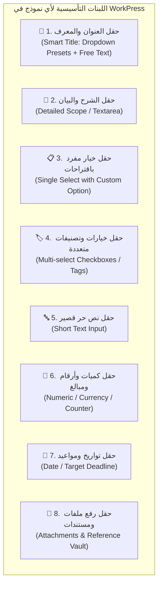
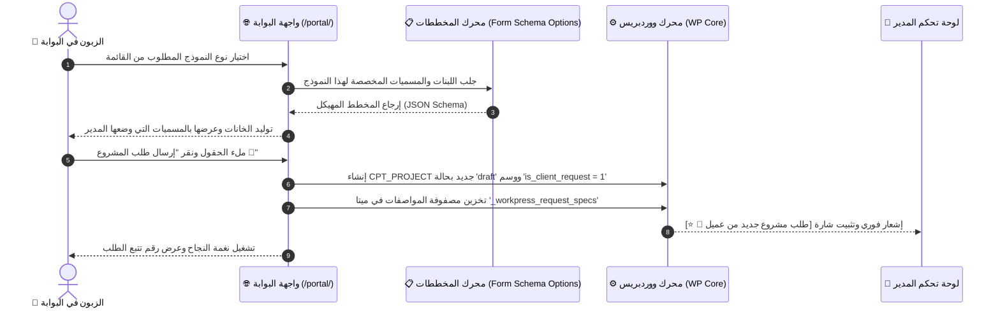

# الدليل السردي والمعماري الشامل: المحرك التجريدي العام لنماذج استقبال الطلبات
## WorkPress Domain-Agnostic Dynamic Request Forms & Meta-Schema Architecture

> **نوع الوثيقة:** دليل سردي وتشغيلي معماري لنظام استقبال وتخصيص نماذج الطلبات والمشاريع التجريدية  
> **النطاق:** الإدارة والمدير (Admin Builder) ➔ بوابة العميل (Client Portal) ➔ مراجعة وتأسيس المشروع (Project Establishment)  
> **الملف البصري التفاعلي المرافق:** [dynamic-request-forms-visual-guide.html](dynamic-request-forms-visual-guide.html)  
> **المرجع المعماري الأساسي:** [01-CLIENT-AND-VIEWER-PORTAL.md](../backlog/01-CLIENT-AND-VIEWER-PORTAL.md) & [ARCHITECTURE.md](../core/ARCHITECTURE.md)

---

## 🧭 1. الفلسفة التجريدية الكبرى: المنظومة العامة المستقلة عن أي مجال (Domain-Agnostic Core)

في فلسفة **WorkPress**، لا يوجد أي افتراض مسبق لطبيعة نشاط المستخدم. النظام ليس برنامجاً للمصممين، ولا للمترجمين، ولا للمبرمجين حصراً، بل هو **منظومة إدارة عمل تجريدية فائقة المرونة (Pure Abstract Work Engine)** تقوم على مبدأ:

> **«المنظومة توفر اللبنات الأولية المجردة (Primitives)، والمدير هو من يحدد المعنى والمسميات وطبيعة الحقول وفق طبيعة عمله دون قيود.»**

```
┌──────────────────────────────────────────────────────────────────────────────────────────────────┐
│                             🏢 محرك النماذج التجريدي العام (UNIVERSAL META-ENGINE)                │
├──────────────────────────────────────────────────────────────────────────────────────────────────┤
│                                                                                                  │
│   📌 1. معرف الكيان (Title Primitive)       ➔  حقل نصي يقبل اقتراحات سريعة + كتابة حرة           │
│   📝 2. الشرح والبيان (Scope Primitive)     ➔  حقل نصي موسع لتفصيل نطاق المطلوب                │
│   🧩 3. مصفوفة المواصفات (Specs Primitives) ➔  لبنات إدخال عامة (خيارات، أرقام، تواريخ، ملفات...)│
│                                                                                                  │
└──────────────────────────────────────────────────────────────────────────────────────────────────┘
```

---

## 🧱 2. اللبنات الأولية العامة (Universal Field Primitives)

كل نموذج في المنظومة يتكون من مزيج مرن من **7 لبنات إدخال عامة وتجريدية**:



### توصيف اللبنات التجريدية:
1. **معرف الطلب الذكي (`smart_title`):**
   - الحقل المسؤول عن تسمية الكيان (`post_title`).
   - يسمح للمدير بإدخال قائمة خيارات سريعة مسبقة + إتاحة خيار الكتابة الحرة دائماً للزبون (`أخرى / كتابة مخصصة`).
2. **شرح الطلب (`scope_description`):**
   - الحقل المسؤول عن متن الكيان (`post_content`).
3. **قائمة الخيارات التخصصية (`select_with_custom`):**
   - خانة منسدلة تحتوي على خيارات محددة من المدير + خيار كتابة حرة إضافي.
4. **التصنيفات والخيارات المتعددة (`multi_select_pills`):**
   - وسوم قابلة للاختيار المتعدد لتحديد متطلبات أو شروط متعددة.
5. **المدخلات النصية الموجزة (`short_text`):**
   - لأي معلومة محددة (رقم مرجعي، رابط خارجي، اسم جهة، إلخ).
6. **المدخلات الرقمية والكمية (`numeric_amount`):**
   - كمية، عدد ساعات، عدد صفحات، ميزانية، أو تقديرات مالية.
7. **المواعيد المستهدفة (`target_date`):**
   - تاريخ التسليم المطلوب أو موعد البدء.
8. **المرفقات والملفات (`file_attachments`):**
   - رفع أي مستندات أو مراجع تدعم الطلب.

---

## 🏛️ 3. الهيكلية المعمارية في ووردبريس (WordPress Ontology)

ترتبط نماذج الطلبات بكيانات ووردبريس الرسمية وفق مخطط هندسي موحد:



---

## 🎛️ 4. لوحة بناء وتخصيص النماذج (Admin Form Builder)

يتحكم المدير في إنشاء وتسمية نماذجه بحرية تامة:

1. **إدارة النماذج (Form Models):**
   - إنشاء نموذج عام موحد، أو إنشاء عدة نماذج منفصلة للخدمات المختلفة.
2. **تسمية الحقول (Custom Labeling):**
   - المدير يكتب مسمى الحقل بنفسه (مثلاً: *"عنوان الطلب"*، *"اسم المنظومة"*، *"موضوع المعاملة"*، *"اسم الملف"*...).
3. **تحديد الإلزامية والترتيب:**
   - تحديد الحقول الإلزامية (`Required`) والاختيارية (`Optional`).
   - ترتيب ظهور الخانات بالسحب والإفلات.

---

## 🏢 5. شاشة مراجعة واعتماد الطلب للمدير

عند وصول الطلب:
1. **الكيان:** ينشأ كـ **مشروع رسمي (`workpress_project`)** في خط أنابيب المشاريع وليس مجرد مهمة.
2. **خزينة المواصفات (Specifications Vault):** تظهر للمدير بطاقة تسرد كافة الحقول التي ملأها الزبون بالمسميات التي وضعها المدير، مع قيمها المختارة أو المكتوبة.
3. **الاعتماد والتأسيس:** زر واحد يحول المشروع إلى **نشط (Active)** وينشئ المراحل والمهام المكلفة للأعضاء.

---

## 🎯 الخلاصة المعمارية
بهذا التجريد الكامل، يصبح نظام **WorkPress** قادراً على العمل مع أي مجال أو قطاع في العالم دون استثناء، بفضل الفصل الكامل بين **اللبنات البرمجية الأولية** و**المسميات التخصصية للمدير**.
