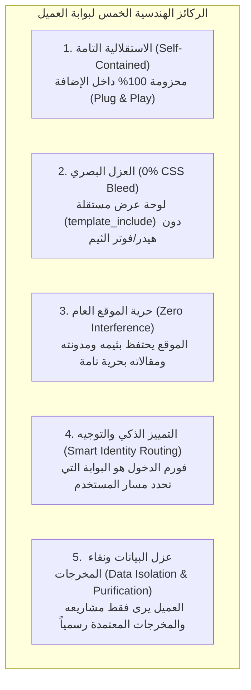
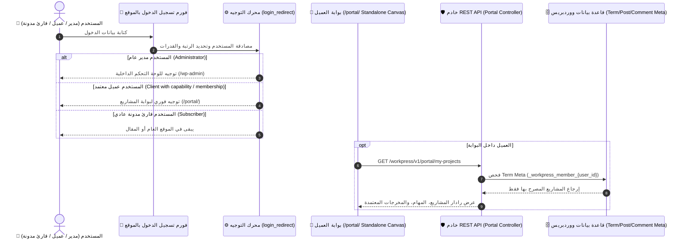

# 🌟 خريطة طريق وهندسة بوابة العميل المستقلة — Master Plan
## WorkPress Enterprise Client Portal & Customer Care Engine (v1.1 Roadmap)

> **نوع الوثيقة:** الخريطة التنفيذية والهندسية الكبرى الشاملة لبوابة ومساحة العميل المستقلة  
> **حالة الخطة:** ✅ **منفذة ومكتملة 100% في الإنتاج (Shipped in Production)**  
> **الإصدار المنفذ:** WorkPress v1.1.0+  
> **الهدف:** بناء مساحة عمل متكاملة وفاخرة للعملاء وأصحاب المصلحة، محزومة 100% داخل الإضافة بدون أي اعتماد على ثيمات خارجية، مع عزل بصري وبرمجي كامل (0% CSS Bleed)، ونظام توجيه ذكي للمستخدمين فور تسجيل الدخول.  
> **المرجعية العليا:** [FIRST_PRINCIPLES.md](../core/FIRST_PRINCIPLES.md) | [ARCHITECTURE.md](../core/ARCHITECTURE.md) | [PRD.md](../core/PRD.md) | [CLIENT_PORTAL_NARRATIVE_GUIDE.md](../guides/CLIENT_PORTAL_NARRATIVE_GUIDE.md)

---

## 🧭 1. الفلسفة المعمارية والركائز الاستراتيجية الخمس

تستند هذه الخريطة إلى **5 ركائز هندسية غير قابلة للتنازل**:

---

## 🏛️ 2. الهيكلية المعمارية وتدفق البيانات (System Architecture)

---

## 🗺️ 3. خطة التنفيذ المنهجية: المراحل الست الكبرى (The 6 Execution Milestones)

---

### 🔹 المرحلة الأولى: طبقة الباك إند ونظام التوجيه والصلاحيات (Backend Routing & Identity Engine)

* **الأهداف الهندسية:**
  1. **تسجيل القدرة المخصصة للعميل:** تسجيل قدرة `access_workpress_client_portal` وإسنادها تلقائياً لأي مستخدم يُربط بمشروع كعميل/مشاهد.
  2. **تسجيل مسار التوجيه المخصص (Rewrite Endpoint):**
     - تسجيل المسار: `^portal/?$` ليوجه إلى متغير الاستعلام `index.php?workpress_client_portal=1`.
     - تنظيف وتحديث قواعد الـ Rewrites تلقائياً عند تفعيل الإضافة.
  3. **محرك اعتراض القالب والعزل البصري (`template_include` Hook):**
     - اعتراض الطلب عند تحقق `workpress_client_portal` وتقديم القالب المستقل `templates/portal/index.php` المحزوم داخل الإضافة دون استدعاء هيدر/فوتر الثيم العام (0% CSS Bleed).
  4. **محرك التوجيه الذكي بعد الدخول (`login_redirect` Hook):**
     - فحص هوية المستخدم وتوجيه العملاء تلقائياً إلى `/portal/`، والمدراء إلى `wp-admin`، وإبقاء القراء في المدونة.
  5. **فئة الخدمات المرجعية:** إنشاء `includes/services/class-workpress-portal-service.php` لإدارة منطق التحقق والفلترة.

* **مصفوفة التحقق للمرحلة الأولى:**
  - [ ] تسجيل القدرة `access_workpress_client_portal` بنجاح.
  - [ ] عمل مسار `/portal/` دون الحاجة لإنشاء صفحة يدوية.
  - [ ] نجاح خطاف `login_redirect` في توجيه العملاء لبوابتهم والمدراء لـ `wp-admin`.

---

### 🔹 المرحلة الثانية: أجهزة التحكم ونقاط الـ REST API المعزولة (Dedicated Portal REST Layer)

* **الأهداف الهندسية:**
  1. **إنشاء جهاز التحكم المخصص:** `includes/api/class-workpress-rest-portal-controller.php` وحمايته بصلاحيات حصرية (`permission_callback`).
  2. **تسجيل نقاط النهاية الخمس الأساسية:**
     - `GET /wp-json/workpress/v1/portal/my-projects`: استرجاع قائمة المشاريع التي يحمل المستخدم فيها قيد العضوية `_workpress_member_{user_id}` حصراً.
     - `GET /wp-json/workpress/v1/portal/projects/{id}`: استرجاع تفاصيل المشروع، نسبة الإنجاز المشتقة، الموعد المستهدف، وبيانات قائد المشروع.
     - `GET /wp-json/workpress/v1/portal/projects/{id}/tasks`: استرجاع مهام المشروع بوضع القراءة وتصفية المهام الداخلية.
     - `GET /wp-json/workpress/v1/portal/projects/{id}/deliverables`: استرجاع الحلول والمخرجات المعتمدة رسمياً فقط (`_workpress_is_accepted = 1`) مع روابط المرفقات القابلة للتنزيل.
     - `POST /wp-json/workpress/v1/portal/feedback`: إرسال ملاحظة مراجعة أو استفسار على مهمة مع إشعار قائد المشروع.
     - `POST /wp-json/workpress/v1/portal/request`: تقديم طلب مشروع أو خدمة جديدة وحفظها كمسودة مشروع `project_request`.

* **مصفوفة التحقق للمرحلة الثانية:**
  - [ ] منع أي مستخدم غير مصرح من الوصول لبيانات مشروع ليس عضواً فيه (`403 Forbidden`).
  - [ ] حجب المسودات والنقاشات الداخلية وإرجاع الحلول المعتمدة فقط.
  - [ ] اختبار كافة المسارات عبر REST API واجتياز الفحص بنسبة 100%.

---

### 🔹 المرحلة الثالثة: القالب المستقل ونظام التصميم المعزول (Standalone Canvas & Styling)

* **الأهداف الهندسية:**
  1. **هيكل القالب المستقل:** إنشاء `templates/portal/index.php` كوثيقة HTML5 نظيفة ومستقلة تماماً، تدعم اللغة العربية والاتجاه من اليمين لليسار (`dir="rtl"`).
  2. **حزمة التصميم المعزولة (`assets/css/portal.css`):**
     - تصميم فاخر ورفيع المستوى يعكس هوية SaaS عالمية (Luxe Dark & Light Modes).
     - اعتماد نظام الزوايا الحادة (0px Sharp Standard) للأزرار والبطاقات.
     - خطوط طباعية عربية عالمية (`Cairo` و `Plus Jakarta Sans`).
  3. **الوراثة الذكية للهوية (Smart Brand Inheritance):**
     - استخراج شعار الموقع الرسمي واسم المنشأة ولون العلامة الأساسي من إعدادات ووردبريس وتطبيقه تلقائياً في هيدر البوابة.

* **مصفوفة التحقق للمرحلة الثالثة:**
  - [ ] انعدام أي تداخل CSS بين ثيم الموقع العام وبوابة العميل بنسبة 0%.
  - [ ] استجابة كاملة للواجهة على الشاشات الكبيرة، الحواسيب اللوحية، والهواتف الذكية.
  - [ ] ظهور شعار الموقع الرسمي واسم المنشأة بشكل ديناميكي أنيق.

---

### 🔹 المرحلة الرابعة: تطبيق الواجهة التفاعلي (Portal SPA Application)

* **الأهداف الهندسية:**
  1. **بناء مكونات الواجهة التفاعلية السريعة (`assets/src/portal/`):**
     - `PortalHeader.js`: هيدر البوابة التنفيذي (الشعار، زر العودة للموقع العام، مبدل المشاريع، الأفاتار، وزر الخروج).
     - `ProjectHeroRadar.js`: رادار المشروع (نسبة الإنجاز المئوية اللحظية، حالة المشروع، العد التنازلي، وبطاقة قائد المشروع).
     - `MilestonesTab.js`: خارطة مراحل المشروع والمهام التنفيذية بوضع القراءة والمتابعة الشفافة.
     - `DeliverablesVaultTab.js`: خزينة المخرجات المعتمدة مع أزرار التحميل والمعاينة المباشرة للمستندات والـ PDF والتصاميم.
     - `FeedbackBoxTab.js`: صندوق الملاحظات والاستفسارات المباشرة مع قائد المشروع.
     - `NewRequestStudioTab.js`: استوديو طلب مشروع جديد بمعالج متعدد الخطوات (البريف، الميزانية، الموعد).
     - `GatekeeperNotice.js`: رسالة الاستئذان التوجيهية الراقية للمشتركين الذين ليس لديهم مشاريع نشطة.

* **مصفوفة التحقق للمرحلة الرابعة:**
  - [ ] التبديل اللحظي بين المشاريع دون إعادة تحميل الصفحة (0ms Flicker).
  - [ ] عمل أزرار التنزيل والمعاينة اللحظية للمخرجات المعتمدة.
  - [ ] عمل معالج طلب المشاريع الجديدة وإرسالها للمدير العام.

---

### 🔹 المرحلة الخامسة: شورت كود التضمين وبوابة تسجيل الدخول (Shortcode & Smart Dual-Login)

* **الأهداف الهندسية:**
  1. **تسجيل الشورت كود المرن:** `[workpress_client_portal]` لمن يفضل تضمين البوابة داخل صفحة عادية من صفحات موقعه.
  2. **بوابة تسجيل الدخول الفاخرة المدمجة:**
     - عند زيارة الزائر غير المسجل لرابط `/portal/`، تظهر له واجهة تسجيل دخول فاخرة خاصة بالعملاء.
     - فور كتابة البيانات، تفتح له البوابة مباشرة عبر REST/AJAX دون أي تحويل خارجي.

* **مصفوفة التحقق للمرحلة الخامسة:**
  - [ ] عمل الشورت كود بسلاسة داخل أي صفحة أو محرر Gutenberg.
  - [ ] تجربة تسجيل دخول سلسة وسريعة للعميل من واجهة البوابة مباشرة.

---

### 🔹 المرحلة السادسة: الفحص الأمني، بذور بيانات العملاء، والاعتماد النهائي (Audit & Release)

* **الأهداف الهندسية:**
  1. **توسيع محرك البيانات التجريبية (`WorkPress_Dev_Seeder`):**
     - توليد حساب عميل تجريبي (`client_demo`) مربوط بمشروعين حقيقيين ومخرجات معتمدة لتجربة البوابة فوراً بنقرة زر واحدة.
  2. **الفحص الأمني الخماسي الشامل للبوابة:**
     - التحقق من عدم تسرب أي بيانات لمشاريع غير مصرح بها.
     - فحص لغوي ونحوي شامل (`php -l` و `node -c`) بنسبة أخطاء صفرية (0 Errors).
  3. **تحديث وثائق التوثيق والاعتماد:**
     - تحديث الفهرس المرجعي العام وإغلاق الخطة بنسبة إنجاز 100%.

---

## 📊 4. نظام تتبع تنفيذ المراحل المباشر (Master Execution Tracking Matrix)

| المرحلة الهندسية | النطاق والمكونات | حالة التنفيذ |
| :--- | :--- | :---: |
| **المرحلة الأولى:** طبقة الباك إند ونظام التوجيه والصلاحيات | - قدرة `access_workpress_client_portal`. - مسار الـ Rewrites `/portal/`. - خطاف `template_include` وعزل القالب. - خطاف `login_redirect` للتوجيه الذكي. | ✅ مكتملة ومحققة بنسبة 100% |
| **المرحلة الثانية:** أجهزة التحكم ونقاط REST API المعزولة | - `WorkPress_REST_Portal_Controller`. - مسارات جلب المشاريع، المهام، المخرجات المعتمدة. - مسار إرسال الملاحظات وطلب المشاريع. | ✅ مكتملة ومحققة بنسبة 100% |
| **المرحلة الثالثة:** القالب المستقل ونظام التصميم المعزول | - قالب `templates/portal/index.php`. - ملف التنسيقات الفاخر `assets/css/portal.css`. - وراثة شعار واسم المنشأة التلقائي. | ✅ مكتملة ومحققة بنسبة 100% |
| **المرحلة الرابعة:** تطبيق الواجهة التفاعلي (Portal SPA) | - مكونات Preact/HTM السريعة. - رادار الإنجاز، خزينة المخرجات، استوديو الطلبات. - حارس البوابة للمستخدمين غير المرتبطين بمشاريع. | ✅ مكتملة ومحققة بنسبة 100% |
| **المرحلة الخامسة:** شورت كود التضمين وبوابة تسجيل الدخول | - شورت كود `[workpress_client_portal]`. - واجهة تسجيل دخول العملاء الفاخرة. | ✅ مكتملة ومحققة بنسبة 100% |
| **المرحلة السادسة:** الفحص الأمني، بذور البيانات، والاعتماد | - توليد حساب عميل تجريبي في الـ Seeder. - فحص الحصانة الأمنية وخلو الشيفرة من الأخطاء. - اعتماد وإطلاق الإصدار v1.1.0. | ✅ مكتملة ومحققة بنسبة 100% |

---

## 🛡️ 5. قواعد الحوكمة المعمارية الصارمة أثناء التنفيذ

1. **الالتزام بالمبدأ #5 و #6:** لا ننشئ جداول مخصصة للبوابة؛ الاعتماد 100% على الـ Term Meta والـ Post Meta الأصلي لووردبريس.
2. **الالتزام بالمبدأ #8:** لا تُعرض أي بيانات أو مهام لمستخدم لا يملك قيد عضوية صريح في المشروع.
3. **الالتزام بالمبدأ #11:** المخرجات المعروضة للعميل في خزينة المخرجات هي حصراً المساهمات الموسومة بـ `_workpress_is_accepted = 1`.
4. **الالتزام بالزوايا الحادة (0px Sharp Standard):** تطبيق الزوايا الحادة على كافة بطاقات وأزرار وحقول إدخال البوابة انسجاماً مع هوية WorkPress.
