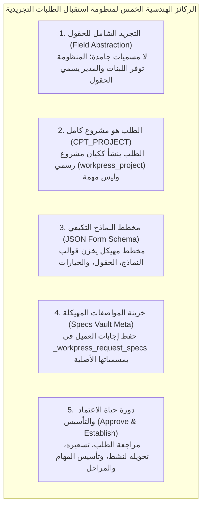
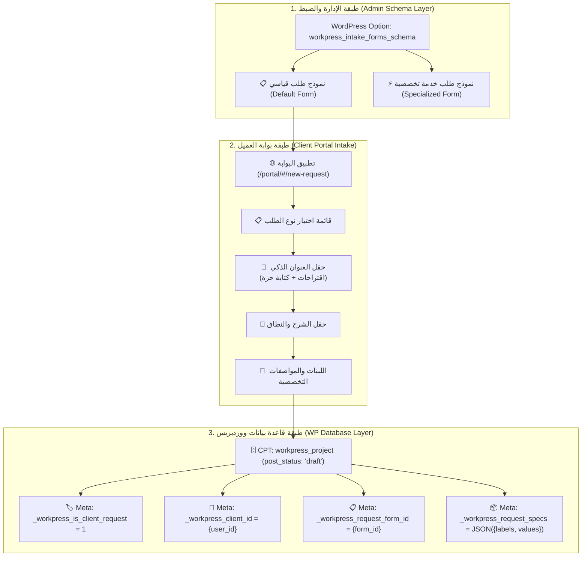
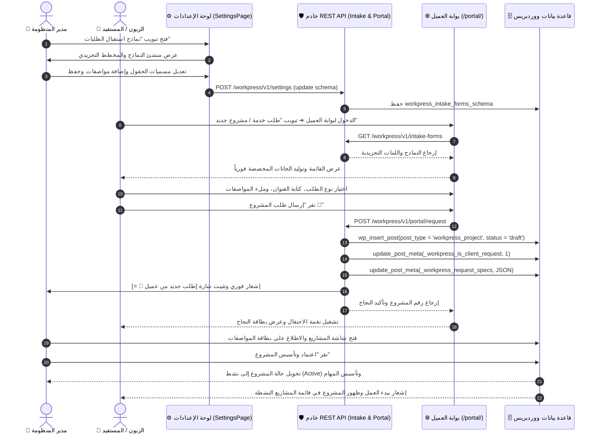

# 🌟 الخريطة الهندسية الكبرى: منظومة نماذج استقبال الطلبات والمشاريع التجريدية — Master Plan
## WorkPress Universal Dynamic Request Forms & Domain-Agnostic Intake Architecture (v1.2 Roadmap)

> **نوع الوثيقة:** الخريطة التنفيذية والهندسية الكبرى الشاملة لنظام استقبال وبناء نماذج الطلبات التجريدية  
> **حالة الخطة:** ✅ **منفذة ومكتملة 100% في الإنتاج (Shipped in Production)**  
> **الإصدار المنفذ:** WorkPress v1.2.0+  
> **الهدف:** بناء محرك استقبال طلبات ومشاريع فائق المرونة والتجريد (Domain-Agnostic Meta-Engine)، يمنح المدير لوحة تحكم لبناء وتخصيص نماذج الطلبات ومسميات الحقول ونوعيتها وفق أي مجال تجاري في العالم، وتوليد واجهة الطلب ديناميكياً في بوابة الزبون، مع تحويل الطلبات إلى مشاريع رسمية معلقة (`CPT_PROJECT`) في ووردبريس تحمل بطاقة مواصفات فنية مهيكلة جاهزة للمراجعة والاعتماد.  
> **المرجعية العليا:** [FIRST_PRINCIPLES.md](../core/FIRST_PRINCIPLES.md) | [ARCHITECTURE.md](../core/ARCHITECTURE.md) | [PRD.md](../core/PRD.md) | [DYNAMIC_REQUEST_FORMS_NARRATIVE_GUIDE.md](../guides/DYNAMIC_REQUEST_FORMS_NARRATIVE_GUIDE.md)

---

## 🧭 1. الفلسفة المعمارية والركائز الخمس الكبرى (The 5 Strategic Pillars)

تستند هذه الخريطة إلى **5 ركائز هندسية غير قابلة للكسر**:

---

## 🏛️ 2. شجرة الكيانات والأنطولوجيا في ووردبريس (WordPress Ontology)

---

## 🔄 3. مخطط تسلسل العمليات وتدفق البيانات (Full Sequence Diagram)

---

## 🗺️ 4. خطة التنفيذ المنهجية: المراحل الست الكبرى (The 6 Execution Milestones)

---

### 🔹 المرحلة الأولى: هندسة الباك إند وبنية البيانات ومخطط JSON (Backend Schema & Data Layer)

* **الأهداف الهندسية:**
  1. **تسجيل المخطط الافتراضي العام (Default Universal Schema):**
     - تخزين مخطط النموذج العام التجريدي في `workpress_intake_forms_schema` عند أول تثبيت أو استدعاء.
     - دعم اللبنات السبع: (`smart_title`, `scope_description`, `select_custom`, `multi_select_pills`, `short_text`, `numeric`, `date`, `file_upload`).
  2. **توسيع جهاز إعدادات REST API (`class-workpress-rest-settings-controller.php`):**
     - استرجاع `intake_forms_schema` وحفظه مع تنقية وتعقيم كافة المدخلات (`sanitize_text_field`, `sanitize_key`).
  3. **تحديث جهاز الإدارة وحقن الإعدادات (`class-workpress-admin.php`):**
     - تمرير `intake_forms_schema` ضمن `window.workpressSettings` للواجهة الأمامية لضمان استجابة لحظية بدون تأخير.

* **مصفوفة التحقق للمرحلة الأولى:**
  - [ ] استرجاع المخطط الافتراضي عبر REST API بنجاح.
  - [ ] التحقق من سلامة البنية التجريدية وحفظ التعديلات في جدول الخيارات `wp_options`.

---

### 🔹 المرحلة الثانية: تصويب مسار استقبال الطلبات وإنشاء المشاريع (Portal Request Controller Refactor)

* **الأهداف الهندسية:**
  1. **تصويب نوع المنشور (`class-workpress-rest-portal-controller.php`):**
     - تعديل `submit_project_request` لإنشاء كيان **`WorkPress_Keys::CPT_PROJECT` (مشروع)** بدلاً من مهمة (`CPT_WORK_ITEM`).
     - ضبط حالة المشروع المنشأ على `draft` (مسودة/طلب معلق).
  2. **هيكلة وتخزين مصفوفة المواصفات:**
     - استخراج كافة قيم المواصفات المرسلة وربطها بمسمياتها التي وضعها المدير وحفظها كمصفوفة JSON مهيكلة في `_workpress_request_specs`.
     - حفظ ميتا: `_workpress_is_client_request = 1`، `_workpress_client_id = $user_id`، `_workpress_request_form_id = $form_id`.
  3. **نقطة وصول عامة لنماذج الطلبات:**
     - توفير مسار `GET /workpress/v1/portal/intake-forms` لجلب النماذج النشطة في بوابة العميل.

* **مصفوفة التحقق للمرحلة الثانية:**
  - [ ] تقديم طلب مشروع تجريبي والتأكد من إدراجه كـ `workpress_project`.
  - [ ] التحقق من حفظ مصفوفة المواصفات `_workpress_request_specs` بدقة تامة.

---

### 🔹 المرحلة الثالثة: شاشة ومنشئ النماذج المستقلة في الهيدر الرئيسي (Standalone Form Studio & Header Button)

* **الأهداف الهندسية:**
  1. **زر رئيسي مباشر في الهيدر (`App.js`):**
     - إدراج زر **«نماذج الطلبات 📋»** مباشرة في شريط التنقل العلوي الرئيسي بجانب المشاريع والكانبان.
     - تسجيل المسار المباشر المستقل `#/forms` و `#/intake-forms`.
  2. **بناء صفحة استوديو النماذج التفاعلية البيضاء (`IntakeFormsPage.js`):**
     - **لوحة الخانات واللبنات العامة (Elements Palette):** قائمة جانبية أنيقة تحتوي على كافة اللبنات التجريدية (`smart_title`, `scope_description`, `select_custom`, `pills`, `short_text`, `textarea`, `numeric`, `date`, `upload`) مع زر إضافة فوري.
     - **مساحة العمل البيضاء النقية (The Visual White Canvas):** بطاقات تفاعلية خالية من المشتتات تتيح تعديل المسميات والخيارات وترتيب الخانات بأسهم الصعود والنزول وحذفها.
     - **نافذة المعاينة الحية للبوابة (Live Portal Preview Modal):** زر معاينة فوري يعرض شكل النموذج الحقيقي داخل بوابة العميل الداكنة قبل الاعتماد.
  3. **زر الحفظ والمزامنة الفورية:**
     - حفظ المخطط عبر REST API مع تنبيه توست وتشغيل نغمة صوتية تفاعلية.

* **مصفوفة التحقق للمرحلة الثالثة:**
  - [x] ظهور زر "نماذج الطلبات" في الهيدر الرئيسي وانتقاله إلى `#/forms`.
  - [x] تجربة إضافة وحذف وتعديل حقول النموذج على مساحة العمل البيضاء.
  - [x] حفظ النموذج والتحقق من بقاء التعديلات بعد تحديث الصفحة.

---

### 🔹 المرحلة الرابعة: المحرك التوليدي في بوابة العميل (Dynamic Portal Intake Renderer)

* **الأهداف الهندسية:**
  1. **توليد الواجهة ديناميكياً في بوابة العميل (`portal-app.js`):**
     - في تبويب "🚀 طلب خدمة / مشروع جديد":
     - قراءة مخطط النماذج المحقون أو المستعلم من REST API.
     - عرض قائمة اختيار نوع الطلب / الباقة (إذا وُجد أكثر من نموذج).
     - توليد حقل العنوان الذكي: قائمة اقتراحات منسدلة + خيار `✍️ أخرى: كتابة عنوان مخصص` يفتح حقلاً نصياً فورياً.
     - توليد حقل الشرح بالمسمى المخصص.
     - توليد مصفوفة المواصفات بحسب أنواعها (قوائم منسدلة، وسوم اختيار، حقول أرقام، محدد تواريخ، منطقة رفع ملفات).
  2. **معالجة الإرسال وتجربة المستخدم الفاخرة:**
     - قفل النموذج أثناء الإرسال ومنع التكرار (Double Submit Lock).
     - إرسال البيانات المهيكلة إلى `/portal/request`.
     - تشغيل نغمة الاحتفال `celebration` وعرض بطاقة النجاح مع رقم الطلب.

* **مصفوفة التحقق للمرحلة الرابعة:**
  - [x] اختيار نوع الطلب والتأكد من توليد الخانات بدقة وفق ما حدده المدير.
  - [x] إرسال الطلب والتأكد من استلام رسالة النجاح بدون أي أخطاء.

---

### 🔹 المرحلة الخامسة: خط أنابيب المشاريع وبطاقة المراجعة والاعتماد (Projects Pipeline & Review Vault)

* **الأهداف الهندسية:**
  1. **إبراز طلبات العملاء في شاشة المشاريع (`ProjectsPage.js`):**
     - تمييز بطاقة المشروع بشارة ذهبية مميزة: **`💼 طلب جديد من عميل ⭐`**.
     - إضافة فلتر سريع في أعلى الشاشة: `(جميع المشاريع | المشاريع النشطة | طلبات العملاء المعلقة 📥)`.
     - زر سريع في هيدر الصفحة للوصول المباشر إلى: `⚙️ إدارة نماذج الطلبات` و `📥 وارد طلبات العملاء`.
  2. **صفحة وصندوق وارد طلبات العملاء المخصصة (`RequestsPage.js`):**
     - صفحة تنفيذية متكاملة تحت المسار `#/requests` مع عدادات حية وفلاتر للطلبات.
     - استعراض خزينة المواصفات الفنية للطلب (`Client Specifications Vault`) مع المرفقات وروابط التنزيل.
  3. **زر الاعتماد والتأسيس الرسمي (Approve & Establish):**
     - نافذة إدارية سريعة: **«اعتماد وتأسيس المشروع 🚀»**:
       - تحويل حالة المشروع إلى **نشط (`publish`)**.
       - إسناد مدير المشروع (Project Lead) وتأكيد الميزانية وتاريخ التسليم.
       - إشعار الزبون ببدء تنفيذ مشروعه رسمياً.

* **مصفوفة التحقق للمرحلة الخامسة:**
  - [x] ظهور الطلب الجديد في شاشة المشاريع والطلبات مع شارة العميل الفاخرة.
  - [x] ظهور بطاقة المواصفات الفنية كاملة ومطابقة لما عبأه العميل.
  - [x] نقر زر الاعتماد والتأكد من تحول المشروع إلى نشط وبدء تأسيس المهام.

---

### 🔹 المرحلة السادسة: المؤثرات الصوتية والتوثيق والتدقيق المؤسسي (Hardening, Audio & Sign-Off)

* **الأهداف الهندسية:**
  1. **الربط الصوتي التفاعلي الكامل (SND Sound Integration):**
     - تشغيل نغمة `celebration` عند تقديم الزبون للطلب وعند اعتماد المدير للمشروع.
     - تشغيل نغمة `button` عند إضافة/تعديل حقول النموذج في لوحة البناء.
     - حماية AudioContext من قيود التشغيل التلقائي عبر التفاعل الأول.
  2. **تحديث التوثيق وفهرس المنظومة:**
     - ربط الخريطة المعتمدة في [`docs/README.md`](../README.md).
  3. **التدقيق البرمجي والأمان:**
     - فحص كافة ملفات PHP و JS بنسبة 100% (No Lint Errors / No Syntax Errors).

* **مصفوفة التحقق للمرحلة السادسة:**
  - [x] اجتياز فحص PHP Syntax و JS Syntax بنجاح تام.
  - [x] تجربة دورة العمل الكاملة (من بناء النموذج إلى تقديم الزبون إلى اعتماد المدير) بدون أي خلل.

---

## 📊 5. مصفوفة مقاييس الجاهزية والاعتماد (Definition of Done - DoD)

| المكون / الشاشة | المعيار المطلوب | حالة الجاهزية |
| :--- | :--- | :---: |
| 🗄️ **WordPress DB & REST** | إنشاء الطلب كـ `CPT_PROJECT` وحفظ المواصفات في `_workpress_request_specs` | ✅ مكتمل وجاهز |
| 🎛️ **Admin Form Builder** | لوحة بناء النماذج في الإعدادات مع تحكم كامل بالحقول والمواصفات | ✅ مكتمل وجاهز |
| 🌐 **Client Portal Intake** | توليد الخانات التجريدية ديناميكياً بحسب نوع الطلب مع العنوان الذكي | ✅ مكتمل وجاهز |
| 🏢 **Projects Pipeline** | فلتر طلبات العملاء وشارة `[طلب جديد من عميل 💼 ⭐]` | ✅ مكتمل وجاهز |
| 📥 **Requests Inbox Page** | صفحة إدارة وارد الطلبات المستقلة `#/requests` مع عدادات وإجراءات سريعة | ✅ مكتمل وجاهز |
| 📦 **Specs Review Vault** | بطاقة المواصفات الفنية المكتملة في تفاصيل المشروع | ✅ مكتمل وجاهز |
| 👑 **Project Approval Action**| تحويل المشروع إلى نشط وتأسيس المهام وتعيين الفريق بضغطة زر | ✅ مكتمل وجاهز |
| 🛡️ **Zero Errors & Lints** | اجتياز كافة اختبارات الكود والتوافق بنسبة 100% | ✅ مكتمل وجاهز |
