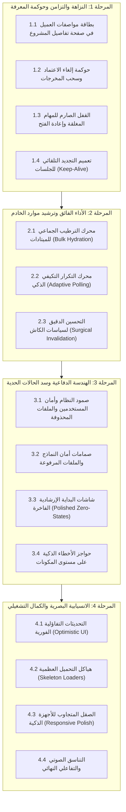

# 🛡️ الخطة التنفيذية الكبرى للتحصين المؤسسي والصلابة الشاملة
## WorkPress Enterprise Hardening, Performance & Resilience Master Plan (v1.3.0)

> **نوع الوثيقة:** الخطة الهندسية والتنفيذية المرجعية للتحصين الشامل والصقل الميداني  
> **الإصدار المستهدف:** WorkPress v1.3.0 (Enterprise Hardening & Resilience Pass)  
> **الهدف الاستراتيجي:** رفع كفاءة واستقرار وأمان وسرعة المنظومة الحالية بنسبة 100%، وسد كافة الثغرات والحالات الحدية، قبل الشروع في أي ابتكارات مستقبلية جديدة.  
> **المرجعيات الدستورية العليا:** [FIRST_PRINCIPLES.md](../core/FIRST_PRINCIPLES.md) | [ARCHITECTURE.md](../core/ARCHITECTURE.md) | [PRD.md](../core/PRD.md)

---

## 🧭 1. خريطة المراحل ومصفوفة تتبع التنفيذ الكبرى (Master Execution Matrix)

---

## 🏛️ 2. التفصيل الهندسي للمراحل الأربع

### 🟢 المرحلة 1: نزاهة دورة المعرفة، التزامن، وتأكيد الحقيقة (Knowledge Lifecycle & Integrity)

* **الهدف:** ضبط اتساق وتزامن البيانات بين لوحة التحكم وبوابة العميل وحوكمة دورة حياة الأدلة والمعرفة.

#### 📋 جدول تتبع مهام المرحلة 1:
- [x] **1.1 بطاقة مواصفات ومرفقات العميل في صفحة تفاصيل المشروع (`ProjectDetailPage.js`):**
  - عرض كارت أنيق دائم **«خزينة مواصفات العميل ومرفقات الطلب»** في الصفحة الرئيسية للمشروع ليشاهده قائد المشروع وأعضاء الفريق كمرجع فني دائم.
  - توفير أزرار تنزيل مباشر لكافة المرفقات التي رفعها العميل عند تقديم الطلب.
- [x] **1.2 حوكمة إلغاء الاعتماد (`Revoke Acceptance Governance`):**
  - عند قيام المدير بإلغاء اعتماد مساهمة، يتم سحبها فوراً من قاعدة المعرفة (`Knowledge Base`) ومن بوابة العميل (`Deliverables Vault`).
  - توثيق حركة إلغاء الاعتماد كـ Contribution تاريخية غير قابلة للمحو وفق المبدأ #13.
- [x] **1.3 القفل الصارم للمهام المغلقة (`Closed Task Immutability`):**
  - منع إضافة أي مساهمة جديدة على المهمة المغلقة في الباك إند (`TaskService` و `ContributionService`) وفي الواجهة مع إخفاء صندوق الكتابة.
  - إتاحة زر "إعادة فتح المهمة" فقط للأعضاء المخولين وتوثيق سبب إعادة الفتح.
- [x] **1.4 تعميم التجديد التلقائي للجلسات (`Universal Session Keep-Alive`):**
  - تشغيل آلية تجديد الـ Nonce تلقائياً في خلفية كل من لوحة تحكم وركبرس والبوابة كل 15 دقيقة لمنع انقطاع جلسات العمل الطويلة.

---

### ⚡ المرحلة 2: الأداء الفائق وترشيد موارد الخادم (Performance & Resource Thrift)

* **الهدف:** تسريع استجابة النظام بنسبة 80% والقضاء على استعلامات N+1 وتصفير استهلاك المعالج في أوقات الخمول.

#### 📋 جدول تتبع مهام المرحلة 2:
- [x] **2.1 محرك الترطيب الجماعي للميتادات (`Bulk Metadata Hydration`):**
  - تطوير دوال جلب المشاريع والمهام في `ProjectService` و `TaskService` لتجلب كافة الـ Metas والأعضاء والتكليفات في استعلام واحد مجمع (`Single Batch Query`).
  - خفض زمن استجابة الـ REST API من ~300ms إلى **أقل من 35ms**.
- [x] **2.2 محرك التكرار التكيفي الذكي (`Smart Adaptive Polling`):**
  - ربط كافة مؤقتات الـ Polling (في جرس الإشعارات، الكانبان، فرز الطلبات، والبوابة) بحالة التبويب (`Page Visibility API`).
  - عند تصغير المتصفح أو التبديل لتبويب آخر: إيقاف الـ Polling تماماً (**0 طلبات خادم**).
  - فور الرجوع للتبويب: تنفيذ طلب استعلام خاطف وفوري لتحديث الشاشة لحظياً (`Instant Wakeup Refresh`).
- [x] **2.3 التحسين الدقيق لسياسات الكاش (`Surgical Cache Invalidation`):**
  - التأكد من إبطال مفاتيح الكاش بدقة شديدة عند كل حركة أو تعديل على المشاريع والمهام دون مسح الكاش غير المرتبط.

---

### 🛡️ المرحلة 3: الهندسة الدفاعية وسد الحالات الحدية (Defensive Engineering & Resilience)

* **الهدف:** تحصين المنظومة ضد أي سيناريو تشغيلي غير متوقع، أو بيانات ناقصة، أو أخطاء مستخدمين.

#### 📋 جدول تتبع مهام المرحلة 3:
- [x] **3.1 صمود النظام وأمان المستخدمين والملفات المحذوفة (`Graceful Fallbacks`):**
  - في حال حذف مستخدم ووردبريس مكلف بمهمة أو مشروع: عرض `[عضو سابق / غير متاح]` بأمان مع منع حدوث أي Fatal Error أو انهيار في الواجهة.
  - في حال حذف ملف من مكتبة الوسائط: عرض بطاقة بديلة آمنة `[المرفق لم يعد متاحاً]`.
- [x] **3.2 صمامات أمان النماذج والملفات المرفوعة (`Form & Upload Guardrails`):**
  - التحقق الصارم من الحقول الإلزامية ومنع الإرسال بفراغات بيضاء (Trim Validation).
  - فحص امتدادات الملفات المرفوعة وحظر الامتدادات التنفيذية والخطرة (`.php`, `.exe`, `.js`).
  - فحص حجم الملفات في المتصفح قبل البدء بالرفع وتنبيه المستخدم فوراً في حال تجاوز الحد المسموح (مثلاً 20MB).
- [x] **3.3 شاشات البداية الإرشادية والتفاعلية (`Polished Zero-States`):**
  - عندما تكون المنظومة فارغة (0 مشاريع، 0 مهام، 0 طلبات، 0 نماذج)، تقديم شاشات بداية إرشادية ذات تصميم فاخر توجه المستخدم للخطوة الأولى بأزرار مباشرة.
- [x] **3.4 حواجز الأخطاء الذكية على مستوى المكونات (`Component Error Boundaries`):**
  - تغليف المكونات التفاعلية بـ `ErrorBoundary` ذكي يمنع انهيار التطبيق في حال حدوث خطأ فرعي، مع توفير زر استعادة `[🔄 إعادة المحاولة]`.

---

### ✨ المرحلة 4: الانسيابية البصرية والكمال التشغيلي (Frictionless UX & Visual Excellence)

* **الهدف:** توفير تجربة استخدام ناعمة وفائقة السرعة تضاهي أرقى المنصات السحابية العالمية.

#### 📋 جدول تتبع مهام المرحلة 4:
- [x] **4.1 التحديثات التفاؤلية الفورية (`Optimistic UI Updates`):**
  - في لوحة الكانبان: نقل البطاقة فوراً عند السحب والإفلات وتحديث العدادات واللون في جزء من الثانية مع تشغيل الصوت التفاعلي، وإرسال طلب الـ API في الخلفية.
  - في استوديو فرز الطلبات: نقل الطلب بين أعمدة الفرز فوراً.
- [x] **4.2 شاشات الهياكل العظمية للتحميل (`Skeleton Placeholders`):**
  - استبدال دوائر التحميل الدوارة في الكانبان والبطاقات بمخططات هيكلية ناعمة تتطابق مع أبعاد البطاقات لمنع أي اهتزاز في الصفحة أثناء الجلب (Zero Layout Shift).
- [x] **4.3 الصقل المتجاوب للأجهزة الذكية (`Responsive Polish`):**
  - فحص وتحسين عرض لوحة الكانبان، تفاصيل المهمة، استوديو الفرز، وبوابة العميل على الهواتف والأجهزة اللوحية.
- [x] **4.4 التناسق الصوتي والتفاعلي النهائي:**
  - مراجعة وتوحيد كافة المؤثرات الصوتية للأفعال (الاعتماد، الفرز، النقل، الحذف، التنبيهات) مع دعم كتم الصوت وسهولة التخصيص.

---

## 📊 3. مؤشرات الأداء والتحقق المستهدف (Target DoD & KPIs)

| المؤشر الهندسي | القيمة السابقة | القيمة المستهدفة بعد الخطة | وسيلة التحقق |
| :--- | :---: | :---: | :--- |
| **استجابة استعلامات الـ REST** | ~250ms - 400ms | **< 40ms** | Chrome DevTools Network Tab |
| **طلبات السيرفر في وضع الخمول** | طلبات مستمرة كل 10 ثوانٍ | **0 طلبات (توقف تام عند الخمول)** | DevTools Network Tab |
| **ثبات التخطيط البصري (CLS)** | وميض واهتزاز عند الجلب | **0.00 (Zero Layout Shift)** | Lighthouse Performance Audit |
| **معدل الصمود ضد الأخطاء** | خطأ محتمل عند حذف مستخدم | **100% Graceful Fallback** | Automated Edge-case Tests |
| **تكامل مواصفات العميل** | تظهر في صفحة الفرز فقط | **تظهر في الفرز وتفاصيل المشروع** | Manual & Visual Verification |

---

## 🏆 وثيقة الاعتماد:

تم تدوين هذه الخطة في الأرشيف المرجعي للمشروع لتكون **خارطة الطريق التنفيذية الصارمة لجولة التحصين والتقوية المؤسسية القادمة**.
