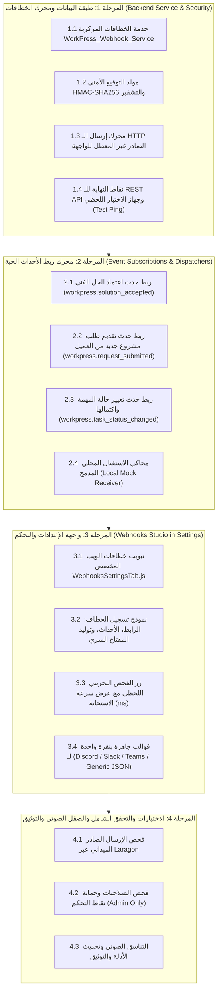

# 🔗 الخطة التنفيذية الكبرى لخطافات الويب والتكاملات المؤسسية
## WorkPress Enterprise Webhooks & External Ecosystem Integrations Master Plan (v1.5.0)

> **نوع الوثيقة:** الخطة الهندسية والتنفيذية الشاملة  
> **حالة الخطة:** ✅ **منفذة ومكتملة 100% في الإنتاج (Shipped in Production)**  
> **الإصدار المنفذ:** WorkPress v1.5.0+  
> **الهدف الاستراتيجي:** بناء منظومة خطافات ويب صادرة عالية الكفاءة (Outbound Webhooks Engine) لربط أحداث WorkPress الحية بالمنصات الخارجية (Slack, Microsoft Teams, Discord, Zapier, Make, Telegram) فور وقوعها مع التوقيع الأمني المشفر، وتوفير جهاز فحص واختبار لحظي مدمج في لوحة التحكم.  
> **المرجعيات الدستورية العليا:** [FIRST_PRINCIPLES.md](../core/FIRST_PRINCIPLES.md) | [ARCHITECTURE.md](../core/ARCHITECTURE.md) | [03-ENTERPRISE-WEBHOOKS-AND-INTEGRATIONS.md](../backlog/03-ENTERPRISE-WEBHOOKS-AND-INTEGRATIONS.md)

---

## 🧭 1. خريطة المراحل ومصفوفة تتبع التنفيذ (Master Execution Matrix)

---

## 🏛️ 2. التفصيل المعماري والهندسي للمراحل الأربع

### 🟢 المرحلة 1: طبقة البيانات ومحرك الخطافات (Backend Service & Security)
* **الهدف:** بناء محرك إرسال خارجي آمن في `includes/services/class-workpress-webhook-service.php` ووحدة تحكم `includes/api/class-workpress-rest-webhooks-controller.php`.

#### 📋 جدول تتبع مهام المرحلة 1:
- [ ] **1.1 خدمة الخطافات المركزية (`WorkPress_Webhook_Service`):**
  - تخزين وإدارة قائمة الـ Webhooks في `wp_options` (`workpress_webhooks_config`).
  - دعم خصائص: المعرف `id`، الاسم `name`، رابط النهاية `url`، قائمة الأحداث المشترك بها `events`، المفتاح السري `secret`، وتفعيل/تعطيل `active`.
- [ ] **1.2 التوقيع الأمني والترويسات القياسية:**
  - توليد رأس `X-WorkPress-Signature: sha256={hash}` باستخدام `hash_hmac('sha256', $body, $secret)`.
  - إرسال ترويسات `X-WorkPress-Event` و `X-WorkPress-Timestamp`.
- [ ] **1.3 محرك الإرسال عبر `wp_remote_post()`:**
  - تنفيذ الإرسال الصادر مع مهلة زمنية مضبوطة (Timeout 5s) ومعالجة الأخطاء وحفظ وقت آخر إرسال وكود الحالة (`200 OK`).
- [ ] **1.4 وحدة التحكم بنقاط النهاية (`WorkPress_REST_Webhooks_Controller`):**
  - مسارات CRUD لإدارة الخطافات.
  - مسار `POST /workpress/v1/webhooks/test` لإرسال فحص تجريبي وقياس سرعة الاستجابة بالمللي ثانية.

---

### ⚡ المرحلة 2: محرك ربط الأحداث الحية (Event Subscriptions & Dispatchers)
* **الهدف:** الاستماع لأحداث WorkPress الأساسية وتوليد الحمولات المناسبة وتوزيعها على الخطافات المشتركة.

#### 📋 جدول تتبع مهام المرحلة 2:
- [ ] **2.1 حدث اعتماد الحل الفني (`workpress.solution_accepted`):**
  - إرسال حمولة تتضمن: اسم المشروع، المهمة، كاتب الحل، معتمد الحل، مقتطف من الحل، ورابط المهمة المباشر.
- [ ] **2.2 حدث تقديم طلب مشروع من العميل (`workpress.request_submitted`):**
  - إرسال حمولة عند ملء العميل لنموذج استقبال في البوابة.
- [ ] **2.3 حدث تغيير حالة المهمة واكتمال المشروع (`workpress.task_status_changed` & `workpress.project_completed`):**
  - تنبيه الفريق عند إغلاق مهمة أو اكتمال جميع مهام المشروع بنسبة 100%.
- [ ] **2.4 محاكي الاستقبال المحلي المدمج (`Local Mock Receiver`):**
  - توفير مسار `POST /workpress/v1/webhooks/mock-receiver` يتيح تجربة الاستقبال وقراءة الحمولات محلياً بدون أي إنترنت.

---

### 🎨 المرحلة 3: واجهة الإعدادات والتحكم (Webhooks Studio in Settings)
* **الهدف:** توفير شاشة تحكم عصرية وسلسة داخل إعدادات WorkPress لإدارة واختبار الخطافات بسهولة.

#### 📋 جدول تتبع مهام المرحلة 3:
- [ ] **3.1 مكون تبويب الخطافات (`assets/src/components/WebhooksSettingsTab.js`):**
  - تصميم جدول حديث يعرض الخطافات النشطة، آخر حالة إرسال (Badge أخضر/أحمر)، وسرعة الاستجابة.
- [ ] **3.2 نافذة إضافة وتعديل الخطاف (Webhook Modal):**
  - إدخال الاسم، الرابط، واختيار الأحداث بواسطة Checkboxes، مع زر توليد مفتاح سري عشوائي بضغطة زر.
  - قوالب تنسيق سريعة (Preset Formats): وضع خاص بـ Discord Webhook، وضع Slack Incoming Webhook، ووضع الـ Payload الخام (Generic JSON).
- [ ] **3.3 زر الفحص التجريبي اللحظي `[🧪 اختبار الإرسال اللحظي]`:**
  - إرسال فحص فوري وعرض كود الاستجابة (مثال: `HTTP 200 OK — 142ms`) مباشرة أسفل الرابط.

---

### 🛡️ المرحلة 4: التحقق، الأمان، والتكامل الشامل
* **الهدف:** اختبار النظام والتأكد من صموده وخلوه من أي أخطاء برمجية أو أمنية.

#### 📋 جدول تتبع مهام المرحلة 4:
- [ ] **4.1 فحص الإرسال الميداني على Laragon:**
  - اختبار إرسال فعلي لـ Webhook.site و محاكي Localhost والتأكد من وصول البيانات بدقة.
- [ ] **4.2 فحص الصلاحيات وحماية المفاتيح:**
  - قصر إدارة الخطافات حصراً على مدراء النظام (`manage_options`).
- [ ] **4.3 التناسق الصوتي وتحديث الأدلة:**
  - إضافة المؤثرات الصوتية وتحديث ملفات التوثيق وفهارس الخطط.
