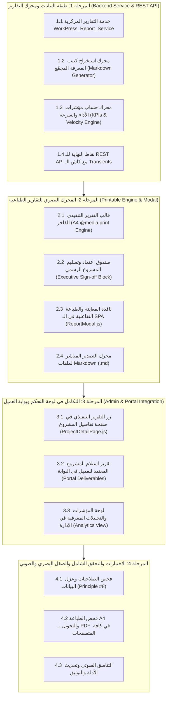

# 📊 الخطة التنفيذية الكبرى للتقارير التنفيذية والتحليلات المؤسسية وكتاب المعرفة
## WorkPress Executive Reporting, Knowledge Book & Analytics Master Plan (v1.4.0)

> **نوع الوثيقة:** الخطة الهندسية والتنفيذية المرجعية الشاملة  
> **الإصدار المستهدف:** WorkPress v1.4.0 (Executive Reporting & Analytics Release)  
> **الهدف الاستراتيجي:** تمكين المنشآت والعملاء من استخراج تقارير إنجاز ختامية رسمية فاخرة بضغطة زر (Executive Sign-off PDF & HTML)، وتصدير كتيب المعرفة المجمّع للمشروع (Project Knowledge Book)، وتوفير لوحة تحليلات للأداء المعرفي وسرعة الإنجاز (Velocity & KPI Analytics).  
> **المرجعيات الدستورية العليا:** [FIRST_PRINCIPLES.md](../core/FIRST_PRINCIPLES.md) | [ARCHITECTURE.md](../core/ARCHITECTURE.md) | [PRD.md](../core/PRD.md)

---

## 🧭 1. خريطة المراحل ومصفوفة تتبع التنفيذ (Master Execution Matrix)

---

## 🏛️ 2. التفصيل المعماري والهندسي للمراحل الأربع

### 🟢 المرحلة 1: طبقة البيانات ومحرك التقارير والـ REST API
* **الهدف:** بناء الخدمات البرمجية الخلفية لجمع بيانات المشاريع المكتملة، وتجميع الحلول المعرفية المعتمدة، وحساب المؤشرات التشغيلية بدقة متناهية.

#### 📋 جدول تتبع مهام المرحلة 1:
- [x] **1.1 خدمة التقارير المركزية (`WorkPress_Report_Service`):**
  - إنشاء الملف `includes/services/class-workpress-report-service.php`.
  - دالة `get_project_summary( $project_id )`: تجميع كافة بيانات المشروع، الفريق، التواريخ، والمهام المكتملة.
- [x] **1.2 محرك استخراج كتيب المعرفة المجمّع (`generate_knowledge_book`):**
  - تجميع كافة المساهمات المعتمدة (`_workpress_is_accepted = 1`) المرتبطة بالمشروع في مستند Markdown مهيكل مع فهرس للمحتويات، الأكواد، والمرفقات.
- [x] **1.3 محرك حساب مؤشرات الأداء والسرعة (`calculate_project_kpis`):**
  - حساب: معدل قبول الحلول من أول محاولة (Acceptance Rate)، متوسط زمن دورة المهمة (Average Cycle Time)، ومؤشر القيمة المعرفية لكل عضو.
- [x] **1.4 وحدة التحكم بنقاط النهاية (`WorkPress_REST_Report_Controller`):**
  - إنشاء الملف `includes/api/class-workpress-rest-report-controller.php`.
  - تسجيل المسارات:
    - `GET /workpress/v1/projects/{id}/report`: جلب بيانات التقرير التنفيذي الكاملة.
    - `GET /workpress/v1/projects/{id}/knowledge-book`: جلب كتيب المعرفة المجمع.
    - `GET /workpress/v1/analytics/overview`: جلب مؤشرات الأداء الكلية.

---

### 🎨 المرحلة 2: المحرك البصري للتقارير الطباعية (Printable Engine & Modal)
* **الهدف:** تصميم قالب طباعي فاخر يضاهي أرقى التقارير الاستشارية العالمية، متوافق مع مقاس A4، مع أزرار تصدير فورية.

#### 📋 جدول تتبع مهام المرحلة 2:
- [x] **2.1 قالب التقرير التنفيذي الفاخر (`admin.css` & `@media print`):**
  - ترويسة رسمية: شعار المنشأة، اسم المشروع، الكود التعريفي، المدير العام، قائد المشروع، وفترة التنفيذ.
  - بطاقات الإنجاز التنفيذية: إجمالي المهام، نسبة الإنجاز 100%، إجمالي المساهمات، وعدد الحلول المعتمدة.
  - فهرس الحلول المعتمدة والمخرجات الفنية لكل مهمة.
- [x] **2.2 صندوق اعتماد وتسليم المشروع الرسمي (`Executive Sign-off Block`):**
  - مساحات مخصصة لتوقيع وختم: قائد المشروع، ممثل العميل، والمدير التنفيذي مع التاريخ.
- [x] **2.3 نافذة المعاينة والطباعة التفاعلية (`ReportModal.js`):**
  - بناء مكون `assets/src/components/ReportModal.js` لمعاينة التقرير بوضوح، مع زر `[🖨️ طباعة / حفظ PDF]` وزر `[📥 تنزيل كـ Markdown]`.
- [x] **2.4 تصدير ملفات Markdown المباشرة:**
  - تنزيل فوري لملف `.md` يحتوي على كتيب المعرفة الكامل للمشروع لاستخدامه في التوثيق الداخلي (GitHub / Notion).

---

### 🔗 المرحلة 3: التكامل في لوحة التحكم وبوابة العميل (Admin & Portal Integration)
* **الهدف:** ربط التقارير في كافة نقاط التفاعل ذات الصلة في لوحة الإدارة وبوابة العميل.

#### 📋 جدول تتبع مهام المرحلة 3:
- [x] **3.1 زر التقرير التنفيذي في صفحة تفاصيل المشروع (`ProjectDetailPage.js`):**
  - إضافة زر رئيسي `[📑 التقرير التنفيذي وكتاب المعرفة]` في ترويسة تفاصيل المشروع.
- [x] **3.2 تقرير استلام المشروع المعتمد للعميل في البوابة (`portal-app.js`):**
  - تمكين العميل في مساحة `/portal/` من استعراض وتحميل التقرير الرسمي للمشروع بعد اكتماله من قسم «خزينة المخرجات».
- [x] **3.3 لوحة المؤشرات والتحليلات المعرفية وتكامل لوحة التحكم الرئيسية (`DashboardPage.js`):**
  - إضافة أزرار استخراج التقارير في رادار المشاريع الرئيسي وتكامل المكون `ReportModal` في لوحة الإدارة.

---

### 🛡️ المرحلة 4: التحقق، التناسق الصوتي، والأداء
* **الهدف:** اختبار النظام والتأكد من صموده وخلوه من أي أخطاء برمجية أو أمنية.

#### 📋 جدول تتبع مهام المرحلة 4:
- [x] **4.1 فحص الصلاحيات وحصانة شرط العضوية (Principle #8):**
  - التحقق من حماية المسارات وفحص الصلاحيات (`manage_options` و عضوية المشروع `is_member`).
- [x] **4.2 التحقق الميداني الطباعي وتناسق القالب:**
  - اختبار طباعة التقرير وتصدير الـ PDF ومطابقة التنسيقات في `@media print`.
- [x] **4.3 التناسق الصوتي والتفاعلي:**
  - تفعيل المؤثرات الصوتية `soundManager.play('pop')` عند فتح وتوليد التقرير بنجاح.
- [x] **4.4 تحديث الفهارس والأدلة:**
  - توثيق الميزة الجديدة في مصفوفة المتطلبات والأدلة التشغيلية والفهرس العام.

---

## 🏆 وثيقة الاعتماد:

تم تدوين وتنفيذ هذه الخطة بالكامل بنجاح 100% لتكون **حزمة التقارير التنفيذية والتحليلات المؤسسية WorkPress v1.4.0** منجزة وجاهزة للاستخدام والإنتاج.

