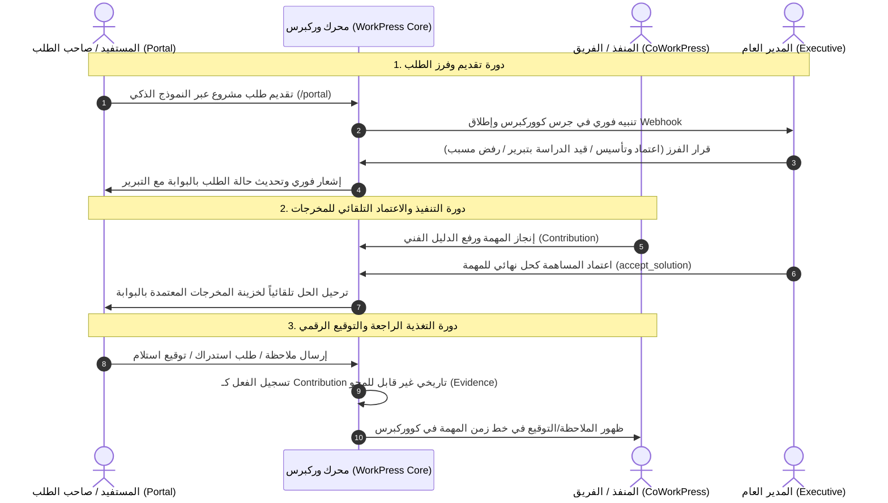

# وثيقة الخطة التنفيذية المعمارية الشاملة: الحوكمة العامة الثلاثية والارتدادات التبادلية
## Universal Governance, Tri-Partite Authorization & Bi-Directional Portal Synergy Master Plan

---

> **المرجعية المعمارية العليا:**
> - [FIRST_PRINCIPLES.md](file:///C:/laragon/www/WORKPRESS/wp-content/plugins/WorkPress/docs/core/FIRST_PRINCIPLES.md) (المبادئ الأولى: 4، 6، 7، 8، 9، 10، 13، 14، 17، 19)
> - [ARCHITECTURE.md](file:///C:/laragon/www/WORKPRESS/wp-content/plugins/WorkPress/docs/core/ARCHITECTURE.md) (عقود التفويض، العضوية، والمساهمات)
> - [PRD.md](file:///C:/laragon/www/WORKPRESS/wp-content/plugins/WorkPress/docs/core/PRD.md) (متطلبات المنتج وتجريد النواة)

---

## 1. الرؤية الفلسفية والمعمارية (Architectural Vision)

نظام **WorkPress (ورككبرس)** هو محرك ذاكرة مؤسسية عام (Organizational Memory Engine) مجرد تماماً ومحايد للمجال التجاري (`Core stays domain neutral`). 
- **ورككبرس (WorkPress)**: هو النواة والمحرك المركزي وقواعد الأعمال (Core Services & Business Rules).
- **كووركبرس (CoWorkPress)**: هي مساحة العمل التفاعلية وواجهته التنفيذية الموسعة لإدارة العمليات والمهام والكانبان والمعرفة للفرق الداخلية.
- **البوابة (WorkPress Portal)**: هي واجهة التفاعل الخفيفة المستقلة والمباشرة لأصحاب الطلبات والمستفيدين والجهات الخارجية.

تعتمد هذه الخطة **النموذج الثلاثي للتفويض (Tri-Partite Authorization Model)** لضبط العلاقات والحدود بين المستخدمين دون أي تخصيص ضيق أو تسريب لمصطلحات تجارية قطاعية محددة.

---

## 2. النموذج الثلاثي للتفويض (The Tri-Partite Authorization Engine)

تخضع كل عملية واستعلام داخل النظام للمعادلة المعمارية المنصوص عليها في [ARCHITECTURE.md](file:///C:/laragon/www/WORKPRESS/wp-content/plugins/WorkPress/docs/core/ARCHITECTURE.md):

$$\mathbf{Authorization\ Decision} = \mathbf{Access\ (\text{صلاحية الوصول})} \ \land\ \mathbf{Visibility\ (\text{صلاحية الظهور/العضوية})} \ \land\ \mathbf{Action\ (\text{صلاحية الفعل/القرار})}$$

```
┌──────────────────────────────────────────────────────────────────────────────────────────────────┐
│ 1. صلاحيات الوصول والواجهات (Perimeter & Interface Access)                                       │
│    «أين يُسمح للمستخدم بالدخول؟»                                                                │
│    ├─ access_workpress_admin     : الدخول لغرفة عمليات كووركبرس (CoWorkPress)                    │
│    ├─ access_workpress_portal    : الدخول للبوابة المستقلة ومساحة المخرجات (/portal)             │
│    └─ manage_workpress_settings  : الدخول لإعدادات النظام ومصفوفة الصلاحيات (Admin Only)          │
├──────────────────────────────────────────────────────────────────────────────────────────────────┤
│ 2. صلاحيات النطاق والظهور (Visibility & Data Scoping)                                            │
│    «ماذا يُسمح للمستخدم أن يرى؟»                                                                 │
│    ├─ read_workpress_projects    : قراءة واستعراض المشاريع المصرح بها (وفق العضوية Membership)   │
│    ├─ read_workpress_tasks       : استعراض المهام في سياق مشاريعه (مع فلترة التكليف الاختيارية) │
│    ├─ read_knowledge_base        : الاطلاع على بنك المعرفة والحلول المقبولة                      │
│    └─ view_incoming_requests     : الاطلاع على سجل الطلبات الواردة                               │
├──────────────────────────────────────────────────────────────────────────────────────────────────┤
│ 3. صلاحيات الأفعال والقرارات (Action, Mutation & Decision Power)                                 │
│    «ماذا يُسمح للمستخدم بتغييره واتخاذه من قرارات؟»                                              │
│    ├─ أفعال التأسيس والإنشاء     : create_workpress_projects, create_workpress_tasks             │
│    │                              submit_work_requests                                           │
│    ├─ أفعال التنفيذ والمساهمة   : add_contributions, edit_assigned_tasks, change_task_status     │
│    ├─ أفعال الإسناد والإدارة    : assign_tasks, edit_others_workpress_tasks, manage_members      │
│    ├─ أفعال الفرز والقرار       : triage_requests, approve_requests, reject_requests             │
│    │                              accept_solutions (اعتماد كحل), revoke_solutions (إلغاء)        │
│    ├─ أفعال التوقيع والاستلام   : signoff_project_deliverables, submit_client_feedback           │
│    └─ أفعال النظام والتخصيص     : manage_intake_forms, manage_webhooks                           │
└──────────────────────────────────────────────────────────────────────────────────────────────────┘
```

---

## 3. مصفوفة الأدوار الثلاثية المجردة (The 3 Abstract Roles)

| الخاصية المعمارية | 1. المدير العام (Executive Admin) | 2. المنفذون الفنيون (Specialists / Team) | 3. المستفيد / صاحب الطلب (Portal Stakeholder) |
| :--- | :--- | :--- | :--- |
| **الدور القياسي (WP Role)** | `administrator` | `editor` / `author` / `contributor` | `subscriber` / `workpress_portal_user` |
| **واجهة الدخول (Access)** | كووركبرس + البوابة + الإعدادات | **كووركبرس (CoWorkPress)** | **البوابة فقط (/portal)** مع حظر wp-admin |
| **نطاق الرؤية (Visibility)** | رؤية شاملة لكافة المشاريع والطلبات | محكوم بعضوية مشاريعه (`Membership`) | محكوم بمشاريعه ومخرجاته المعتمدة فقط |
| **أفعال الكانبان والمهام** | كاملة (إنشاء، تعديل، إسناد، حذف) | تنفيذ المهام المكلف بها وتحديث الحالات | **ممنوع** (لا يرى كواليس الكانبان الفنية) |
| **أفعال المساهمات والحلول** | اعتماد الحلول وإلغاؤها وإغلاق المهام | كتابة مساهمات ورفع حلول وأدلة فنية | إضافة ملاحظات/استفسارات ومصادقة على التسليم |
| **أفعال الطلبات والفرز** | فرز، وضع قيد الدراسة، اعتماد، رفض | مراجعة الطلبات إن فُوض بذلك | **تقديم طلبات مشاريع** ومتابعة تبريراتها |

---

## 4. محرك الارتدادات التبادلية (Two-Way Synapses Engine)



---

## 5. خطة تتبع تنفيذ المراحل (Milestone Execution Tracker)

```
الحالة العامة للخطة:
[x] المرحلة 1: حوكمة النواة ومصفوفة الصلاحيات الذرية (Core Capabilities Registry)
[x] المرحلة 2: محرك العزل الأمني وحارس التوجيه التلقائي (Security & Redirection Guard)
[x] المرحلة 3: مصفوفة الصلاحيات وإدارة الأعضاء في كووركبرس (CoWorkPress UI & Aliasing)
[x] المرحلة 4: محرك الارتدادات والأدلة غير القابلة للمحو (Immutable Evidence Synapse)
[x] المرحلة 5: تجريد وتعميم واجهة البوابة ومساحة المخرجات (Portal Generalization)
[x] المرحلة 6: الفحص والاختبار البرمجي الشامل (Verification & Quality Assurance)
```

---

### المرحلة 1: حوكمة النواة ومصفوفة الصلاحيات الذرية (Core Capabilities Registry)
- [x] **1.1** تحديث [class-workpress-capabilities-registry.php](file:///C:/laragon/www/WORKPRESS/wp-content/plugins/WorkPress/includes/core/class-workpress-capabilities-registry.php):
  - تسجيل حزم الصلاحيات المجردة: (واجهات الوصول، المشاريع، المهام، المساهمات، الطلبات والفرز، المعرفة والتقارير، أدوات النظام، وخدمات البوابة).
- [x] **1.2** تحديث [class-workpress-install.php](file:///C:/laragon/www/WORKPRESS/wp-content/plugins/WorkPress/includes/core/class-workpress-install.php):
  - ضبط توزيع الصلاحيات الافتراضية بدقة للأدوار الثلاثة (`administrator`, `editor`/`author`, `workpress_portal_user`/`subscriber`).
- [x] **1.3** تحديث [class-workpress-permission-service.php](file:///C:/laragon/www/WORKPRESS/wp-content/plugins/WorkPress/includes/services/class-workpress-permission-service.php):
  - التحقق من تطبيق المعادلة: `capability + membership + project role (+ assignment)`.

---

### المرحلة 2: محرك العزل الأمني وحارس التوجيه التلقائي (Security & Redirection Guard)
- [x] **2.1** تحديث [class-workpress-admin.php](file:///C:/laragon/www/WORKPRESS/wp-content/plugins/WorkPress/includes/admin/class-workpress-admin.php):
  - تفعيل `auth_redirect` و `admin_init` guard: إذا كان المستخدم يملك صلاحية البوابة `access_workpress_portal` فقط ويفتقر إلى `access_workpress_admin`، يتم تحويله تلقائياً من أي مسار `/wp-admin/` إلى رابط البوابة `/portal/`.
- [x] **2.2** تعزيز التحقق في نقاط نهاية REST API:
  - التأكد من أن جميع Endpoints الخاصة بكووركبرس تتطلب صراحة `access_workpress_admin` أو الصلاحية المناسبة.

---

### المرحلة 3: مصفوفة الصلاحيات وإدارة الأعضاء في كووركبرس (CoWorkPress UI & Aliasing)
- [x] **3.1** تحديث [class-workpress-rest-roles-controller.php](file:///C:/laragon/www/WORKPRESS/wp-content/plugins/WorkPress/includes/api/class-workpress-rest-roles-controller.php):
  - إرجاع حزم الصلاحيات الثلاثية المنظمة ودعم المسميات المستعارة للأدوار (Role Aliases).
- [x] **3.2** تحديث [SettingsPage.js](file:///C:/laragon/www/WORKPRESS/wp-content/plugins/WorkPress/assets/src/pages/SettingsPage.js):
  - تبويب **مصفوفة الصلاحيات (`roles_permissions`)**: عرض الصلاحيات في بطاقات ومجموعات واضحة حسب (الوصول، الظهور، والأفعال).
  - تبويب **إدارة الأعضاء والأدوار (`members`)**: دليل أعضاء موحد مع فلتر علوي لاختيار الدور (الإدارة، المنفذون، المستفيدون/أصحاب الطلبات).

---

### المرحلة 4: محرك الارتدادات والأدلة غير القابلة للمحو (Immutable Evidence Synapse)
- [x] **4.1** تحديث [class-workpress-contribution-service.php](file:///C:/laragon/www/WORKPRESS/wp-content/plugins/WorkPress/includes/services/class-workpress-contribution-service.php):
  - تسجيل أحداث البوابة كمساهمات رسمية: `client_feedback` (ملاحظة مستفيد)، `client_revision_request` (طلب استدراك مسبب)، و `client_signoff` (توقيع استلام).
- [x] **4.2** تحديث [class-workpress-portal-service.php](file:///C:/laragon/www/WORKPRESS/wp-content/plugins/WorkPress/includes/services/class-workpress-portal-service.php):
  - ربط فوري لخزينة المخرجات المعتمدة مع حدث `accept_solution`.
- [x] **4.3** التحقق من تفعيل التنبيهات والإشعارات اللحظية في قاعدة البيانات وخطافات الويب (Webhooks) عند وقوع أي حدث تبادلي.

---

### المرحلة 5: تجريد وتعميم واجهة البوابة ومساحة المخرجات (Portal Generalization)
- [x] **5.1** تحديث [portal-app.js](file:///C:/laragon/www/WORKPRESS/wp-content/plugins/WorkPress/assets/src/portal/portal-app.js):
  - تنقية كافة النصوص لتصبح عامة ومجردة: «بوابة المستفيدين ومساحة المشاريع» (WorkPress Portal)، «تسجيل دخول المستفيدين»، و«المخرجات والحلول المعتمدة».
  - دعم أفعال المستفيد المنضبطة (إرسال استفسار، طلب استدراك، وتوقيع محضر الاستلام).
- [x] **5.2** تحديث [RequestsPage.js](file:///C:/laragon/www/WORKPRESS/wp-content/plugins/WorkPress/assets/src/pages/RequestsPage.js) و [ProjectDetailPage.js](file:///C:/laragon/www/WORKPRESS/wp-content/plugins/WorkPress/assets/src/pages/ProjectDetailPage.js):
  - تعميم مصطلحات وارد الطلبات، أصحاب الطلبات، وخزينة المواصفات.

---

### المرحلة 6: الفحص والاختبار البرمجي الشامل (Verification & Quality Assurance)
- [x] **6.1** تشغيل فاحص الـ PHP Syntax Lint لكافة ملفات الـ PHP المعدلة والتأكد من خلوها من الأخطاء:
  ```powershell
  & "C:\laragon\bin\php\php-8.3.16-Win32-vs16-x64\php.exe" -l <files>
  ```
- [x] **6.2** تشغيل فاحص الـ Node JS Syntax لكافة ملفات الـ JavaScript:
  ```powershell
  node -c <files>
  ```
- [x] **6.3** اختبار سيناريوهات العزل الأمني والارتدادات التبادلية.
- [x] **6.4** توثيق النتائج النهائية في [walkthrough.md](file:///C:/Users/tawfik.mostefaoui/.gemini/antigravity-ide/brain/602ed5c3-013a-4324-a732-eaa03c6e989c/walkthrough.md).

---

## 6. معايير القبول والجودة (Definition of Done)

1. **حيادية النواة 100%**: خلو كود النواة وقواعد البيانات من أي تسمية تجارية قطاعية صلبة.
2. **صحة المعادلة الثلاثية**: كل إجراء يُفحص عبر: الوصول (Access) $\land$ الظهور (Visibility) $\land$ الفعل (Action).
3. **العزل التام**: مستخدم البوابة لا يرى `/wp-admin/` مطلقاً ويُعاد توجيهه فوراً إلى البوابة.
4. **توثيق الأدلة التاريخية**: كل ملاحظة أو توقيع من البوابة يسجل كـ `Contribution` غير قابل للمحو في خط زمن المهمة.
5. **سلامة الكود**: اجتياز كامل فحوصات التركيب (0 errors).
