# 🛡️ ميثاق وخطة التصحيح والتحصين المعماري الشامل (WorkPress Guardian Remediation Plan)
## WorkPress Architectural & Logic Remediation Master Plan (v2.2.1 Hardening)

> **وثيقة معتمدة وموجهة وفق دستور ومبادئ حارس وركبرس (`.agents/skills/workpress-guardian/SKILL.md`)**  
> **المرجع الحاكم الأعلى:** المبادئ الـ 21 غير القابلة للكسر (`docs/core/FIRST_PRINCIPLES.md`) ودستور وركبرس (`.agents/rules/workpress-constitution.md`).  
> **تاريخ الإصدار:** 27 أغسطس 2026  
> **الحالة:** 🟢 قيد التنفيذ الدقيق الفوري (In Active Execution)  

---

## 🎯 1. مصفوفة الالتزام بدستور وركبرس (Guardian Compliance Matrix)

| المبدأ الدستوري | متطلب الحارس | التطبيق الإلزامي في هذه الخطة |
| :--- | :--- | :--- |
| **المبدأ 5: مصدر الحقيقة** | نموذج بيانات ووردبريس هو الأصل الوحيد | توحيد مفاتيح الميتا (`_workpress_status`, `_workpress_contribution_type`) وإلغاء أي تشعبات. |
| **المبدأ 7 و 8: الصلاحية والعضوية** | القدرة تجيب عن الاستطاعة، العضوية تجيب عن الرؤية | تصحيح `CAP_ACCESS_PORTAL` ودعم رتبة `ROLE_MANAGER` المعيارية في فحص `is_user_lead`. |
| **المبدأ 10 و 13: التاريخ لا يُمحى** | كل حدث يترك دليلاً ثابتاً | تصحيح توقيع خطاف `workpress_project_request_submitted` لربط الفاعل الحقيقي `actor_id` بالإشعارات. |
| **المبدأ 17 و 18: طبقة الخدمات** | الـ REST API عقد للنواة وتمر الأفعال بالخدمات | تصحيح دالة إعدادات الـ REST لتستدعي `WorkPress_Project_Service` المركزية (مبدأ DRY). |
| **الأمان الثلاثي (Tri-Partite)** | Capability + Nonce + Sanitize + Null Safety | إضافة فحوصات Null Safety في متحكم سلة المهملات وتأمين استدعاء كائن الأدوار. |
| **صلابة الواجهة (UI Resilience)** | حظر الانهيار الصامت وتأمين الوعود | إغلاق كافة وعود `apiFetch` بـ `.catch()` وإعادة ضبط حالات التحميل (`setLoading(false)`). |

---

## 📋 2. خطة العمل التنفيذية الذرية (Atomic Execution Breakdown)

```mermaid
graph TD
    subgraph "المرحلة 1: تحصين النواة والخدمات (Backend Core)"
        F01["1.1 تصحيح متغير خدمة الأمان $term_id"]
        F02["1.2 توحيد ثابت CAP_ACCESS_PORTAL"]
        F03["1.3 توحيد توقيع خطاف طلبات المشاريع"]
        F04["1.4 تصحيح حقول التقارير التنفيذية assignees و due_at"]
        F05["1.5 دعم رتبة ROLE_MANAGER في is_user_lead"]
        F06["1.6 تصحيح META_CONTRIBUTION_TYPE"]
        F07["1.7 تمرير WORKPRESS_VERSION للوحة التحكم"]
        F08["1.8 إضافة sound_transition لاستجابة الإعدادات"]
        F09["1.9 تأمين كائن wp_roles عند إلغاء التفعيل"]
        F10["1.10 حماية Null Safety لسلة المهملات"]
        F11["1.11 تنقية استعلام المعرفة وحظر المحذوفات"]
        F12["1.12 إزالة المتغيرات الميتة في التجميد"]
        F13["1.13 إزالة تكرار مخطط النماذج DRY"]
    end

    subgraph "المرحلة 2: تحصين واجهة Preact (Frontend Safety)"
        F14["2.1 تأمين وعود صفحات Preact الـ 8 بـ .catch"]
        F15["2.2 تأمين وعود النوافذ المنبثقة الـ 6"]
        F16["2.3 تأمين تحميل الصوتيات في البوابة والتطبيق"]
    end

    subgraph "المرحلة 3: بروتوكول التحقق الصارم (Verification)"
        V01["3.1 فحص PHP 8.3 Syntax Linter"]
        V02["3.2 مطابقة الصلاحيات 100%"]
        V03["3.3 ماسح الـ 360 درجة المجهري (0 عيوب)"]
        V04["3.4 تشغيل حزمة اختبارات التكامل"]
    end

    F01 --> F02 --> F03 --> F04 --> F05 --> F06 --> F07 --> F08 --> F09 --> F10 --> F11 --> F12 --> F13
    F13 --> F14 --> F15 --> F16
    F16 --> V01 --> V02 --> V03 --> V04
```

---

## 🛠️ 3. المواصفات البرمجية التفصيلية لكل تعديل

### 1.1 خدمة الأمان (`class-workpress-security-service.php`)
* **السطر 91:** استبدال `$term->term_id` بـ `(int) $term_id`.

### 1.2 سجل الثوابت (`class-workpress-keys.php`)
* **السطر 179:** تغيير قيمة `CAP_ACCESS_PORTAL` إلى `'access_workpress_portal'`.
* **السطر 82:** تغيير قيمة `META_CONTRIBUTION_TYPE` إلى `'_workpress_contribution_type'`.

### 1.3 خطافات الأحداث (`class-workpress-hooks.php`)
* **السطور 161-163:** تعديل دالة `fire_project_request_submitted( $project_id, $client_user_id, $specs = array() )`.

### 1.4 خدمة التقارير التنفيذية (`class-workpress-report-service.php`)
* **السطور 74-76:** استخراج أسماء المكلفين من `$task['assignees']` وقراءة موعد الاستحقاق من `$task['due_at']`.

### 1.5 خدمة المشاريع (`class-workpress-project-service.php`)
* **السطر 421:** فحص `in_array( $member_role, array( 'manager', 'lead', WorkPress_Membership_Service::ROLE_MANAGER ), true )`.

### 1.6 لوحة تحكم المشرف (`class-workpress-admin.php`)
* **السطر 175:** إسناد `'version' => WORKPRESS_VERSION`.

### 1.7 متحكم إعدادات الـ REST (`class-workpress-rest-settings-controller.php`)
* **السطر 58:** إدراج `'sound_transition' => get_option( 'workpress_sound_transition', 'transition_up' )`.
* **السطور 64-116:** استدعاء `WorkPress_Project_Service::get_default_intake_forms_schema()`.

### 1.8 ملف التثبيت (`class-workpress-install.php`)
* **السطر 363:** التحقق من تهيئة `$wp_roles` قبل `foreach ( $wp_roles->roles as ... )`.

### 1.9 متحكم سلة المهملات (`class-workpress-rest-trash-controller.php`)
* **السطر 122:** فحص `! empty( $comment )` قبل الوصول لـ `$comment->comment_post_ID`.

### 1.10 خدمة المعرفة (`class-workpress-knowledge-service.php`)
* **السطور 51-62:** تغيير الحالة إلى `'status' => 'approve'` وإضافة استبعاد `_workpress_is_pending_trash`.

### 1.11 خدمة التجميد (`class-workpress-hibernation-service.php`)
* **السطور 87-88 والسطور 150-151:** حذف تعريف المتغير `$user_name` غير المستخدم.

### 2.1 صفحات Preact والنوافذ المنبثقة
* إلحاق `.catch()` بجميع الوعود غير المغلقة واستعادة حالة `loading`.

---
*تم توثيق هذه الخطة كمرجع تنفيذي نهائي خاضع لرقابة حارس المنظومة.*
