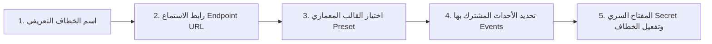
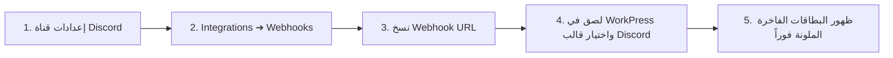

# الدليل التشغيلي الشامل لاستخدام وربط خطافات الويب (Webhooks)
## WorkPress Webhooks & Automations Usage Guide

> **دليل المستخدم والمسؤول خطوة بخطوة لربط WorkPress مع منصات الأتمتة الخارجية والتطبيقات (Make.com, Discord, Slack, Zapier, Webhook.site) وإرسال الإشعارات التلقائية عبر البريد الإلكتروني.**

---

## 🌟 1. مقدمة مبسطة: ما هي خطافات الويب (Webhooks)؟

**خطاف الويب (Webhook)** هو "ساعي بريد رقمي فوري". بدلاً من قيام المنصات الأخرى بسؤال WorkPress كل دقيقة "هل حدث جديد؟"، يقوم نظام WorkPress بنفسه وبشكل فوري لحظة حدوث أي عملية (مثل: اعتماد حل مهمة، تقديم عميل لطلب جديد، أو اكتمال مشروع) بإرسال رسالة فورية إلى الرابط الذي تحدده حاملاً معه كافة التفاصيل.

### 💡 ماذا يمكنك أن تصنع بهذا النظام؟
1. **تنبيهات البريد الإلكتروني الفورية (Gmail / Outlook):** إرسال إيميل جميل للمدير أو العميل فور اعتماد مهمة أو تقديم طلب.
2. **قنوات الديسكورد وسلاك (Discord & Slack Channels):** نشر بطاقات ملونة في قنوات الفريق لإشعال الحماس عند إنجاز المهام.
3. **رسائل وتطبيقات الجوال (WhatsApp / Telegram / SMS):** إرسال رسائل نصية أو واتساب للعملاء عند تغير حالة مشاريعهم عبر ربط Make أو Zapier.
4. **جداول البيانات وإدارات المهام الخارجية (Google Sheets / Notion / Trello):** أرشفة وتوثيق كل طلب مشروع جديد في ملف إكسل أو نوشن فوراً.

---

## 🚀 2. الوصول إلى استوديو إدارة الخطافات في WorkPress

1. ادخل إلى لوحة تحكم ووردبريس ➔ ثم افتح منصة **WorkPress**.
2. من القائمة العلوية أو الجانبية، اختر **الإعدادات (Settings ⚙️)**.
3. اضغط على تبويب **"خطافات الويب والتكامل الخارجي" (Webhooks Studio)**.

ستظهر لك لوحة متكاملة تعرض:
* عدد الخطافات النشطة والإجمالية.
* سرعة الاستجابة الزمنية (Latency بالملي ثانية ms).
* زر **`+ إضافة خطاف جديد`** وزر **`🔄 تحديث`**.

---

## 🛠️ 3. كيفية إضافة وضبط خطاف ويب جديد (Add Webhook)

عند الضغط على زر **`+ إضافة خطاف جديد`**، ستفتح لك نافذة إعدادات مرنة تطلب منك البيانات التالية:



### الحقول الأساسية:
1. **اسم الخطاف (Webhook Name):** مسمى تعريفي يساعدك على تذكره (مثال: `إشعارات Make والبريد الإلكتروني` أو `قناة الديسكورد العامة`).
2. **رابط الاستماع الخارجي (Webhook Endpoint URL):** الرابط الذي تنسخه من Make.com أو Discord أو Slack أو الموقع الذي ترغب بالربط معه.
3. **قالب البيانات المعماري (Payload Preset):**
   * **`Generic REST JSON (الافتراضي للأتمتة)`**: اختر هذا الخيار عند الربط مع **Make.com** أو **Zapier** أو **n8n** أو **Webhook.site**، حيث يرسل البيانات الخام كاملة ومفصلة.
   * **`Discord Rich Embeds`**: اختر هذا الخيار عند الربط المباشر مع سيرفر **Discord** ليظهر كبطاقة ملونة بشعار المنظومة دون الحاجة لوسيط.
   * **`Slack Block Kit`**: اختر هذا الخيار عند الربط المباشر مع مساحة عمل **Slack**.
   * **`Microsoft Teams MessageCard`**: اختر هذا الخيار للربط مع قنوات **Teams**.
4. **الأحداث المشترك بها (Subscribed Events):**
   * اختر العمليات التي تريد أن يقوم النظام بإشعارك بها:
     * ✅ **اعتماد حل رسمي لمهمة:** عند اعتماد مساهمة أحد الموظفين أو المستقلين.
     * ✅ **سحب اعتماد حل مهمة:** عند التراجع عن اعتماد حل لإعادة مراجعته.
     * ✅ **تقديم طلب مشروع جديد:** عند قيام عميل بملء وإرسال نموذج طلب من بوابته.
     * ✅ **اكتمال مشروع بالكامل:** عند إنجاز 100% من مهام المشروع.
     * ✅ **تغير حالة مهمة عمل:** عند نقل المهمة بين (قيد التنفيذ، مراجعة، منجزة).
5. **المفتاح السري (Secret Key):** كود أمني يتم إنشاؤه تلقائياً لضمان مصداقية الإشعارات ومنع التلاعب.
6. **الحالة (نشط / Active):** تأكد من تفعيل الزر ليكون باللون الأخضر.

---

## 📧 4. دليل الربط خطوة بخطوة مع Make.com لإرسال إيميلات Gmail

هذا السيناريو يتيح لك استقبال إيميل منسق واحترافي على Gmail لحظة حدوث أي حدث في WorkPress.

### الخطوة 1: إنشاء سيناريو جديد ورابط Webhook في Make
1. افتح حسابك في [Make.com](https://www.make.com) واضغط على **`Create a new scenario`**.
2. اضغط على إشارة الزائد **`+`** واختر موديول **`Webhooks`** ➔ ثم اختر **`Custom webhook`**.
3. اضغط على **`Add`**، اكتب اسماً للخطاف (مثال: `WorkPress Alerts`)، ثم اضغط **`Save`**.
4. سيظهر لك رابط فريد، اضغط على **`Copy address to clipboard`**.

---

### الخطوة 2: لصق الرابط وإجراء فحص تجريبي في WorkPress
1. ارجع إلى WorkPress ➔ إعدادات خطافات الويب ➔ اضغط **`+ إضافة خطاف جديد`**.
2. الصق الرابط في حقل **رابط الاستماع (URL)**.
3. تأكد من بقاء القالب على **`Generic REST JSON`**.
4. حدد الأحداث التي تريدها، ثم اضغط زر **`⚡ فحص الاتصال الفوري`** الموجود داخل النافذة.
5. ستشاهد رسالة خضراء تفيد بنجاح الفحص `✅ نجح الاتصال! كود: HTTP 200`.
6. اضغط زر **`حفظ وتفعيل الخطاف`**.

---

### الخطوة 3: إضافة موديول Gmail في Make وتنسيق الإيميل
1. في Make.com، بجانب دائرة Webhooks اضغط على زر **`Add another module`** واختر **`Gmail`** ➔ ثم اختر **`Send an email`**.
2. قم بربط حسابك في Google إذا لم يكن مربوطاً.
3. في حقل **`To (المستلم)`**: اكتب بريدك الإلكتروني الشخصي (مثال: `your-email@gmail.com`).
4. في حقل **`Subject (عنوان الرسالة)`**: اكتب:
   ```text
   [WorkPress] إشعار جديد في مساحة العمل
   ```
5. في حقل **`Content (محتوى الرسالة)`**: انسخ النص المنظم التالي واستبدل الأقواس بالحقول المقابلة لها من القائمة المنسدلة:

```text
🌟 مرحباً، وصلك إشعار فوري جديد من منصة WorkPress:

📁 المشروع: {{data.project_name}}
📋 عنوان المهمة: {{data.task_title}}
👤 المنفذ / المستخدم: {{data.author_name}}
💬 تفاصيل الحدث: {{data.message}}
⏱️ توقيت العملية: {{timestamp}}
🏢 مساحة العمل: {{workspace}}

--------------------------------------------
تم إرسال هذا الإشعار تلقائياً عبر محرك WorkPress Webhook Engine.
```

6. اضغط **`OK`**.
7. في أسفل الشاشة على اليسار، قم بتفعيل زر السيناريو ليكون **`ON`** (Immediately as data arrives).
8. اضغط على أيقونة **الحفظ 💾** (Save).

---

## 🎮 5. دليل الربط المباشر مع Discord (بدون أي وسيط)

يمكنك إرسال بطاقات ملونة فاخرة ومباشرة لقناة ديسكورد خلال 30 ثانية:



1. افتح سيرفر **Discord** الخاص بك ➔ اضغط على ترس **إعدادات القناة (Edit Channel)** التي تريد استقبال الإشعارات فيها.
2. اختر من القائمة الجانبية **`Integrations`** ➔ ثم اضغط **`Create Webhook`**.
3. قم بتسميته (مثلاً `WorkPress Bot`) واضغط **`Copy Webhook URL`**.
4. اذهب إلى لوحة WorkPress ➔ استوديو الخطافات ➔ اضغط **`+ إضافة خطاف جديد`**.
5. الصق الرابط، وفي حقل القالب اختر **`Discord Rich Embeds`**.
6. اضغط **`⚡ فحص الاتصال الفوري`**، وستسمع صوت إشعار فوري في الديسكورد وتظهر بطاقة أنيقة باللون الأخضر والأزرق!
7. اضغط **`حفظ وتفعيل الخطاف`**.

---

## 💬 6. دليل الربط المباشر مع Slack

1. ادخل إلى لوحة تحكم تطبيقات سلاك [api.slack.com/apps](https://api.slack.com/apps) وأنشئ تطبيقاً جديداً.
2. فعّل ميزة **`Incoming Webhooks`** واختر القناة المستهدفة، ثم انسخ الرابط المولد.
3. في WorkPress: أضف خطافاً جديداً، الصق الرابط، واختر قالب **`Slack Block Kit`**.
4. احفظ الخطاف، وستصل كافة العمليات والاعتمادات على شكل أقسام Block Kit منسقة في سلاك.

---

## ⚡ 7. الفحص الفوري السريع عبر موقع Webhook.site (بدون تسجيل)

إذا كنت ترغب فقط في معاينة الـ JSON وكيف يرسل النظام البيانات قبل تجهيز بريدك:
1. افتح موقع [webhook.site](https://webhook.site).
2. انسخ الرابط الفريد الظاهر أعلى الصفحة `Your unique URL`.
3. الصقه في WorkPress واضغط **`فحص تجريبي فوري`**.
4. ارجع لصفحة Webhook.site وسترى فوراً الطلب كاملاً مع الترويسات `X-WorkPress-Event` وكافة المتغيرات!

---

## 📋 8. جدول مرجعي بكافة الحقول المتوفرة في الرسائل

عند استخدام منصات الأتمتة (Make / Zapier)، هذه قائمة الحقول التي يمكنك الاستفادة منها داخل المتغير `data`:

| الحقل في Make | معناه بالعربية | متى يظهر؟ |
| :--- | :--- | :--- |
| `event` | نوع الحدث المنفذ (مثل `workpress.solution_accepted`) | في جميع الإشعارات |
| `workspace` | اسم موقعك / مساحة عمل WorkPress | في جميع الإشعارات |
| `timestamp` | تاريخ ووقت الإرسال | في جميع الإشعارات |
| `data.project_name` | اسم المشروع المتعلق به الحدث | عند اعتماد حل، تغيير حالة، أو اكتمال مشروع |
| `data.task_title` | عنوان مهمة العمل | عند اعتماد حل، تغيير حالة، أو فتح مهمة |
| `data.author_name` | اسم الموظف/المستقل صاحب الحل المعتمد | عند اعتماد حل رسمي |
| `data.author_email` | إيميل صاحب الحل المعتمد | عند اعتماد حل رسمي |
| `data.accepted_by` | اسم المشرف/المدير الذي اعتمد الحل | عند اعتماد حل رسمي |
| `data.client_name` | اسم العميل الذي قدم طلب المشروع | عند تقديم طلب مشروع جديد |
| `data.client_email` | إيميل العميل مقدم الطلب | عند تقديم طلب مشروع جديد |
| `data.form_title` | عنوان نموذج الطلب المستخدم | عند تقديم طلب مشروع جديد |
| `data.tasks_count` | إجمالي عدد المهام المنجزة في المشروع | عند اكتمال المشروع بنسبة 100% |
| `data.message` | رسالة نصية توضيحية شاملة | في جميع الإشعارات والفحوصات التجريبية |

---

## 🔍 9. استكشاف المشكلات وحلها (Troubleshooting & FAQs)

### ❓ المشكلة 1: الرسائل تصل فارغة على الإيميل؟
* **السبب:** في منصة Make، لم يتم ملء حقلي `Subject` و `Content` في موديول Gmail.
* **الحل:** افتح موديول Gmail في Make، والصق النموذج النصي الموجود في **القسم 4 (الخطوة 3)** وعيّن المتغيرات.

### ❓ المشكلة 2: الإشعار لا يصل نهائياً؟
* **السبب 1:** السيناريو في Make مغلق `OFF` أو تم نسيان الضغط على زر الحفظ 💾.
* **السبب 2:** وجود فلتر بشروط خاطئة على خط الربط بين الموديولات (رمز المفتاح 🔧).
* **الحل:** اضغط على رمز المفتاح 🔧 وتأكد من حذف أي شروط غير مطلوبة، وتأكد أن حالة السيناريو هي **`ON`**.

### ❓ المشكلة 3: الخطاف يظهر باللون الرمادي (غير نشط) في WorkPress؟
* **الحل:** اضغط على زر التعديل (أيقونة القلم ✏️) وقم بتفعيل خيار "تفعيل هذا الخطاف فوراً" ثم احفظ.

### ❓ المشكلة 4: كيف أتأكد من سرعة وصول الإشعار؟
* بجانب كل خطاف في لوحة تحكم WorkPress، ستجد رقماً مثل `⚡ 350ms` أو `⚡ 600ms` يوضح بدقة سرعة استجابة السيرفر الخارجي بالملي ثانية.
